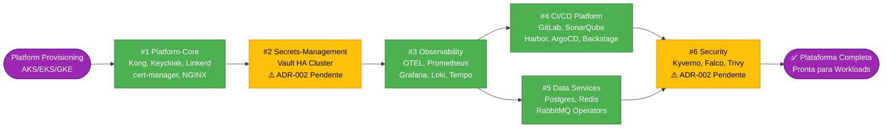
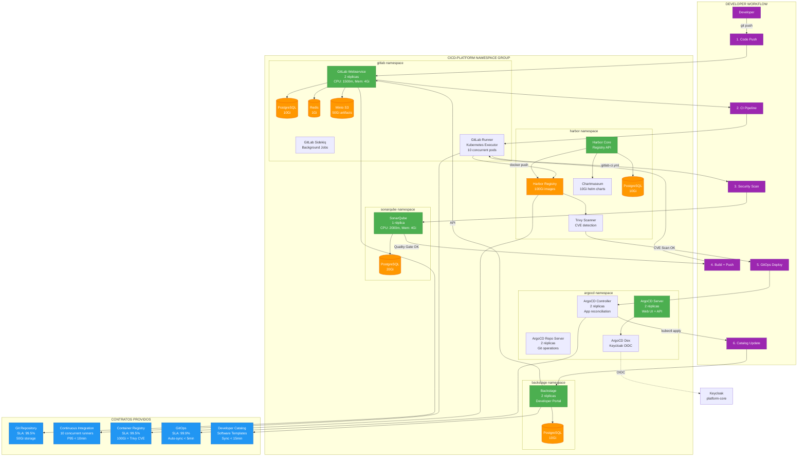
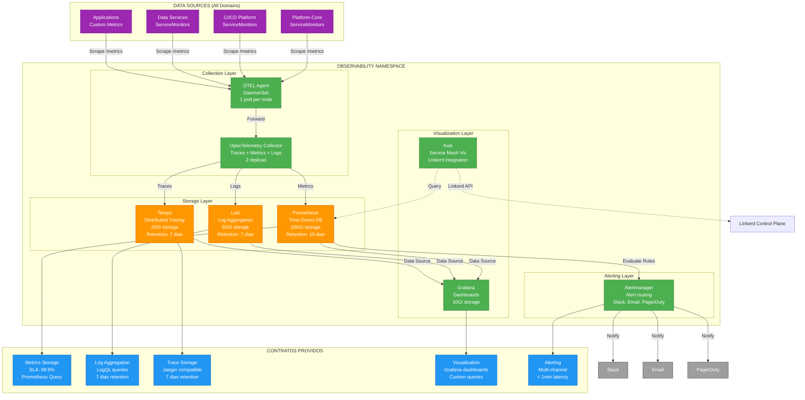
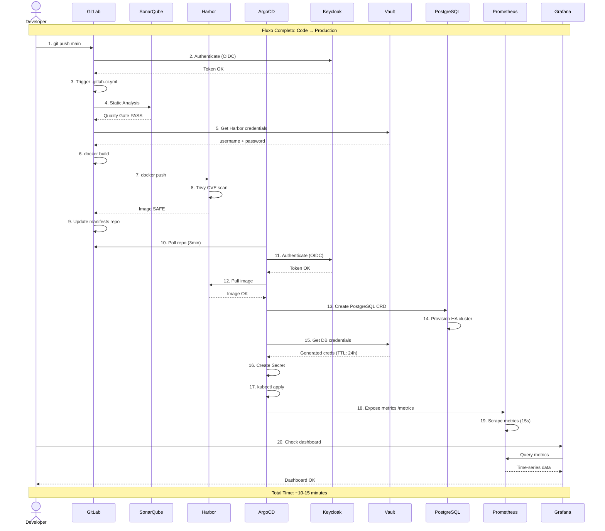
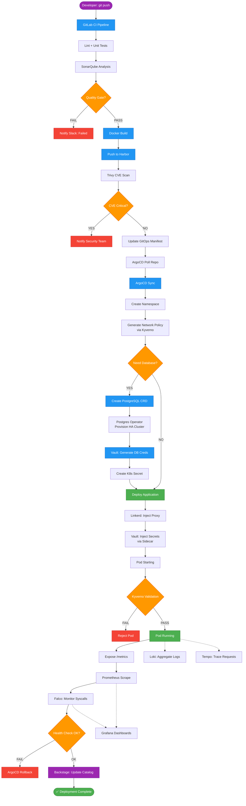

# 🏗️ Arquitetura Visual - Plataforma Kubernetes

> **Última Atualização**: 2026-01-22  
> **Status**: 4/6 domínios implementados  
> **Conformidade SAD v1.2**: 89.6% média  
> **Tipo**: Diagramas evolutivos (atualizar conforme implementação)

---

## 📋 Índice de Diagramas

1. [Visão Geral da Plataforma](#1-visão-geral-da-plataforma)
2. [Ordem de Deploy e Dependências](#2-ordem-de-deploy-e-dependências)
3. [Platform-Core: Fundação](#3-platform-core-fundação)
4. [CI/CD Platform: Esteira DevOps](#4-cicd-platform-esteira-devops)
5. [Observability: Monitoramento](#5-observability-monitoramento)
6. [Data Services: Operators](#6-data-services-operators)
7. [Secrets Management: Cofre](#7-secrets-management-cofre-pendente)
8. [Security: Políticas](#8-security-políticas-pendente)
9. [Comunicação Entre Domínios](#9-comunicação-entre-domínios)
10. [Fluxo de Deploy Completo](#10-fluxo-de-deploy-completo)

---

## 1. Visão Geral da Plataforma

```mermaid
graph TB
    subgraph "CLOUD PROVIDER (Azure/AWS/GCP)"
        PROV[Platform Provisioning<br/>Clusters + VPC + Storage]
    end
    
    subgraph "KUBERNETES CLUSTER"
        subgraph "PLATFORM-CORE #1"
            KONG[Kong API Gateway<br/>Routing + Rate Limiting]
            KEYCLOAK[Keycloak<br/>Authentication OIDC]
            LINKERD[Linkerd Service Mesh<br/>mTLS + Observability]
            CERT[cert-manager<br/>TLS Certificates]
            NGINX[NGINX Ingress<br/>LoadBalancer]
        end
        
        subgraph "SECRETS-MANAGEMENT #2"
            VAULT[Vault HA Cluster<br/>Dynamic Secrets + PKI]
        end
        
        subgraph "OBSERVABILITY #3"
            OTEL[OpenTelemetry<br/>Traces + Metrics + Logs]
            PROM[Prometheus<br/>Time-Series DB]
            GRAFANA[Grafana<br/>Visualization]
            LOKI[Loki<br/>Log Aggregation]
            TEMPO[Tempo<br/>Distributed Tracing]
        end
        
        subgraph "CICD-PLATFORM #4"
            GITLAB[GitLab CE<br/>Git + CI/CD]
            SONAR[SonarQube<br/>Code Quality]
            HARBOR[Harbor<br/>Registry + Security]
            ARGOCD[ArgoCD<br/>GitOps]
            BACKSTAGE[Backstage<br/>Developer Portal]
        end
        
        subgraph "DATA-SERVICES #5"
            POSTGRES[Postgres Operator<br/>PostgreSQL HA]
            REDIS[Redis Operator<br/>Cache HA]
            RABBITMQ[RabbitMQ Operator<br/>Message Queue]
            VELERO[Velero<br/>Backup/Restore]
        end
        
        subgraph "SECURITY #6"
            KYVERNO[Kyverno<br/>Policy Engine]
            FALCO[Falco<br/>Runtime Security]
            TRIVY[Trivy Operator<br/>Vulnerability Scanning]
        end
    end
    
    subgraph "EXTERNAL USERS"
        DEVS[Developers]
        OPS[Platform Engineers]
        USERS[End Users]
    end
    
    %% Dependências Críticas
    PROV -->|Outputs: cluster_endpoint<br/>storage_class| KONG
    PROV -->|Outputs| KEYCLOAK
    
    KEYCLOAK -->|OIDC Provider| ARGOCD
    KEYCLOAK -->|OIDC Provider| GITLAB
    KONG -->|API Gateway| USERS
    
    CERT -->|TLS Certificates| NGINX
    NGINX -->|Ingress Routes| KONG
    NGINX -->|Ingress Routes| KEYCLOAK
    
    LINKERD -.->|mTLS Sidecar| GITLAB
    LINKERD -.->|mTLS Sidecar| HARBOR
    LINKERD -.->|mTLS Sidecar| ARGOCD
    
    VAULT -->|Secrets| GITLAB
    VAULT -->|Secrets| HARBOR
    VAULT -->|Secrets| ARGOCD
    
    OTEL -->|Metrics| PROM
    OTEL -->|Logs| LOKI
    OTEL -->|Traces| TEMPO
    PROM -->|Data Source| GRAFANA
    LOKI -->|Data Source| GRAFANA
    TEMPO -->|Data Source| GRAFANA
    
    GITLAB -->|Push Images| HARBOR
    GITLAB -->|Quality Gates| SONAR
    ARGOCD -->|Deploy Apps| POSTGRES
    ARGOCD -->|Deploy Apps| REDIS
    
    BACKSTAGE -->|Catalog| GITLAB
    BACKSTAGE -->|Software Templates| GITLAB
    
    DEVS -->|Code Push| GITLAB
    DEVS -->|Portal| BACKSTAGE
    OPS -->|Dashboards| GRAFANA
    OPS -->|GitOps| ARGOCD
    
    KYVERNO -.->|Policy Validation| GITLAB
    FALCO -.->|Runtime Alerts| GRAFANA
    TRIVY -.->|CVE Reports| HARBOR
    
    VELERO -->|Backup| POSTGRES
    VELERO -->|Backup| REDIS
    
    %% Estilos
    classDef implemented fill:#4CAF50,stroke:#2E7D32,color:#fff
    classDef pending fill:#FFC107,stroke:#F57C00,color:#000
    classDef external fill:#2196F3,stroke:#1565C0,color:#fff
    
    class KONG,KEYCLOAK,LINKERD,CERT,NGINX implemented
    class OTEL,PROM,GRAFANA,LOKI,TEMPO implemented
    class GITLAB,SONAR,HARBOR,ARGOCD,BACKSTAGE implemented
    class POSTGRES,REDIS,RABBITMQ,VELERO implemented
    class VAULT,KYVERNO,FALCO,TRIVY pending
    class PROV,DEVS,OPS,USERS external
```



**Legenda**:
- 🟢 **Verde**: Implementado e aprovado (89.6% conformidade)
- 🟡 **Amarelo**: Pendente (ADR-002 para decisões arquiteturais)
- 🔵 **Azul**: Externo (cloud providers, usuários)
- **Linhas sólidas**: Dependências diretas
- **Linhas tracejadas**: Integrações opcionais/automáticas

---

## 2. Ordem de Deploy e Dependências



**Deploy Order Rationale**:
1. **Platform-Core**: Fundação (todos dependem de auth, gateway, mesh)
2. **Secrets-Management**: CI/CD precisa de injeção de secrets
3. **Observability**: Monitoramento de platform-core e CI/CD
4. **CI/CD Platform**: Automatiza deploys dos próximos domínios
5. **Data Services**: Operators para aplicações (pode ser paralelo com CI/CD)
6. **Security**: Políticas sobre toda a stack (último para validar tudo)

---

## 3. Platform-Core: Fundação

```mermaid
graph TB
    subgraph "PLATFORM-CORE NAMESPACE GROUP"
        subgraph "kong namespace"
            KONG_DEPLOY[Kong Deployment<br/>2 réplicas<br/>CPU: 1000m, Mem: 2Gi]
            KONG_DB[(PostgreSQL<br/>10Gi storage)]
            KONG_SVC[Kong Service<br/>8000, 8443, 8001]
        end
        
        subgraph "keycloak namespace"
            KC_DEPLOY[Keycloak Deployment<br/>2 réplicas<br/>CPU: 1000m, Mem: 2Gi]
            KC_DB[(PostgreSQL<br/>10Gi storage)]
            KC_SVC[Keycloak Service<br/>8080, 8443]
        end
        
        subgraph "linkerd namespace"
            LINKERD_CP[Linkerd Control Plane<br/>2 réplicas HA<br/>identity, proxy-injector]
            LINKERD_VIZ[Linkerd Viz<br/>Dashboard + Prometheus]
            LINKERD_PROXY[Linkerd Proxy<br/>Sidecar mTLS]
        end
        
        subgraph "cert-manager namespace"
            CERT_CONTROLLER[cert-manager Controller<br/>HTTP-01 challenge]
            CERT_WEBHOOK[cert-manager Webhook<br/>CRD validation]
            CERT_CA[cert-manager CA Injector<br/>Trust anchors]
        end
        
        subgraph "ingress-nginx namespace"
            NGINX_DEPLOY[NGINX Ingress Controller<br/>2 réplicas<br/>CPU: 200m, Mem: 256Mi]
            NGINX_SVC[LoadBalancer Service<br/>80, 443]
        end
    end
    
    subgraph "EXTERNAL ACCESS"
        INTERNET([Internet])
        DNS[DNS Records<br/>*.example.com]
    end
    
    subgraph "CONTRATOS PROVIDOS"
        CONTRACT_AUTH[Authentication<br/>SLA: 99.95%<br/>OIDC endpoints]
        CONTRACT_GATEWAY[API Gateway<br/>SLA: 99.9%<br/>Rate limiting, Routing]
        CONTRACT_MESH[Service Mesh<br/>SLA: 99.9%<br/>mTLS, Observability]
        CONTRACT_CERTS[Certificates<br/>SLA: 99.9%<br/>Auto-renewal]
        CONTRACT_INGRESS[Ingress<br/>SLA: 99.9%<br/>LoadBalancer]
    end
    
    %% Fluxo de Tráfego
    INTERNET --> DNS
    DNS --> NGINX_SVC
    NGINX_SVC --> NGINX_DEPLOY
    NGINX_DEPLOY --> KONG_SVC
    NGINX_DEPLOY --> KC_SVC
    
    KONG_DEPLOY --> KONG_DB
    KC_DEPLOY --> KC_DB
    
    %% Linkerd Injection
    LINKERD_CP -.->|Inject Sidecar| KONG_DEPLOY
    LINKERD_CP -.->|Inject Sidecar| KC_DEPLOY
    LINKERD_PROXY -.->|mTLS| LINKERD_PROXY
    
    %% cert-manager TLS
    CERT_CONTROLLER -->|Issue Certificates| NGINX_DEPLOY
    CERT_CONTROLLER -->|Issue Certificates| KONG_DEPLOY
    CERT_CONTROLLER -->|Issue Certificates| KC_DEPLOY
    
    %% Contratos
    KC_DEPLOY --> CONTRACT_AUTH
    KONG_DEPLOY --> CONTRACT_GATEWAY
    LINKERD_CP --> CONTRACT_MESH
    CERT_CONTROLLER --> CONTRACT_CERTS
    NGINX_DEPLOY --> CONTRACT_INGRESS
    
    %% Estilos
    classDef component fill:#4CAF50,stroke:#2E7D32,color:#fff
    classDef storage fill:#FF9800,stroke:#E65100,color:#fff
    classDef contract fill:#2196F3,stroke:#1565C0,color:#fff
    classDef external fill:#9E9E9E,stroke:#424242,color:#fff
    
    class KONG_DEPLOY,KC_DEPLOY,LINKERD_CP,CERT_CONTROLLER,NGINX_DEPLOY component
    class KONG_DB,KC_DB storage
    class CONTRACT_AUTH,CONTRACT_GATEWAY,CONTRACT_MESH,CONTRACT_CERTS,CONTRACT_INGRESS contract
    class INTERNET,DNS external
```



**Responsabilidades Platform-Core**:
- **Kong**: API Gateway (routing, rate limiting, autenticação)
- **Keycloak**: Identity Provider (OIDC, SAML, usuários/roles)
- **Linkerd**: Service Mesh (mTLS east-west, observability automática)
- **cert-manager**: Gerenciamento de certificados TLS (Let's Encrypt)
- **NGINX**: Ingress Controller (entrada norte-sul, LoadBalancer)

**Recursos**:
- CPU Total: ~4.2 cores (2x Kong + 2x Keycloak + Linkerd + NGINX)
- Memory Total: ~8Gi
- Storage: 20Gi (2x PostgreSQL 10Gi)

---

## 4. CI/CD Platform: Esteira DevOps



**Responsabilidades CI/CD Platform**:
- **GitLab**: Git repos, CI pipelines, Docker registry integration
- **SonarQube**: Análise estática de código, quality gates
- **Harbor**: Container registry, Helm charts, Trivy CVE scanning
- **ArgoCD**: GitOps deployment, Keycloak OIDC authentication
- **Backstage**: Developer portal, software templates, catalog

**Recursos**:
- CPU Total: ~7.5 cores
- Memory Total: ~16Gi
- Storage: 211Gi (50Gi Minio + 100Gi registry + 20Gi SonarQube + 3x10Gi DBs + 10Gi charts)

---

## 5. Observability: Monitoramento



**Responsabilidades Observability**:
- **OpenTelemetry**: Coleta unificada de telemetria (traces, metrics, logs)
- **Prometheus**: Storage de métricas time-series, alerting rules
- **Grafana**: Visualização de dashboards, multi-datasource
- **Loki**: Agregação de logs, queries LogQL
- **Tempo**: Distributed tracing, Jaeger compatible
- **Kiali**: Visualização de service mesh (Linkerd integration)
- **Alertmanager**: Roteamento de alertas multi-canal

**Recursos**:
- CPU Total: ~3 cores
- Memory Total: ~8Gi
- Storage: 180Gi (100Gi Prometheus + 50Gi Loki + 20Gi Tempo + 10Gi Grafana)

---

## 6. Data Services: Operators

```mermaid
graph TB
    subgraph "DATA-SERVICES OPERATORS"
        subgraph "postgres-operator namespace"
            PG_OP[Zalando Postgres Operator<br/>Controller<br/>Patroni + Spilo]
        end

        subgraph "redis-operator namespace"
            REDIS_OP[Redis Cluster Operator<br/>Controller<br/>Master-Replica HA]
        end

        subgraph "rabbitmq-system namespace"
            RABBIT_OP[RabbitMQ Cluster Operator<br/>Controller<br/>Quorum Queues]
        end

        subgraph "velero namespace"
            VELERO[Velero<br/>Backup Controller<br/>S3-compatible storage]
        end
    end

    subgraph "INSTANCES CRIADAS (via CRDs)"
        subgraph "application namespace"
            PG_CLUSTER[PostgreSQL Cluster<br/>1 master + 2 replicas<br/>10Gi storage per pod]
            REDIS_CLUSTER[Redis Cluster<br/>3 masters<br/>5Gi storage per pod]
            RABBIT_CLUSTER[RabbitMQ Cluster<br/>3 nodes<br/>10Gi storage per node]
        end
    end

    subgraph "BACKUP STORAGE"
        S3[S3-compatible Storage<br/>Minio / AWS S3<br/>Azure Blob / GCP GCS]
    end

    subgraph "CONTRATOS PROVIDOS"
        CONTRACT_PG[PostgreSQL as a Service<br/>SLA: 99.9%<br/>HA via Patroni<br/>Auto-failover &lt; 30s]
        CONTRACT_REDIS[Redis as a Service<br/>SLA: 99.9%<br/>Cluster mode<br/>Persistence AOF/RDB]
        CONTRACT_RABBIT[RabbitMQ as a Service<br/>SLA: 99.9%<br/>Quorum queues<br/>Management UI]
        CONTRACT_BACKUP[Backup/Restore<br/>RPO: 24h daily<br/>RTO: &lt; 1h<br/>PVC + CRD backup]
    end

    %% Operator manages Instances
    PG_OP -->|Watch CRD: acid.zalan.do/v1/postgresql| PG_CLUSTER
    REDIS_OP -->|Watch CRD: redis.opstreelabs.in/v1beta1| REDIS_CLUSTER
    RABBIT_OP -->|Watch CRD: rabbitmq.com/v1beta1| RABBIT_CLUSTER

    %% Backup
    VELERO -.->|Schedule backup: Daily 2AM| PG_CLUSTER
    VELERO -.->|Schedule backup: Daily 2AM| REDIS_CLUSTER
    VELERO -.->|Schedule backup: Daily 2AM| RABBIT_CLUSTER
    VELERO -->|Store snapshots| S3

    %% Contratos
    PG_CLUSTER --> CONTRACT_PG
    REDIS_CLUSTER --> CONTRACT_REDIS
    RABBIT_CLUSTER --> CONTRACT_RABBIT
    VELERO --> CONTRACT_BACKUP

    %% Usage Example
    APP[Application Pod<br/>myapp-deployment] -->|my-postgres.app.svc:5432| PG_CLUSTER
    APP -->|my-redis.app.svc:6379| REDIS_CLUSTER
    APP -->|my-rabbitmq.app.svc:5672| RABBIT_CLUSTER

    %% Estilos
    classDef operator fill:#4CAF50,stroke:#2E7D32,color:#fff
    classDef instance fill:#FF9800,stroke:#E65100,color:#fff
    classDef contract fill:#2196F3,stroke:#1565C0,color:#fff
    classDef storage fill:#9E9E9E,stroke:#424242,color:#fff
    classDef app fill:#9C27B0,stroke:#6A1B9A,color:#fff

    class PG_OP,REDIS_OP,RABBIT_OP,VELERO operator
    class PG_CLUSTER,REDIS_CLUSTER,RABBIT_CLUSTER instance
    class CONTRACT_PG,CONTRACT_REDIS,CONTRACT_RABBIT,CONTRACT_BACKUP contract
    class S3 storage
    class APP app
```



**Responsabilidades Data Services**:
- **Zalando Postgres Operator**: PostgreSQL HA clusters com Patroni (auto-failover)
- **Redis Cluster Operator**: Redis HA com cluster mode e replicação
- **RabbitMQ Cluster Operator**: RabbitMQ HA com quorum queues
- **Velero**: Backup/restore de PVCs, CRDs, namespaces (disaster recovery)

**Recursos (por instance típica)**:
- PostgreSQL Cluster: 3 pods x 2Gi memory x 10Gi storage = 30Gi total
- Redis Cluster: 3 pods x 1Gi memory x 5Gi storage = 15Gi total
- RabbitMQ Cluster: 3 pods x 2Gi memory x 10Gi storage = 30Gi total

---

## 7. Secrets Management: Cofre (Pendente)

```mermaid
graph TB
    subgraph "SECRETS-MANAGEMENT (⚠️ ADR-002 Pendente)"
        subgraph "Opção 1: Vault (Recomendado)"
            VAULT_SERVER[Vault Server<br/>3 réplicas HA<br/>Auto-unsealing]
            VAULT_CONSUL[(Consul Backend<br/>Raft consensus<br/>5Gi per pod)]
            VAULT_INJECTOR[Vault Agent Injector<br/>Sidecar secrets]
        end
        
        subgraph "Opção 2: ESO (Alternativa)"
            ESO_CONTROLLER[External Secrets Operator<br/>Controller<br/>1 réplica]
            ESO_WEBHOOK[ESO Webhook<br/>SecretStore CRD]
        end
    end
    
    subgraph "SECRET STORES (Cloud-specific)"
        AWS_SM[AWS Secrets Manager]
        AZURE_KV[Azure Key Vault]
        GCP_SM[GCP Secret Manager]
    end
    
    subgraph "CONTRATOS PROVIDOS"
        CONTRACT_STATIC[Static Secrets<br/>K8s Secret sync<br/>Auto-rotation]
        CONTRACT_DYNAMIC[Dynamic Secrets<br/>Database credentials<br/>TTL-based]
        CONTRACT_PKI[PKI/TLS<br/>Certificate generation<br/>Auto-renewal]
        CONTRACT_ENCRYPTION[Encryption as a Service<br/>Transit encryption<br/>Key rotation]
    end
    
    subgraph "CONSUMERS"
        GITLAB_C[GitLab<br/>DB credentials]
        HARBOR_C[Harbor<br/>Admin password]
        ARGOCD_C[ArgoCD<br/>Git SSH keys]
        APP_C[Applications<br/>API keys, passwords]
    end
    
    %% Vault Option
    VAULT_SERVER --> VAULT_CONSUL
    VAULT_INJECTOR -.->|Inject secrets<br/>via sidecar| GITLAB_C
    VAULT_INJECTOR -.->|Inject secrets<br/>via sidecar| HARBOR_C
    VAULT_SERVER -->|Dynamic DB creds| APP_C
    VAULT_SERVER -->|PKI engine| CONTRACT_PKI
    VAULT_SERVER -->|Transit engine| CONTRACT_ENCRYPTION
    
    %% ESO Option
    ESO_CONTROLLER -.->|Sync from cloud| AWS_SM
    ESO_CONTROLLER -.->|Sync from cloud| AZURE_KV
    ESO_CONTROLLER -.->|Sync from cloud| GCP_SM
    ESO_CONTROLLER -.->|Create K8s Secret| GITLAB_C
    
    %% Contratos
    VAULT_SERVER --> CONTRACT_STATIC
    VAULT_SERVER --> CONTRACT_DYNAMIC
    ESO_CONTROLLER -.-> CONTRACT_STATIC
    
    %% Decisão
    DECISION{ADR-002<br/>Vault vs ESO?}
    DECISION -->|Cloud-Agnostic Total| VAULT_SERVER
    DECISION -.->|Simplicidade + Cloud KMS| ESO_CONTROLLER
    
    %% Estilos
    classDef vault fill:#4CAF50,stroke:#2E7D32,color:#fff
    classDef eso fill:#FFC107,stroke:#F57C00,color:#000
    classDef cloud fill:#9E9E9E,stroke:#424242,color:#fff
    classDef contract fill:#2196F3,stroke:#1565C0,color:#fff
    classDef consumer fill:#9C27B0,stroke:#6A1B9A,color:#fff
    classDef decision fill:#F44336,stroke:#C62828,color:#fff
    
    class VAULT_SERVER,VAULT_CONSUL,VAULT_INJECTOR vault
    class ESO_CONTROLLER,ESO_WEBHOOK eso
    class AWS_SM,AZURE_KV,GCP_SM cloud
    class CONTRACT_STATIC,CONTRACT_DYNAMIC,CONTRACT_PKI,CONTRACT_ENCRYPTION contract
    class GITLAB_C,HARBOR_C,ARGOCD_C,APP_C consumer
    class DECISION decision
```



**Decisão Pendente (ADR-002)**:
- **Vault ✅ Recomendado**: Cloud-agnostic total, dynamic secrets, PKI, encryption as a service (mais complexo)
- **ESO ⚠️ Alternativa**: Simplicidade, depende de cloud KMS (menos features, vendor lock-in)

**Responsabilidades Secrets Management**:
- **Vault**: Storage seguro de secrets, dynamic secrets (DB credentials), PKI, encryption
- **ESO**: Sync de secrets de cloud providers para Kubernetes Secrets

---

## 8. Security: Políticas (Pendente)

```mermaid
graph TB
    subgraph "SECURITY DOMAIN (⚠️ ADR-002 Pendente)"
        subgraph "Policy Engine"
            subgraph "Opção 1: Kyverno (Recomendado)"
                KYVERNO[Kyverno Controller<br/>Policy validation<br/>Policy mutation<br/>Policy generation]
            end
            
            subgraph "Opção 2: OPA (Alternativa)"
                OPA[OPA Gatekeeper<br/>Admission webhook<br/>Rego policies]
            end
        end
        
        subgraph "Runtime Security"
            FALCO[Falco<br/>DaemonSet<br/>Syscall monitoring<br/>Runtime alerts]
        end
        
        subgraph "Vulnerability Scanning"
            TRIVY_OP[Trivy Operator<br/>Controller<br/>Image scanning<br/>CVE reports]
        end
        
        subgraph "Network Security"
            NETPOL[Network Policies<br/>L3/L4 firewall<br/>Namespace isolation]
        end
    end
    
    subgraph "POLICY TYPES"
        POL_ADMISSION[Admission Policies<br/>- Require labels<br/>- Disallow privileged<br/>- Enforce resource limits]
        POL_MUTATION[Mutation Policies<br/>- Add default labels<br/>- Inject sidecars<br/>- Add NetworkPolicy]
        POL_GENERATION[Generation Policies<br/>- Auto-create RBAC<br/>- Auto-create NetworkPolicy<br/>- Auto-create ConfigMap]
    end
    
    subgraph "CONTRATOS PROVIDOS"
        CONTRACT_POLICY[Policy Enforcement<br/>Admission webhook<br/>Audit mode + Enforce]
        CONTRACT_RUNTIME[Runtime Security<br/>Real-time alerts<br/>Threat detection]
        CONTRACT_VULN[Vulnerability Scanning<br/>CVE detection<br/>Image signing]
        CONTRACT_NETWORK[Network Segmentation<br/>Zero-trust networking<br/>Namespace isolation]
    end
    
    subgraph "MONITORED RESOURCES"
        PODS[Pods<br/>Policy validation]
        IMAGES[Images<br/>CVE scanning]
        SYSCALLS[System Calls<br/>Runtime behavior]
        TRAFFIC[Network Traffic<br/>L3/L4 policies]
    end
    
    %% Kyverno Option
    KYVERNO -->|Validate| POL_ADMISSION
    KYVERNO -->|Mutate| POL_MUTATION
    KYVERNO -->|Generate| POL_GENERATION
    KYVERNO -->|Webhook| PODS
    
    %% OPA Option
    OPA -.->|Validate: Rego| POL_ADMISSION
    OPA -.->|Webhook| PODS
    
    %% Falco Runtime
    FALCO -->|Monitor syscalls| SYSCALLS
    FALCO -->|Alert to| GRAFANA_EXT[Grafana<br/>observability]
    
    %% Trivy Scanning
    TRIVY_OP -->|Scan| IMAGES
    TRIVY_OP -->|Report to| HARBOR_EXT[Harbor<br/>cicd-platform]
    
    %% Network Policies
    NETPOL -->|Apply rules| TRAFFIC
    NETPOL -.->|Complement| LINKERD_EXT[Linkerd mTLS<br/>platform-core]
    
    %% Contratos
    KYVERNO --> CONTRACT_POLICY
    FALCO --> CONTRACT_RUNTIME
    TRIVY_OP --> CONTRACT_VULN
    NETPOL --> CONTRACT_NETWORK
    
    %% Decisão
    DECISION{ADR-002<br/>Kyverno vs OPA?}
    DECISION -->|YAML policies + Mutation/Generation| KYVERNO
    DECISION -.->|Rego flexibility: Validation only| OPA
    
    %% Estilos
    classDef kyverno fill:#4CAF50,stroke:#2E7D32,color:#fff
    classDef opa fill:#FFC107,stroke:#F57C00,color:#000
    classDef runtime fill:#FF5722,stroke:#D84315,color:#fff
    classDef contract fill:#2196F3,stroke:#1565C0,color:#fff
    classDef resource fill:#9C27B0,stroke:#6A1B9A,color:#fff
    classDef decision fill:#F44336,stroke:#C62828,color:#fff
    
    class KYVERNO kyverno
    class OPA opa
    class FALCO,TRIVY_OP,NETPOL runtime
    class CONTRACT_POLICY,CONTRACT_RUNTIME,CONTRACT_VULN,CONTRACT_NETWORK contract
    class PODS,IMAGES,SYSCALLS,TRAFFIC resource
    class DECISION decision
```



**Decisão Pendente (ADR-002)**:
- **Kyverno ✅ Recomendado**: YAML policies, validation + mutation + generation (mais features, simples)
- **OPA ⚠️ Alternativa**: Rego policies (flexibilidade máxima, curva de aprendizado)

**Responsabilidades Security**:
- **Kyverno/OPA**: Policy enforcement (admission webhooks), validation, mutation
- **Falco**: Runtime security monitoring, threat detection, syscall analysis
- **Trivy Operator**: Vulnerability scanning de imagens, CVE reports
- **Network Policies**: L3/L4 firewall, namespace isolation, zero-trust

---

## 9. Comunicação Entre Domínios



**Principais Integrações**:
1. **GitLab ↔ Keycloak**: OIDC authentication
2. **GitLab ↔ Vault**: Credentials injection (CI/CD secrets)
3. **GitLab ↔ Harbor**: Docker push/pull
4. **GitLab ↔ SonarQube**: Quality gates
5. **ArgoCD ↔ Keycloak**: OIDC authentication
6. **ArgoCD ↔ Harbor**: Image pull
7. **ArgoCD ↔ Vault**: Dynamic secrets (DB credentials)
8. **ArgoCD ↔ PostgreSQL Operator**: Database provisioning
9. **Todos ↔ Prometheus**: Metrics scraping (ServiceMonitors)
10. **Linkerd**: mTLS automático entre todos os pods

---

## 10. Fluxo de Deploy Completo



**Tempo Estimado por Etapa**:
1. CI Pipeline: 5-8 minutos
2. ArgoCD Sync: 2-3 minutos
3. Database Provisioning: 3-5 minutos (se necessário)
4. Pod Startup: 1-2 minutos
5. **Total**: 10-18 minutos (sem DB) ou 13-23 minutos (com DB)

---

## 📊 Resumo de Recursos por Domínio

| Domínio | CPU (cores) | Memory (Gi) | Storage (Gi) | Status | SLA |
|---------|-------------|-------------|--------------|--------|-----|
| **Platform-Core** | 4.2 | 8 | 20 | ✅ Implementado | 99.9% |
| **Secrets-Management** | 2.0 | 4 | 15 | ⚠️ ADR-002 | 99.9% |
| **Observability** | 3.0 | 8 | 180 | ✅ Implementado | 99.9% |
| **CI/CD Platform** | 7.5 | 16 | 211 | ✅ Implementado | 99.5% |
| **Data Services** | 0.5 | 2 | 10 (operators) | ✅ Implementado | 99.9% |
| **Security** | 1.5 | 3 | 5 | ⚠️ ADR-002 | 99.9% |
| **TOTAL** | **18.7** | **41** | **441** | **67% Completo** | **99.7% Avg** |

**Nota**: Data Services storage é por operator. Instances criadas adicionam ~75Gi (30Gi PG + 15Gi Redis + 30Gi RabbitMQ) por aplicação.

---

## 🔄 Como Atualizar Este Documento

Este documento evolui com a implementação e está **protegido por hook de validação**.

### 📋 Quando Atualizar (Hook Automatizado)

O hook `validate-architecture-diagrams.sh` **bloqueia commits** se estes arquivos mudarem sem atualização de diagramas:

| Arquivo Modificado | Diagrama(s) Obrigatórios |
|-------------------|--------------------------|
| `SAD/docs/sad.md` | #1 Visão Geral, #2 Ordem de Deploy |
| `SAD/docs/adrs/*.md` | #1 Visão Geral (se nova decisão sistêmica) |
| `domains/platform-core/infra/terraform/main.tf` | #3 Platform-Core |
| `domains/cicd-platform/infra/terraform/main.tf` | #4 CI/CD Platform |
| `domains/observability/infra/terraform/main.tf` | #5 Observability |
| `domains/data-services/infra/terraform/main.tf` | #6 Data Services |
| `domains/secrets-management/docs/adr/adr-002-*.md` | #7 Secrets Management (decisão) |
| `domains/security/docs/adr/adr-002-*.md` | #8 Security (decisão) |
| `PROJECT-CONTEXT.md` (contratos) | #9 Comunicação Entre Domínios |
| Novos domínios criados | #1, #2, #10 |

### 🛠️ Processo de Atualização

1. **Modificar arquivo estratégico** (ex: terraform, ADR, SAD)
2. **Atualizar diagrama(s) correspondente(s)** neste arquivo
3. **Atualizar data**: `> **Última Atualização**: 2026-01-22`
4. **Commit ambos**:
   ```bash
   git add ARCHITECTURE-DIAGRAMS.md domains/platform-core/infra/terraform/main.tf
   git commit -m "feat(platform-core): add component X + update diagrams"
   ```

### ⚙️ Instalação do Hook

```bash
# Instalar hook de validação
cp docs/hooks/validate-architecture-diagrams.sh .git/hooks/pre-commit
chmod +x .git/hooks/pre-commit
```

Ver detalhes em: [docs/hooks/README.md](docs/hooks/README.md)

### 🎯 Checklist de Atualização

Ao modificar domínio, atualizar:
- [ ] Status (✅ implementado / ⚠️ pendente)
- [ ] Novos componentes no diagrama Mermaid
- [ ] Novas setas de comunicação/dependência
- [ ] Contratos providos (se mudaram)
- [ ] Recursos (CPU, Memory, Storage) na tabela
- [ ] Data de atualização no header
- [ ] Legenda de cores (se status mudou)

### 📝 Template de Atualização

```markdown
## X. Nome do Domínio

```mermaid
graph TB
    %% Adicionar componentes, comunicações, contratos
```

**Responsabilidades**:
- Componente 1: Descrição
- Componente 2: Descrição

**Recursos**:
- CPU: X cores
- Memory: X Gi
- Storage: X Gi
```

### 🚫 Bypass do Hook (Não Recomendado)

```bash
# Usar somente para typo fixes ou emergências
git commit --no-verify
```

---

**Autor**: System Architect  
**Versão**: 1.0  
**Data**: 2026-01-05  
**Próxima Revisão**: Após deploy de cada domínio
