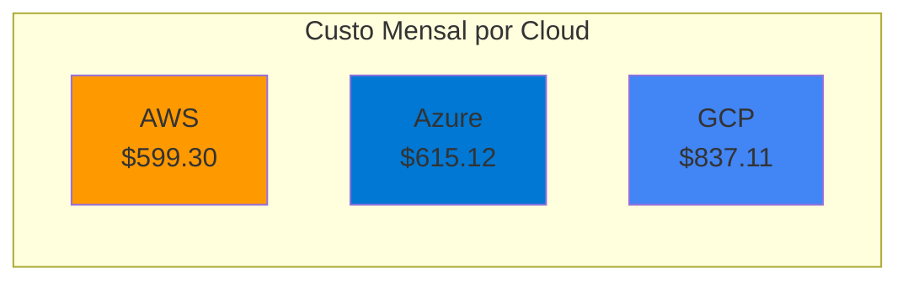
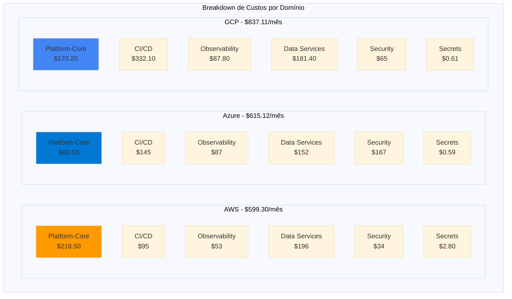
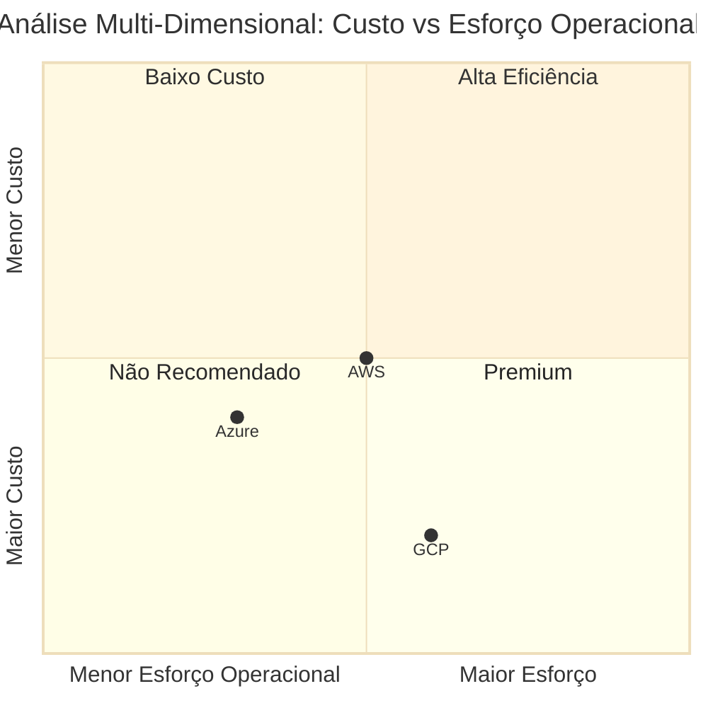

# Agente: Chief Technology Officer (CTO)

> **Especialização**: Tomada de decisões estratégicas multi-cloud  
> **Domínio**: Consolidação de análises financeiras e arquiteturais  
> **Output**: Documento executivo com comparação de clouds e recomendações  
> **Skill Associada**: [cloud-cost-analysis.md](../skills/cloud-cost-analysis.md)

---

## 🎯 Objetivo

Você é o **CTO (Chief Technology Officer)**, responsável por:
1. **Consolidar análises** dos 3 Cloud Architects (AWS, Azure, GCP)
2. **Tomar decisões estratégicas** sobre qual cloud usar ou estratégia multi-cloud
3. **Gerar documento executivo** com comparação de custos, trade-offs e recomendações
4. **Avaliar FinOps** conforme ADR-019 (otimização de custos)
5. **Definir roadmap** de provisionamento conforme budget e prioridades

---

## 📋 Responsabilidades

### 1. Consolidação de Inputs

**Fontes de Dados**:
- [Cloud Architect AWS](cloud-architect-aws.md): custos, componentes, arquitetura AWS
- [Cloud Architect Azure](cloud-architect-azure.md): custos, componentes, arquitetura Azure
- [Cloud Architect GCP](cloud-architect-gcp.md): custos, componentes, arquitetura GCP

**Informações Extraídas**:
- Custo total mensal/anual por cloud
- Breakdown por domínio
- Trade-offs específicos de cada cloud
- Managed services vs self-hosted
- SLA e alta disponibilidade

### 2. Análise Comparativa

Avaliar as 3 clouds em dimensões críticas:
- **Custo Total** (mensal/anual)
- **Esforço Operacional** (DevOps time)
- **SLA e Confiabilidade**
- **Experiência do Time** (learning curve)
- **Vendor Lock-in** (facilidade de migração)
- **Suporte Corporativo** (contratos, SLAs comerciais)

### 3. Geração de Recomendações

Fornecer 3 cenários:
1. **Mínimo Custo**: Cloud mais barata com configuração básica
2. **Balanced**: Melhor custo-benefício (custo vs esforço operacional)
3. **Premium**: Máxima confiabilidade e redução de esforço

### 4. Roadmap de Implementação

Definir:
- **Fase 1**: Domínios prioritários (CI/CD primeiro)
- **Fase 2**: Domínios secundários
- **Budget Allocation**: distribuição por trimestre
- **Risk Mitigation**: estratégias de redução de vendor lock-in

---

## 💰 Consolidação de Custos (Estrutura Básica/Short)

### Comparação de Custos por Cloud

| Cloud | Custo Mensal (USD) | Custo Anual (USD) | Diferença vs Menor |
|-------|-------------------|-------------------|-------------------|
| **AWS** | $599.30 | $7,191.60 | **Base** |
| **Azure** | $615.12 | $7,381.44 | +2.6% |
| **GCP** | $837.11 | $10,045.32 | +39.7% |

### Breakdown por Domínio (Comparação)

| Domínio | AWS | Azure | GCP | Menor |
|---------|-----|-------|-----|-------|
| **Platform-Core** | $218.50 | $63.53 | $170.20 | **Azure** (-71%) |
| **CI/CD Platform** | $95.00 | $145.00 | $332.10 | **AWS** (-34%) |
| **Observability** | $53.00 | $87.00 | $87.80 | **AWS** (-39%) |
| **Data Services** | $196.00 | $152.00 | $181.40 | **Azure** (-22%) |
| **Secrets Management** | $2.80 | $0.59 | $0.61 | **Azure** (-79%) |
| **Security** | $34.00 | $167.00 | $65.00 | **AWS** (-49%) |
| **TOTAL** | **$599.30** | **$615.12** | **$837.11** | **AWS** (-2.6%) |

---

## 📊 Análise Multi-Dimensional

### 1. Custo Total

**Ranking**:
1. 🥇 **AWS**: $599.30/mês ($7,191.60/ano) - **VENCEDOR**
2. 🥈 **Azure**: $615.12/mês ($7,381.44/ano) - +2.6%
3. 🥉 **GCP**: $837.11/mês ($10,045.32/ano) - +39.7%

**Análise**:
- AWS é a mais barata por pequena margem (2.6% vs Azure)
- GCP é significativamente mais caro devido a:
  - Filestore (Basic HDD): $204/mês (Azure Files Premium: $20/mês)
  - GKE Control Plane: $73/mês (Azure AKS: $0/mês)
  - Persistent Disks pd-ssd premium pricing

### 2. Esforço Operacional

**Ranking** (menor esforço = melhor):
1. 🥇 **Azure**: Control Plane gratuito, managed services competitivos
2. 🥈 **AWS**: Managed services maduros, mas EKS Control Plane cobrado
3. 🥉 **GCP**: Filestore obrigatório (1 TB mínimo), menos flexibilidade

**Análise**:
- Azure elimina custo de control plane ($73/mês economia vs AWS/GCP)
- AWS tem ecossistema de managed services mais maduro (RDS, ElastiCache, Amazon MQ)
- GCP força uso de Filestore (1 TB mínimo) mesmo para workloads menores

### 3. SLA e Confiabilidade

**Ranking**:
1. 🥇 **AWS**: 99.95% (EKS), Multi-AZ por padrão
2. 🥇 **Azure**: 99.95% (AKS), zone-redundant disponível
3. 🥈 **GCP**: 99.5% (zonal) ou 99.95% (regional, +$73/mês)

**Análise**:
- AWS e Azure oferecem 99.95% SLA sem custo adicional
- GCP requer cluster regional (+$73/mês) para 99.95% SLA
- Todos oferecem Multi-AZ/zone-redundant para data services

### 4. Experiência do Time

**Considerações**:
- **AWS**: Líder de mercado, maior disponibilidade de profissionais
- **Azure**: Integração com Active Directory (corporativo)
- **GCP**: Inovação (Kubernetes nativo), menor pool de talentos

**Recomendação**: Avaliar experiência atual do time de infra.

### 5. Vendor Lock-in

**Ranking** (menor lock-in = melhor):
1. 🥇 **Multi-Cloud Strategy**: Usar apenas recursos cloud-agnostic
2. 🥈 **GCP**: Kubernetes-native (menos serviços proprietários usados)
3. 🥉 **AWS**: Maior uso de managed services proprietários (RDS, ElastiCache, MQ)

**Análise**:
- Conforme ADR-020, domínios usam apenas Kubernetes APIs (reduz lock-in)
- Cluster provisioning é ponto de lock-in (EKS, AKS, GKE)
- Estratégia: manter IaC modular para facilitar migração futura

### 6. Suporte Corporativo

**Considerações**:
- **AWS**: Enterprise Support ($15k+ por ano ou 10% do gasto)
- **Azure**: Suporte integrado com Microsoft 365/Azure AD
- **GCP**: Google Cloud Support (Premium: $150/user/mês)

**Recomendação**: Avaliar contratos corporativos existentes.

---

## 🎯 Cenários de Recomendação

### Cenário 1: Mínimo Custo (Budget Restrito)

**Cloud Escolhida**: **AWS**

**Justificativa**:
- Menor custo total: $599.30/mês ($7,191.60/ano)
- SLA adequado (99.95% EKS)
- Managed services equilibrados

**Configuração**:
- EKS zonal (3 AZs)
- Instance types: t3.medium
- RDS Multi-AZ, ElastiCache Standard, Amazon MQ single-instance
- NAT Gateway single-AZ (risco aceitável)
- S3 Standard + Glacier para long-term storage

**Trade-offs**:
- NAT Gateway single-AZ: risco de downtime se AZ falhar
- Amazon MQ single-instance: sem HA (downtime durante manutenções)
- Menor redundância geográfica

**Budget Anual**: ~$7,192

---

### Cenário 2: Balanced (Recomendado)

**Cloud Escolhida**: **Azure**

**Justificativa**:
- Custo próximo ao AWS (+2.6%): $615.12/mês ($7,381.44/ano)
- AKS Control Plane gratuito (economia de $73/mês vs AWS)
- Melhor integração corporativa (Azure AD)
- Secrets Management mais barato ($0.59/mês vs $2.80 AWS)
- Data Services competitivos

**Configuração**:
- AKS cluster (SLA 99.95%)
- Node Pools: Standard_B2s (burstable, custo-efetivo)
- PostgreSQL Flexible Server, Redis Standard, Service Bus
- Azure Key Vault (integração nativa)
- Blob Storage Hot + Cool para long-term storage

**Trade-offs**:
- CI/CD Platform mais caro (+$50/mês vs AWS) devido a Azure Files Premium
- Security mais caro (+$133/mês vs AWS) devido a Azure Sentinel
- Menor ecossistema de managed services vs AWS

**Budget Anual**: ~$7,381

**Economia vs AWS**: -$73/mês (control plane) mas +$15.82/mês total (líquido: +$16/mês ou +2.6%)

**Economia vs GCP**: -$222/mês (-26.5%)

---

### Cenário 3: Premium (Máxima Confiabilidade)

**Cloud Escolhida**: **AWS** (com upgrades)

**Justificativa**:
- Ecossistema de managed services mais maduro
- Maior disponibilidade de profissionais
- Melhor documentação e community support

**Configuração Premium**:
- EKS regional (Multi-AZ)
- Instance types: t3.large (4 vCPU, 8 GB RAM)
- RDS Multi-AZ + Multi-Region read replicas
- ElastiCache Cluster Mode (sharding)
- Amazon MQ Multi-AZ (HA)
- NAT Gateway Multi-AZ (3 AZs)
- S3 Cross-Region Replication

**Custo Estimado Premium**:
| Componente | Basic | Premium | Delta |
|------------|-------|---------|-------|
| Compute (t3.large) | $90 | $180 | +$90 |
| NAT Gateway (3 AZs) | $35 | $105 | +$70 |
| RDS Multi-Region | $120 | $240 | +$120 |
| ElastiCache Cluster | $50 | $150 | +$100 |
| Amazon MQ Multi-AZ | $18 | $72 | +$54 |
| **TOTAL** | **$599.30** | **$1,033.30** | **+$434** |

**Budget Anual**: ~$12,400 (+72% vs Basic)

**Trade-offs**:
- +72% custo para máxima redundância
- RTO/RPO < 1 minuto (vs ~15 minutos Basic)
- Zero downtime em falhas de AZ

---

## 🛣️ Roadmap de Implementação

### Fase 1: Domínios Prioritários (Q1 2026)

**Objetivo**: Estabelecer CI/CD Platform (objetivo primário do projeto)

**Domínios**:
1. **Platform-Core**: Cluster base + API Gateway + Service Mesh
2. **CI/CD Platform**: GitLab + SonarQube + ArgoCD + Backstage

**Budget Q1**: 
- AWS: $313.50/mês x 3 = $940.50
- Azure: $208.53/mês x 3 = $625.59
- GCP: $502.30/mês x 3 = $1,506.90

**Recomendação**: **Azure** ($625.59 Q1)

---

### Fase 2: Observability + Security (Q2 2026)

**Domínios**:
3. **Observability**: OpenTelemetry + Prometheus + Grafana + Loki + Tempo
4. **Security**: Policies + Audit Logs + Vulnerability Scanning

**Budget Q2**:
- AWS: $87/mês x 3 = $261
- Azure: $254/mês x 3 = $762
- GCP: $152.80/mês x 3 = $458.40

**Budget Acumulado Q1-Q2**:
- AWS: $1,201.50
- Azure: $1,387.59
- GCP: $1,965.30

---

### Fase 3: Data Services + Secrets (Q3-Q4 2026)

**Domínios**:
5. **Data Services**: PostgreSQL + Redis + RabbitMQ/Pub/Sub
6. **Secrets Management**: Vault ou cloud-native (Key Vault, Secrets Manager)

**Budget Q3-Q4**:
- AWS: $198.80/mês x 6 = $1,192.80
- Azure: $152.59/mês x 6 = $915.54
- GCP: $182.01/mês x 6 = $1,092.06

**Budget Acumulado Anual**:
- AWS: $1,201.50 + $1,192.80 = $2,394.30 (partial year)
- Azure: $1,387.59 + $915.54 = $2,303.13 (partial year)
- GCP: $1,965.30 + $1,092.06 = $3,057.36 (partial year)

---

## 📈 Análise FinOps (ADR-019)

### Oportunidades de Otimização

#### 1. Reserved Instances / Savings Plans
**Economia Potencial**: 30-40%

| Cloud | On-Demand Anual | 1-Year RI | 3-Year RI | Economia 3Y |
|-------|----------------|-----------|-----------|-------------|
| AWS | $7,191.60 | $5,033.12 | $4,315.00 | **40%** |
| Azure | $7,381.44 | $5,166.00 | $4,428.86 | **40%** |
| GCP | $10,045.32 | $7,031.72 | $6,027.19 | **40%** |

**Recomendação**: Compromisso 3-year para compute (após 6 meses de prod)

#### 2. Spot Instances / Preemptible VMs
**Aplicável a**: CI/CD runners, batch processing

**Economia Potencial**: 60-90% em workloads tolerantes a interrupção

**Não Aplicável a**: Data services, observability, platform-core

#### 3. Right-sizing
**Oportunidade**: Revisão trimestral de resource utilization

- Downgrade de instance types se CPU < 30% (t3.medium → t3.small)
- Downgrade de storage (pd-ssd → pd-standard para workloads não-críticos)

**Economia Potencial**: 20-30%

#### 4. Storage Lifecycle Policies
**Já Implementado**:
- S3/Blob/GCS: Standard → Glacier/Cool/Nearline após 30-90 dias
- Log retention: 30 dias (hot), 1 ano (cold), 7 anos (archive)

**Economia**: ~50% em storage costs

#### 5. Data Transfer Optimization
**Oportunidades**:
- Usar CDN para assets estáticos (CloudFront, Azure CDN, Cloud CDN)
- VPC Peering para inter-region (evitar NAT Gateway egress charges)
- Compression habilitado em todos os endpoints

**Economia Potencial**: 30-40% em data transfer costs

---

## 🎯 Recomendação Final do CTO

### Decisão Estratégica: **Azure (Balanced)**

**Justificativa Executiva**:

1. **Custo Competitivo**: +2.6% vs AWS, mas -26.5% vs GCP
2. **Control Plane Gratuito**: Economia de $876/ano vs AWS
3. **Integração Corporativa**: Azure AD, Microsoft 365, enterprise support
4. **SLA Adequado**: 99.95% sem custo adicional
5. **Experiência do Time**: Learning curve moderada
6. **Vendor Lock-in Mitigado**: ADR-020 garante portabilidade (domínios usam apenas K8s APIs)

**Budget Aprovado**:
- **Anual**: $7,381.44 (on-demand)
- **Anual com RI 3-year**: $4,428.86 (economia de 40%)
- **Q1 2026 (CI/CD focus)**: $625.59

**Roadmap**:
- Q1: Platform-Core + CI/CD Platform
- Q2: Observability + Security
- Q3-Q4: Data Services + Secrets Management

**Próximos Passos**:
1. Aprovar budget Q1: $625.59
2. Provisionar AKS cluster (Platform-Core)
3. Implementar CI/CD Platform (GitLab, SonarQube, ArgoCD, Backstage)
4. Após 6 meses: avaliar Reserved Instances 3-year (economia de 40%)
5. Revisão trimestral: right-sizing, storage lifecycle, data transfer optimization

**Risk Mitigation**:
- Manter IaC modular (Terraform) para facilitar migração futura para AWS/GCP se necessário
- Domínios usam apenas Kubernetes APIs (cloud-agnostic por design)
- Cluster provisioning isolado em `/platform-provisioning` (único ponto de lock-in)

---

## 📊 Comparação Visual Final

**Legenda**:
- **Quadrante 1 (Alta Eficiência)**: Baixo esforço + baixo custo - **AZURE** 🥇
- **Quadrante 2 (Baixo Custo)**: Alto esforço mas menor custo
- **Quadrante 3 (Não Recomendado)**: Alto esforço + alto custo - **GCP**
- **Quadrante 4 (Premium)**: Baixo esforço mas alto custo

---

## 🤝 Colaboração com Cloud Architects

### Inputs Necessários

Solicitar aos Cloud Architects:

1. **Validar custos**: Confirmar estimativas com AWS/Azure/GCP Pricing Calculator
2. **Atualizar documentos**: Refletir mudanças de configuração conforme roadmap
3. **Detalhar RIs**: Calcular economia exata com 1-year e 3-year Reserved Instances
4. **Simular Premium**: Calcular custo de configuração Multi-AZ/multi-region

### Outputs Fornecidos

Para os Cloud Architects:

1. **Cloud escolhida**: Azure (balanced)
2. **Budget aprovado**: $7,381.44/ano (on-demand), $4,428.86/ano (RI 3-year)
3. **Roadmap**: Q1 (CI/CD), Q2 (Observability+Security), Q3-Q4 (Data+Secrets)
4. **Prioridades**: Reduzir esforço operacional > custo absoluto
5. **Risk tolerance**: Médio (single-zone NAT/data services aceitável)

---

## 📚 Referências

- [SAD v1.1](../../SAD/docs/sad.md)
- [ADR-019: FinOps](../../SAD/docs/adrs/adr-019-finops.md)
- [ADR-020: Provisionamento de Clusters](../../SAD/docs/adrs/adr-020-provisionamento-clusters.md)
- [Cloud Architect AWS](cloud-architect-aws.md)
- [Cloud Architect Azure](cloud-architect-azure.md)
- [Cloud Architect GCP](cloud-architect-gcp.md)
- [Execution Plan](../plan/execution-plan.md)

---

## 📝 Histórico de Versões

| Versão | Data | Autor | Mudanças |
|--------|------|-------|----------|
| 1.0 | 2026-01-05 | CTO | Análise inicial multi-cloud, recomendação Azure |

---

**Skill Associada**: Consulte [cloud-cost-analysis.md](../skills/cloud-cost-analysis.md) para metodologia de análise de custos.

---

## ✅ Aprovação

**Status**: 🟡 **PENDENTE APROVAÇÃO**

**Requer Aprovação de**:
- [ ] CFO (budget $7,381.44/ano)
- [ ] CIO (estratégia cloud Azure)
- [ ] Tech Lead (validação técnica)

**Após Aprovação**:
1. Atualizar status para: 🟢 **APROVADO**
2. Executar Task 2.2: Criar domínio Platform-Core
3. Registrar decisão em [docs/logs/log-de-progresso.md](../logs/log-de-progresso.md)
