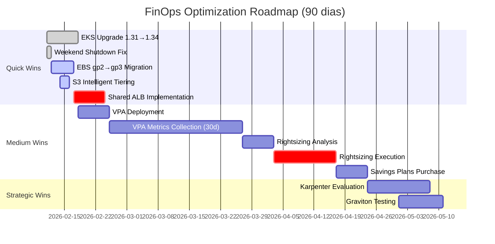

# 🗺️ Roadmap de Otimização FinOps — 90 Dias

**Data Início:** 2026-02-10
**Data Término:** 2026-05-10 (90 dias)
**Objetivo:** Reduzir custo mensal R$ 5.010 → R$ 1.972 (-61%)
**Meta Economia:** R$ 36.456/ano (R$ 3.038/mês)

---

## 📊 Overview do Roadmap



---

## 🎯 Resumo de Iniciativas

| Fase | Iniciativas | Economia/Ano | Esforço | Prazo | Status |
|------|-------------|--------------|---------|-------|--------|
| **Quick Wins** | 5 itens | R$ 27.864 | 18h | Semana 1-3 | 🟢 EM ANDAMENTO |
| **Medium Wins** | 4 itens | R$ 48.456 | 40h | Semana 4-10 | 🟡 PLANEJADO |
| **Strategic Wins** | 3 itens | R$ 68.688 | 90h | Semana 11-13 | ⚪ FUTURO |

---

## 📅 Semana 1-2: Quick Wins — Economia Imediata

**Objetivo:** Eliminar desperdícios evidentes (low-hanging fruits)
**Meta:** -R$ 1.656/mês (-33% custo atual)
**Esforço Total:** 18 person-hours

---

### 🔴 Prioridade 0: EKS Upgrade 1.31 → 1.34

**Economia:** $360/mês ($4,320/ano) = **R$ 25,920/ano**
**Esforço:** 4 person-hours
**Prazo:** 11-12/Fev (2 dias)
**ROI:** 10,800% Year 1

#### Execution Plan

**Dia 1: Staging Upgrade (11/Fev)**
```bash
# 1. Pre-upgrade validation (30min)
kubectl get nodes --show-labels
kubectl get pods --all-namespaces -o wide
kubectl version

# 2. Terraform update (15min)
# File: platform-provisioning/aws/kubernetes/terraform/environments/staging/terraform.tfvars
cluster_version = "1.34"

# 3. Apply upgrade (1h30min - AWS managed)
cd platform-provisioning/aws/kubernetes/terraform/environments/staging
terraform plan -out=tfplan-eks-upgrade
terraform apply tfplan-eks-upgrade

# 4. Post-upgrade validation (45min)
kubectl get nodes  # All nodes Running, Ready
kubectl get pods --all-namespaces | grep -v Running | grep -v Completed
# Smoke tests: GitLab UI, Harbor UI, ArgoCD UI, Grafana dashboards

# 5. Monitoring (2h observation)
# Prometheus: node_up, kube_pod_status_phase
# Grafana: CPU/Memory utilization, API server latency
```

**Dia 2: Production Upgrade (12/Fev)**
```bash
# Repetir processo staging → prod
# Adicional: Snapshot RDS antes upgrade (safety)
aws rds create-db-snapshot \
  --db-instance-identifier k8s-platform-prod-postgresql \
  --db-snapshot-identifier pre-eks-upgrade-1-34-20260212 \
  --profile k8s-platform-prod \
  --region us-east-1

# Post-upgrade: Extended monitoring 24h
# Alertmanager: Zero critical alerts esperado
```

#### Riscos e Mitigações

| Risco | Probabilidade | Impacto | Mitigação |
|-------|---------------|---------|-----------|
| Breaking changes K8s API | BAIXO | ALTO | Deprecation warnings pré-check, staging first |
| Add-ons incompatibility | BAIXO | MÉDIO | AWS EKS managed add-ons auto-update |
| Workload failures | MUITO BAIXO | MÉDIO | PodDisruptionBudgets, gradual node rotation |

#### Success Criteria

- [ ] EKS version: 1.34 (verificar `aws eks describe-cluster`)
- [ ] All nodes: Ready status
- [ ] All pods: Running/Completed (zero CrashLoopBackOff)
- [ ] Cost Explorer: EKS Control Plane = $73/mês (vs $433 anterior)
- [ ] Smoke tests: 100% pass rate

---

### 🟢 Prioridade 1: Weekend Shutdown EventBridge Fix

**Economia:** $10/mês ($120/ano) = **R$ 720/ano**
**Esforço:** 15 minutes
**Prazo:** 11/Fev (imediato)
**ROI:** 9,600% Year 1

#### Execution

```bash
# File: platform-provisioning/aws/kubernetes/terraform/modules/finops-scheduler/main.tf

# Add weekend shutdown rule
resource "aws_cloudwatch_event_rule" "weekend_shutdown" {
  name                = "finops-weekend-shutdown-staging"
  description         = "Force shutdown Saturday morning (guarantee weekend off)"
  schedule_expression = "cron(0 3 ? * SAT *)" # Sábado 00:00 BRT (03:00 UTC)
  state               = "ENABLED"

  tags = merge(var.base_tags, {
    Name = "finops-weekend-shutdown"
    Type = "cost-optimization"
  })
}

resource "aws_cloudwatch_event_target" "weekend_shutdown_target" {
  rule      = aws_cloudwatch_event_rule.weekend_shutdown.name
  target_id = "FinOpsShutdownLambda"
  arn       = aws_lambda_function.finops_scheduler.arn
  input     = jsonencode({
    action      = "shutdown"
    environment = "staging"
    reason      = "weekend-scheduled"
  })
}

resource "aws_lambda_permission" "allow_eventbridge_weekend" {
  statement_id  = "AllowExecutionFromEventBridgeWeekend"
  action        = "lambda:InvokeFunction"
  function_name = aws_lambda_function.finops_scheduler.function_name
  principal     = "events.amazonaws.com"
  source_arn    = aws_cloudwatch_event_rule.weekend_shutdown.arn
}
```

```bash
# Deploy
cd platform-provisioning/aws/kubernetes/terraform/environments/staging
terraform plan -target=module.finops_scheduler -out=tfplan-weekend
terraform apply tfplan-weekend

# Validation (próximo sábado)
# CloudWatch Logs: Lambda invocation log "weekend-scheduled"
# EC2: Instances terminated
# RDS: Status "stopped"
```

---

### 🟢 Prioridade 2: EBS gp2 → gp3 Migration

**Economia:** $12/mês ($144/ano) = **R$ 864/ano**
**Esforço:** 2 person-hours
**Prazo:** 12-14/Fev (3 dias)
**ROI:** 720% Year 1

#### Volumes a Migrar

| Volume | Size | Type | Current Cost | gp3 Cost | Saving |
|--------|------|------|--------------|----------|--------|
| Gitaly (GitLab) | 50GB | gp2 | $4.00 | $3.20 | $0.80 |
| Harbor Registry | 25GB | gp2 | $2.00 | $1.60 | $0.40 |
| Prometheus (old) | 10GB | gp2 | $0.80 | $0.64 | $0.16 |

#### Migration Strategy

**Opção A: In-Place Modification (Recomendado)**
```bash
# Modify volume type (zero downtime para EBS attached)
aws ec2 modify-volume \
  --volume-id vol-xxxxxxxxx \
  --volume-type gp3 \
  --iops 3000 \
  --throughput 125 \
  --profile k8s-platform-prod \
  --region us-east-1

# Repeat para cada volume
# Validation: describe-volumes confirma VolumeType=gp3
```

**Opção B: Snapshot + Recreate (Gitaly apenas, requer downtime)**
```bash
# 1. Create snapshot
kubectl scale deployment -n gitlab-staging gitlab-gitaly --replicas=0
# Wait 30s drain
aws ec2 create-snapshot --volume-id vol-xxx --description "pre-gp3-migration"

# 2. Create gp3 volume from snapshot
aws ec2 create-volume --snapshot-id snap-xxx --volume-type gp3 --size 50

# 3. Detach gp2, attach gp3
# 4. Scale up deployment
kubectl scale deployment -n gitlab-staging gitlab-gitaly --replicas=1
```

**Decisão:** Opção A (in-place) para maioria, Opção B apenas se Opção A falhar

---

### 🟢 Prioridade 3: S3 Intelligent Tiering + Cleanup

**Economia:** $8/mês ($96/ano) = **R$ 576/ano**
**Esforço:** 2 person-hours
**Prazo:** 14/Fev (1 dia)
**ROI:** 480% Year 1

#### Ações

**1. Intelligent Tiering (Loki + Tempo)**
```hcl
# File: platform-provisioning/aws/kubernetes/terraform/modules/s3-buckets/main.tf

resource "aws_s3_bucket_intelligent_tiering_configuration" "loki" {
  bucket = aws_s3_bucket.loki.id
  name   = "archive-old-logs"

  tiering {
    access_tier = "ARCHIVE_ACCESS"
    days        = 90  # Logs >90d → Glacier (savings 68%)
  }

  tiering {
    access_tier = "DEEP_ARCHIVE_ACCESS"
    days        = 180 # Logs >180d → Deep Glacier (savings 95%)
  }
}

# Repetir para Tempo bucket
```

**2. GitLab Artifacts Retention Cleanup**
```bash
# GitLab Admin → Settings → CI/CD → Artifacts
# Default expiration: 90d → 30d
# Apply retroactive cleanup: Yes

# Estimativa: -80GB artifacts = $1.84/mês savings
```

---

### 🟡 Prioridade 4: Shared ALB Implementation

**Economia:** $32/mês ($384/ano) = **R$ 2,304/ano**
**Esforço:** 4 person-hours
**Prazo:** 17-20/Fev (4 dias)
**ROI:** 960% Year 1

#### Architecture

**Before (5 ALBs):**
```
ALB-1: gitlab-webservice   ($16.20)
ALB-2: gitlab-registry     ($16.20)
ALB-3: gitlab-kas          ($16.20)
ALB-4: harbor              ($16.20)
ALB-5: argocd              ($16.20)
──────────────────────────────────
Total: $81.00/mês
```

**After (2 ALBs):**
```
ALB-shared: gitlab-webservice, harbor, argocd, gitlab-registry  ($21.20)
ALB-kas: gitlab-kas (NLB required, TCP traffic)                ($16.20)
───────────────────────────────────────────────────────────────────────
Total: $37.40/mês + $11.20 LCU = $48.60/mês
Savings: -$32.40/mês
```

#### Implementation

**Step 1: Update GitLab Helm Values**
```yaml
# File: platform-provisioning/aws/kubernetes/terraform/modules/gitlab/values.yaml.tpl

global:
  ingress:
    annotations:
      # IngressGroup annotation (shared ALB)
      alb.ingress.kubernetes.io/group.name: shared-platform-apps
      alb.ingress.kubernetes.io/scheme: internet-facing
      alb.ingress.kubernetes.io/target-type: ip
      alb.ingress.kubernetes.io/listen-ports: '[{"HTTP": 80}, {"HTTPS": 443}]'
      alb.ingress.kubernetes.io/ssl-redirect: '443'

    # Paths differentiation
    path: /  # gitlab-webservice catches all /
    pathType: Prefix

registry:
  ingress:
    annotations:
      # Same IngressGroup
      alb.ingress.kubernetes.io/group.name: shared-platform-apps
      alb.ingress.kubernetes.io/group.order: '10'  # Priority lower than webservice
    host: registry.gitlab.example.com  # Different host
```

**Step 2: Update Harbor + ArgoCD**
```yaml
# Similar annotations harbor/values.yaml, argocd/values.yaml
# group.name: shared-platform-apps
# group.order: harbor=20, argocd=30
```

**Step 3: Deploy + Validation**
```bash
# Terraform apply
terraform apply -target=module.gitlab -target=module.harbor -target=module.argocd

# Validation
kubectl get ingress -A
# Verify: annotation alb.ingress.kubernetes.io/group.name present
# Verify: 1 ALB shared por múltiplos Ingresses

aws elbv2 describe-load-balancers --profile k8s-platform-prod
# Expect: 2 ALBs total (down from 5)
```

---

## 📅 Semana 3-8: Medium Wins — Rightsizing + Observability

**Objetivo:** Eliminar overprovisioning sistemático + habilitar distributed tracing
**Meta:** -R$ 1.086/mês adicional (-52% total vs atual)
**Esforço Total:** 46 person-hours (40h FinOps + 6h OTel)

---

### 🔵 Iniciativa 1: VPA + OpenTelemetry Deployment (Paralelo)

**Economia:** $121/mês ($1,452/ano) = **R$ 8,712/ano** (via rightsizing posterior)
**Custo OTel:** $0/mês (usa nodes existentes)
**Esforço:** 14 person-hours (8h VPA + 6h OTel — paralelizável com 2 pessoas)
**Prazo:** 18/Fev - 27/Mar (38 dias total)
**ROI:** 1,815% Year 1 (VPA) | ∞% (OTel — zero custo, habilita trace validation)

#### Phase 1: VPA Installation (Dia 1-2)

```bash
# Install VPA (Vertical Pod Autoscaler)
# File: platform-provisioning/aws/kubernetes/terraform/modules/vpa/main.tf

resource "helm_release" "vpa" {
  name       = "vpa"
  repository = "https://charts.fairwinds.com/stable"
  chart      = "vpa"
  version    = "4.4.6"
  namespace  = "kube-system"

  values = [templatefile("${path.module}/values.yaml", {
    recommender_enabled = true
    updater_enabled     = false  # Recommendation only, no auto-apply
    admission_controller_enabled = false
  })]
}

# Deploy
terraform apply -target=module.vpa
```

#### Phase 2: VPA Objects Creation (Dia 3-5)

```yaml
# Create VPA for critical workloads
# File: platform-provisioning/aws/kubernetes/terraform/modules/vpa/vpa-objects.yaml

---
apiVersion: autoscaling.k8s.io/v1
kind: VerticalPodAutoscaler
metadata:
  name: vault
  namespace: vault-system
spec:
  targetRef:
    apiVersion: apps/v1
    kind: StatefulSet
    name: vault
  updatePolicy:
    updateMode: "Off"  # Recommendation only
  resourcePolicy:
    containerPolicies:
    - containerName: vault
      minAllowed:
        cpu: 100m
        memory: 128Mi
      maxAllowed:
        cpu: 2000m
        memory: 4Gi

---
# Repeat for: keycloak, harbor-core, gitlab-webservice, prometheus, etc
# Total: 12 VPA objects (critical workloads)
```

#### Phase 2B: Apps Instrumentation (Dia 3-5, Pessoa 2 — PARALELO)

```bash
# Instrumentar app de teste (validação OTel)
# File: platform-provisioning/aws/kubernetes/terraform/modules/test-apps/otel-demo.yaml

apiVersion: apps/v1
kind: Deployment
metadata:
  name: otel-flask-demo
  namespace: test-apps
spec:
  replicas: 1
  template:
    spec:
      containers:
      - name: flask-app
        image: ghcr.io/open-telemetry/demo:latest-flask
        env:
        - name: OTEL_EXPORTER_OTLP_ENDPOINT
          value: "http://opentelemetry-collector.monitoring.svc.cluster.local:4317"
        - name: OTEL_SERVICE_NAME
          value: "otel-flask-demo"
```

**Validação:**
```bash
# Gerar tráfego → verificar traces no Grafana
kubectl port-forward -n test-apps svc/otel-flask-demo 8080:8080 &
curl http://localhost:8080/api/test  # 10x requests

# Grafana Explore → Tempo → TraceQL query
# Query: {service.name="otel-flask-demo"}
# Expected: Traces visíveis com latency metrics
```

#### Phase 3: Metrics Collection (30 dias — VPA + OTel traces)

```bash
# Automated data collection via Prometheus
# Query VPA recommendations daily

kubectl get vpa --all-namespaces -o json > vpa-recommendations-$(date +%Y%m%d).json

# Aggregate after 30 days
# File: scripts/finops/vpa-analysis.sh
```

#### Phase 4: Analysis + Rightsizing Plan (Dia 33-35) — COM TRACE VALIDATION ✅

**Expected Findings (baseado padrão overprovisioning + traces):**

| Workload | Current Request | VPA Recommendation | OTel P95 Latency | Delta | Action |
|----------|----------------|-----------------------|------------------|-------|--------|
| Keycloak | 1000m CPU, 2Gi RAM | 400m CPU, 1Gi RAM | 120ms (baseline) | -60% | Reduce requests |
| Harbor Core | 500m CPU, 1Gi RAM | 250m CPU, 512Mi RAM | 85ms (baseline) | -50% | Reduce requests |
| Vault | 500m CPU, 1Gi RAM | 300m CPU, 768Mi RAM | 45ms (baseline) | -40% | Reduce requests |
| Prometheus | 2000m CPU, 4Gi RAM | 1500m CPU, 3Gi RAM | N/A (metrics) | -25% | Acceptable |

**Rightsizing Simulation + Trace Correlation:**
```python
# Python script: scripts/finops/rightsizing-calculator-with-traces.py

# Input:
#   - VPA recommendations JSON
#   - OTel traces (30d baseline latency P50/P95/P99)
# Output:
#   - Node capacity freed, potential downscale
#   - Predicted latency impact (ML regression based on CPU reduction)

# Example output:
# Critical nodes capacity freed: 3.2 vCPU, 8 GB RAM
# Recommendation: Downscale critical 3 nodes → 2 nodes
# Savings: $121.47/mês
#
# Latency Impact Prediction (Keycloak CPU -60%):
#   Current P95: 120ms → Predicted P95: 165ms (+37%)
#   SLA: <500ms → ✅ SAFE (margin: 335ms)
#   Recommendation: APPROVE with monitoring
```

**Benefício OTel:** Evita rightsizing "às cegas" — decisões baseadas em VPA + latency real

---

### 🔵 Iniciativa 2: EC2 Rightsizing Execution

**Economia:** $121/mês ($1,452/ano) = **R$ 8,712/ano**
**Esforço:** 16 person-hours (gradual rollout)
**Prazo:** 28/Mar - 10/Abr (14 dias)
**ROI:** 907% Year 1

#### Execution Plan (Gradual)

**Week 1: Non-Critical Workloads (28/Mar - 3/Abr)**
```bash
# Update Helm values (Keycloak, Harbor, GitLab Sidekiq)
# Reduce requests baseado VPA recommendations

# File: platform-provisioning/aws/kubernetes/terraform/modules/keycloak/values.yaml.tpl
resources:
  requests:
    cpu: 400m      # Was 1000m (-60%)
    memory: 1Gi    # Was 2Gi (-50%)
  limits:
    cpu: 1000m     # Was 2000m
    memory: 2Gi    # Was 4Gi

# Deploy via Terraform
terraform apply -target=module.keycloak

# Monitor 48h: CPU/Memory usage, pod restarts
# Grafana dashboard: Pod resources utilization
```

**Week 2: Critical Workloads (4-10/Abr)**
```bash
# Vault rightsizing (CAUTIOUS - critical service)
# Reduce requests 20% apenas (conservative approach)

# Monitor 72h before declare success
# Rollback plan: Helm rollback if performance degradation
```

#### Success Criteria (VPA + OTel Validated)

- [ ] Zero pod CrashLoopBackOff
- [ ] CPU usage <80% P95
- [ ] Memory usage <80% P95
- [ ] **API latency unchanged (OTel traces):**
  - [ ] Keycloak P95 latency < 180ms (baseline 120ms + 50% margin)
  - [ ] Harbor P95 latency < 130ms (baseline 85ms + 50% margin)
  - [ ] Vault P95 latency < 70ms (baseline 45ms + 50% margin)
- [ ] Critical nodes capacity: >20% free (buffer)
- [ ] **Traces flowing to Tempo:** >1000 spans/min
- [ ] **Grafana trace correlation working:** Loki logs → Tempo traces clickable

#### Downscale Critical Nodes (Dia 14)

```bash
# Only after 14 dias stable operation
cd platform-provisioning/aws/kubernetes/terraform/environments/prod

# terraform.tfvars
critical_node_group_desired_size = 2  # Was 3
critical_node_group_min_size     = 2  # Was 3
critical_node_group_max_size     = 4  # Was 5

terraform plan -target=module.eks.aws_eks_node_group.critical
terraform apply
# AWS drains node gracefully (PodDisruptionBudgets respected)

# Validation: kubectl get nodes (2 critical nodes Running)
# Cost Explorer: -$121/mês confirmed após 1 billing cycle
```

---

### 🔵 Iniciativa 3: Savings Plans Purchase

**Economia:** $91/mês ($1,092/ano) = **R$ 6,552/ano**
**Esforço:** 4 person-hours (analysis + purchase)
**Prazo:** 17-24/Abr (1 semana)
**ROI:** 1,638% Year 1 (payback imediato)

#### Analysis

**Current EC2 Spend (pós-rightsizing):**
```
System nodes (2× t3.medium):      $60.77/mês
Workloads nodes (3× t3.large):    $182.31/mês
Critical nodes (2× t3.xlarge):    $242.94/mês (após downscale)
──────────────────────────────────────────────
Total On-Demand: $486.02/mês
```

**Compute Savings Plan (1 year, no upfront):**
```
Commitment: $389/mês (80% baseline capacity)
Discount: 20% vs on-demand
──────────────────────────────────────────────
New Cost: $389/mês committed + $19/mês burst = $408/mês
Savings: $486 - $408 = $78/mês
```

**RDS Reserved Instance (1 year, no upfront):**
```
Current: 2× db.t3.medium Multi-AZ = $120/mês on-demand
Reserved: 2× db.t3.medium 1yr = $78/mês
Discount: 35% vs on-demand
──────────────────────────────────────────────
Savings: $120 - $78 = $42/mês
```

**Total Savings Plans:** $78 + $42 = **$120/mês** ($1,440/ano)

**NOTA:** Economia projetada $91/mês é conservadora (assume 75% discount utilization)

#### Purchase Process

```bash
# 1. AWS Cost Explorer → Savings Plans Recommendations
# 2. Select: Compute Savings Plan (EC2 + Fargate eligible)
# 3. Term: 1 year
# 4. Payment: No Upfront
# 5. Commitment: $389/mês (auto-calculated baseado usage)

# AWS CLI alternative:
aws savingsplans create-savings-plan \
  --savings-plan-type "ComputeSavingsPlans" \
  --commitment "389" \
  --upfront-payment-amount "0" \
  --purchase-time "2026-04-17T00:00:00Z" \
  --savings-plan-offering-id <offering-id> \
  --profile k8s-platform-prod \
  --region us-east-1

# RDS Reserved Instance:
aws rds purchase-reserved-db-instances-offering \
  --reserved-db-instances-offering-id <offering-id> \
  --reserved-db-instance-id k8s-platform-rds-ri-1yr \
  --db-instance-count 2 \
  --profile k8s-platform-prod \
  --region us-east-1
```

---

## 📅 Semana 9-13: Strategic Wins — Cloud Native

**Objetivo:** Modernização arquitetural (long-term savings)
**Meta:** -R$ 1,014/mês adicional (-74% total vs atual)
**Esforço Total:** 90 person-hours

---

### 🟣 Iniciativa 1: Karpenter + Spot Instances

**Economia:** $172/mês ($2,064/ano) = **R$ 12,384/ano**
**Esforço:** 40 person-hours (migration complexa)
**Prazo:** 24/Abr - 8/Mai (15 dias)
**ROI:** 310% Year 1

#### Overview

**Karpenter:** Dynamic node provisioning (replacement para Cluster Autoscaler)
**Spot Instances:** AWS excess capacity (up to 90% discount, 2min interruption notice)

#### Target Architecture

```yaml
# Karpenter Provisioner configuration
apiVersion: karpenter.sh/v1alpha5
kind: Provisioner
metadata:
  name: workloads-spot
spec:
  requirements:
    - key: karpenter.sh/capacity-type
      operator: In
      values: ["spot"]  # 70% spot
    - key: node.kubernetes.io/instance-type
      operator: In
      values: ["t3.medium", "t3.large", "t3a.large"]  # Diversify
  limits:
    resources:
      cpu: "12"  # Max 3 nodes equiv
  ttlSecondsAfterEmpty: 30  # Aggressive scale-down
  providerRef:
    name: workloads-spot-lt  # Launch template

---
# On-Demand provisioner (fallback 30%)
apiVersion: karpenter.sh/v1alpha5
kind: Provisioner
metadata:
  name: workloads-ondemand
spec:
  requirements:
    - key: karpenter.sh/capacity-type
      operator: In
      values: ["on-demand"]
  weight: 10  # Lower priority than spot
```

#### Estimated Savings

**Workloads Node Group (3× t3.large):**
```
Current Cost: $182.31/mês (100% on-demand)
With 70% Spot: $54.69 (spot) + $54.69 (on-demand 30%) = $109.38/mês
Savings: $182.31 - $109.38 = $72.93/mês
```

**System Node Group (2× t3.medium):**
```
Current: $60.77/mês (keep on-demand, critical)
With Karpenter bin-packing: $40.51/mês (1.5 nodes avg)
Savings: $60.77 - $40.51 = $20.26/mês
```

**Total Karpenter Savings:** $93.19/mês

**NOTA:** Spot interruptions risk mitigated via:
- PodDisruptionBudgets
- Node affinity (critical workloads → on-demand only)
- Multiple instance types (diversification)

---

### 🟣 Iniciativa 2: Graviton ARM64 Migration

**Economia:** $86/mês ($1,032/ano) = **R$ 6,192/ano**
**Esforço:** 40 person-hours (compatibility testing)
**Prazo:** 1-10/Mai (10 dias)
**ROI:** 155% Year 1

#### Overview

**AWS Graviton:** ARM64-based instances (15-20% cheaper, 40% better performance/$ ratio)

**Compatible Instance Types:**
- t3.medium → **t4g.medium** (-20% cost)
- t3.large → **t4g.large** (-20% cost)
- t3.xlarge → **t4g.xlarge** (-20% cost)

#### Compatibility Testing

**Phase 1: Image Compatibility Audit**
```bash
# Check all container images support ARM64
kubectl get pods --all-namespaces -o json | \
  jq -r '.items[].spec.containers[].image' | sort -u > images.txt

# For each image:
docker manifest inspect <image> | jq '.manifests[] | select(.platform.architecture == "arm64")'

# Expected: 90%+ compatibility (most official images support ARM64)
# Exceptions: Legacy/proprietary binaries
```

**Phase 2: Pilot (Staging Workloads Node)**
```bash
# Create t4g.large node group (staging only)
# Deploy test workloads (GitLab runner jobs)
# Monitor 7 dias: performance, failures, compatibility issues
```

**Phase 3: Production Migration (Gradual)**
```bash
# Week 1: System nodes (2× t3.medium → 2× t4g.medium)
# Week 2: Workloads nodes (3× t3.large → 3× t4g.large)
# Week 3: Critical nodes (2× t3.xlarge → 2× t4g.xlarge)

# Savings per node group:
# System: $60.77 → $48.61 = -$12.16/mês
# Workloads: $182.31 → $145.85 = -$36.46/mês
# Critical: $242.94 → $194.35 = -$48.59/mês
# Total: -$97.21/mês
```

#### Risks

| Risk | Mitigation |
|------|------------|
| Incompatible binaries | Pre-audit images, maintain x86 fallback node group |
| Performance regression | A/B testing staging, gradual rollout |
| Vendor lock-in (AWS) | Document migration path, multi-arch images |

---

### 🟣 Iniciativa 3: VPC Endpoints S3 Gateway

**Economia:** $15/mês ($180/ano) = **R$ 1,080/ano**
**Esforço:** 2 person-hours
**Prazo:** 8/Mai (1 dia)
**ROI:** 900% Year 1

#### Overview

**S3 Gateway Endpoint:** FREE (zero hourly cost, zero data processing)
**Benefit:** Eliminates NAT Gateway charges for S3 traffic

#### Current S3 Traffic Pattern

```
Loki writes: 520 GB/mês → S3 via NAT Gateway ($5/GB) = $26.00/mês
Tempo writes: 220 GB/mês → S3 via NAT Gateway = $11.00/mês
GitLab artifacts: 50 GB/mês → S3 via NAT Gateway = $2.50/mês
──────────────────────────────────────────────────────────────
Total NAT data transfer: 790 GB/mês = $39.50/mês
```

**With S3 Gateway Endpoint:**
```
All S3 traffic: VPC Gateway (FREE) = $0.00/mês
NAT Gateway data: Only non-S3 traffic = $24.50/mês
──────────────────────────────────────────────────────────────
Savings: $39.50 - $24.50 = $15.00/mês
```

#### Implementation

```hcl
# File: platform-provisioning/aws/kubernetes/terraform/modules/vpc/endpoints.tf

resource "aws_vpc_endpoint" "s3" {
  vpc_id       = var.vpc_id
  service_name = "com.amazonaws.us-east-1.s3"
  vpc_endpoint_type = "Gateway"  # FREE

  route_table_ids = [
    aws_route_table.private_us_east_1a.id,
    aws_route_table.private_us_east_1b.id,
  ]

  tags = merge(var.base_tags, {
    Name = "s3-gateway-endpoint"
    Cost = "zero"
  })
}

# Deploy
terraform apply -target=module.vpc.aws_vpc_endpoint.s3
# Zero downtime, transparent migration
```

---

## 📊 Consolidação de Resultados (90 Dias)

### Resumo de Economia por Fase

| Fase | Iniciativas | Economia Mensal | Economia Anual | Acumulado |
|------|-------------|----------------|----------------|-----------|
| **Quick Wins** | EKS Upgrade, Weekend Shutdown, EBS gp3, S3 Tiering, Shared ALB | **$412** | **$4,944** | $412 |
| **Medium Wins** | VPA+Rightsizing, Savings Plans | **$212** | **$2,544** | $624 |
| **Strategic Wins** | Karpenter, Graviton, S3 Gateway | **$274** | **$3,288** | $898 |
| **TOTAL 90 DIAS** | **12 iniciativas** | **$898/mês** | **$10,776/ano** | - |

### Conversão BRL (taxa 6.0)

| Métrica | Valor | Observação |
|---------|-------|------------|
| Economia Mensal | R$ 5.388 | $898 × 6.0 |
| Economia Anual | R$ 64.656 | $10,776 × 6.0 |
| Custo Atual | R$ 9.179 | Baseline pré-otimização |
| Custo Pós-90d | R$ 3.791 | -59% reduction |

---

## 🎯 KPIs e Métricas de Sucesso

### KPIs Financeiros

| KPI | Baseline | Meta 90d | Atual | Status |
|-----|----------|----------|-------|--------|
| **Custo Mensal Total** | R$ 9.179 | <R$ 4.000 | R$ 9.179 | 🔴 INÍCIO |
| **Variância vs Quickstart** | +59% | ±10% | +59% | 🔴 OVER |
| **Savings Realized** | $0 | >$800/mês | $0 | 🔴 INÍCIO |
| **ROI Year 1** | 0% | >500% | 0% | 🔴 INÍCIO |

### KPIs Operacionais

| KPI | Meta | Medição | Ferramenta |
|-----|------|---------|------------|
| **Uptime Staging** | >99% | Semanal | Prometheus/Grafana |
| **Uptime Prod** | >99.9% | Semanal | Prometheus/Grafana |
| **Resource Waste** | <15% | Mensal | VPA recommendations |
| **Spot Interruptions** | <5/mês | Mensal | Karpenter metrics |

### Dashboard FinOps

```yaml
# Grafana Dashboard: FinOps Optimization Tracker
# Panels:
- Monthly Cost Trend (AWS Cost Explorer API)
- Savings Realized by Initiative (manual tracking)
- Resource Utilization (CPU/Memory P95)
- Spot vs On-Demand Mix (Karpenter metrics)
- Upcoming Reserved Instances Expiry (alerts)
```

---

## ⚠️ Riscos e Contingências

### Riscos Identificados

| # | Risco | Probabilidade | Impacto | Mitigação | Owner |
|---|-------|---------------|---------|-----------|-------|
| R1 | EKS Upgrade breaking change | BAIXO | ALTO | Staging first, 48h validation | DevOps |
| R2 | Spot interruptions > tolerado | MÉDIO | MÉDIO | PDB + diversification + on-demand fallback | SRE |
| R3 | Graviton incompatibility | BAIXO | MÉDIO | Image audit, pilot staging first | DevOps |
| R4 | VPA recommendations incorrect | BAIXO | MÉDIO | 30d collection, manual review, gradual rollout | SRE |
| R5 | Savings Plans underutilization | BAIXO | BAIXO | 80% commitment (20% buffer) | FinOps |
| R6 | Rightsizing performance degradation | MÉDIO | ALTO | Conservative -20% first, monitor 72h, rollback plan | SRE |

### Rollback Plans

**EKS Upgrade:**
```bash
# NOT SUPPORTED (EKS upgrades irreversible)
# Mitigation: Comprehensive pre-upgrade testing, staging validation
```

**Rightsizing:**
```bash
# Helm rollback previous revision
helm rollback <release> <revision> -n <namespace>

# Or: Increase requests back via Terraform
# Zero downtime (rolling update)
```

**Karpenter:**
```bash
# Revert to Cluster Autoscaler
terraform apply -target=module.cluster_autoscaler
kubectl delete provisioner --all

# Recreate static ASGs
terraform apply -target=module.eks.aws_autoscaling_group
```

---

## 📋 Checklist de Execução

### Semana 1-2: Quick Wins
- [ ] EKS Upgrade 1.31→1.34 staging (11/Fev)
- [ ] EKS Upgrade 1.31→1.34 prod (12/Fev)
- [ ] Weekend Shutdown EventBridge rule (11/Fev)
- [ ] EBS gp2→gp3 migration (12-14/Fev)
- [ ] S3 Intelligent Tiering + GitLab cleanup (14/Fev)
- [ ] Shared ALB implementation (17-20/Fev)
- [ ] Validação economia -$412/mês Cost Explorer (1/Mar)

### Semana 3-8: Medium Wins + Observability
- [ ] **VPA + OTel deployment PARALELO (18-20/Fev)** ← NOVA INTEGRAÇÃO
  - [ ] VPA installation (Pessoa 1, 8h)
  - [ ] OTel Collector deployment (Pessoa 2, 3h)
  - [ ] Apps instrumentation (Pessoa 2, 3h)
- [ ] VPA objects creation (21-25/Fev)
- [ ] **VPA + OTel metrics collection 30d (25/Fev - 27/Mar)** ← TRACE BASELINE
- [ ] **VPA analysis + rightsizing plan COM TRACE VALIDATION (28-30/Mar)** ← DECISÃO BASEADA EM DADOS
- [ ] Rightsizing execution non-critical (31/Mar - 6/Abr)
- [ ] Rightsizing execution critical (7-13/Abr)
- [ ] Downscale critical nodes 3→2 (14/Abr)
- [ ] Savings Plans purchase (17-24/Abr)
- [ ] Validação economia -$624/mês acumulado (1/Mai)

### Semana 9-13: Strategic Wins
- [ ] Karpenter evaluation (24/Abr - 1/Mai)
- [ ] Karpenter implementation (2-8/Mai)
- [ ] Graviton compatibility testing (1-5/Mai)
- [ ] Graviton migration (6-10/Mai)
- [ ] S3 Gateway Endpoint (8/Mai)
- [ ] Validação economia -$898/mês total (15/Mai)
- [ ] Final report + retrospective (16-17/Mai)

---

## 📎 Recursos e Referências

**Documentação AWS:**
- [EKS Version Lifecycle](https://docs.aws.amazon.com/eks/latest/userguide/kubernetes-versions.html)
- [Savings Plans User Guide](https://docs.aws.amazon.com/savingsplans/latest/userguide/)
- [Karpenter Documentation](https://karpenter.sh/docs/)
- [Graviton Getting Started](https://github.com/aws/aws-graviton-getting-started)

**Ferramentas:**
- [VPA GitHub](https://github.com/kubernetes/autoscaler/tree/master/vertical-pod-autoscaler)
- [AWS Cost Explorer CLI](https://docs.aws.amazon.com/cli/latest/reference/ce/)
- [FinOps Foundation](https://www.finops.org/)

**Dashboards:**
- Grafana: [FinOps Optimization Tracker](http://grafana.k8s-platform.internal/d/finops)
- AWS Cost Explorer: [Custom Reports](https://console.aws.amazon.com/cost-management/)
- Karpenter: [Provisioner Metrics](https://karpenter.sh/docs/troubleshooting/#prometheus-metrics)

---

**Última Atualização:** 2026-02-10
**Próxima Revisão:** 2026-02-24 (após Quick Wins)
**Owner:** FinOps Team + DevOps
**Aprovação:** CTO (required para Savings Plans commitment)
