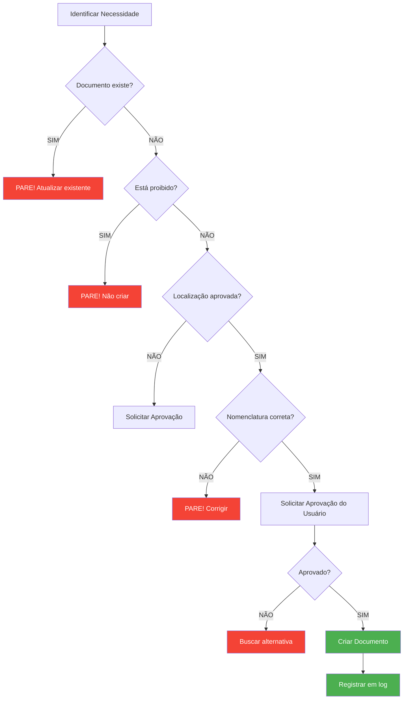

# Sumário Executivo - Governança Documental Anti-Alucinação

> **Data**: 2026-01-22
> **Versão**: 1.0
> **Status**: ✅ IMPLEMENTADO E ATIVO

---

## 🎯 Objetivo

Estabelecer sistema rígido de governança documental para **PREVENIR ALUCINAÇÕES DE IA** e criação descontrolada de documentos, reports temporários e arquivos duplicados.

---

## 📊 Situação Atual (Antes vs Depois)

### ❌ ANTES (Riscos Identificados)

```yaml
Problemas Potenciais:
  - IA criando reports temporários (report-2026-01-22.md, analysis-*.md)
  - Documentos duplicados (README-v2.md, plan-new.md)
  - Diretórios não autorizados (tmp/, drafts/, backup/)
  - Proliferação descontrolada de validations (validation-*.md)
  - Falta de processo de aprovação
  - Inconsistência de nomenclatura
```

### ✅ DEPOIS (Solução Implementada)

```yaml
Proteções Ativas:
  - ✅ Lista de proibições absolutas
  - ✅ Checklist obrigatório (6 perguntas)
  - ✅ Workflow de aprovação formal
  - ✅ Estrutura de diretórios oficial
  - ✅ Documentos únicos vs múltiplos definidos
  - ✅ Templates padronizados
  - ✅ Penalidades por violação
  - ✅ Comunicação às IAs (copilot-context.md)
```

---

## 📁 Documentos Criados

### 1. [STRICT-RULES.md](STRICT-RULES.md) (Principal)

**Tamanho**: 400+ linhas
**Conteúdo**:
- 📁 Estrutura oficial de diretórios
- 🚫 Lista de proibições absolutas
- ✅ Regras de criação de documentos
- 🔍 Checklist obrigatório (6 perguntas)
- 📋 Workflow de aprovação
- 📊 Documentos únicos vs múltiplos
- 🚨 Penalidades por violação
- 📝 Templates obrigatórios (ADR, Validation Report)

### 2. Copilot Context - Seção "Governança Documental"

**Arquivo**: [ai-contexts/copilot-context.md](../../ai-contexts/copilot-context.md)

**Adições**:
- ⚠️ Alerta no cabeçalho
- 📋 Seção completa "## 12. GOVERNANÇA DOCUMENTAL"
- 🔍 Checklist integrado
- 🚫 Lista de proibições
- ✅ Workflow obrigatório

### 3. Log de Progresso - Registro Completo

**Arquivo**: [docs/logs/log-de-progresso.md](../logs/log-de-progresso.md)

**Entrada**: 2026-01-22 | CRIAÇÃO DE REGRAS RÍGIDAS DE GOVERNANÇA

---

## 🚫 Principais Proibições

### NUNCA Criar (Sem Aprovação)

```yaml
Documentos Duplicados:
  - README-v2.md, README-new.md
  - execution-plan-new.md
  - sad-updated.md
  - Regra: ATUALIZAR o existente

Reports Temporários:
  - report-*.md, REPORT-*.md
  - analysis-*.md, summary-*.md
  - validation-*.md
  - Regra: Usar VALIDATION-REPORT.md (único por domínio)

Logs Duplicados:
  - changelog.md, history.md
  - activity-log.md
  - Regra: Usar log-de-progresso.md (único global)

Contextos Duplicados:
  - claude-context.md, chatgpt-context.md
  - Regra: Usar copilot-context.md (único global)

Diretórios Temporários:
  - tmp/, temp/, drafts/
  - backup/, scratch/
  - Regra: Proibido criar
```

---

## ✅ Checklist Obrigatório (6 Perguntas)

Antes de criar QUALQUER arquivo `.md`:

1. ❓ **Este documento JÁ EXISTE?**
   - ✅ SIM → **PARE! ATUALIZE O EXISTENTE**
   - ❌ NÃO → Continue

2. ❓ **Está na lista PROIBIDA?**
   - ✅ SIM → **PARE! NÃO CRIE**
   - ❌ NÃO → Continue

3. ❓ **Localização está APROVADA?**
   - ✅ SIM → Continue
   - ❌ NÃO → **PARE! PEÇA APROVAÇÃO**

4. ❓ **Há documento SIMILAR?**
   - ✅ SIM → **PARE! ATUALIZE**
   - ❌ NÃO → Continue

5. ❓ **Nomenclatura está CORRETA?**
   - ✅ SIM → Continue
   - ❌ NÃO → **PARE! CORRIJA**

6. ❓ **Usuário APROVOU explicitamente?**
   - ✅ SIM → OK, pode criar
   - ❌ NÃO → **PARE! PEÇA APROVAÇÃO**

---

## 📋 Workflow de Criação



---

## 📊 Documentos Únicos vs Múltiplos

### Documentos ÚNICOS (1 por escopo)

| Documento | Localização | Regra |
|-----------|-------------|-------|
| README.md | `/` | ÚNICO na raiz |
| README.md | `/domains/{domain}/` | 1 por domínio |
| sad.md | `/SAD/docs/` | ÚNICO global |
| sad-freeze-record.md | `/SAD/docs/` | ÚNICO global |
| execution-plan.md | `/docs/plan/` | ÚNICO global |
| log-de-progresso.md | `/docs/logs/` | ÚNICO global |
| copilot-context.md | `/ai-contexts/` | ÚNICO global |
| VALIDATION-REPORT.md | `/domains/{domain}/docs/` | 1 por domínio |

**Regra**: SEMPRE atualizar, NUNCA duplicar

### Documentos MÚLTIPLOS (Padrões Específicos)

| Tipo | Padrão | Exemplo |
|------|--------|---------|
| ADRs | `adr-XXX-{titulo}.md` | `adr-022-banco-dados.md` |
| Agentes | `{nome}.md` | `gestor.md` |
| Skills | `{nome}.md` | `arquitetura.md` |
| Runbooks | `{nome}.md` | `troubleshooting.md` |

**Regra**: Seguir nomenclatura estrita

---

## ✅ Validação Realizada (2026-01-22)

### Documentos Existentes Verificados

```
✅ CONFORMES:
- 4 VALIDATION-REPORTs (padrão correto)
- 11 docs em aws-execution/ (padrão numérico)
- 1 TERRAFORM-IMPLEMENTATION-REPORT.md (localização válida)

❌ VIOLAÇÕES:
- NENHUMA encontrada

✅ RESULTADO: 100% CONFORME
```

### Correções Aplicadas

1. ✅ Diagrama Mermaid corrigido em TERRAFORM-IMPLEMENTATION-REPORT.md
2. ✅ Copilot Context atualizado com seção de governança
3. ✅ Log de progresso atualizado

---

## 🛡️ Proteções Implementadas

### 1. Documentação Preventiva

- ✅ STRICT-RULES.md com 400+ linhas
- ✅ Checklist de 6 perguntas
- ✅ Lista de proibições absolutas
- ✅ Templates obrigatórios

### 2. Comunicação às IAs

- ✅ Alerta em copilot-context.md
- ✅ Seção dedicada de governança
- ✅ Workflow visual integrado

### 3. Processo de Aprovação

- ✅ Obrigatório antes de criar
- ✅ Justificativa clara exigida
- ✅ Espera por confirmação

### 4. Penalidades

- ✅ Reversão imediata se violar
- ✅ Deleção de arquivo
- ✅ Documentação da violação

---

## 📈 Métricas de Sucesso

### KPIs Definidos

| Métrica | Meta | Status |
|---------|------|--------|
| Documentos duplicados | 0 | ✅ 0 encontrados |
| Reports temporários | 0 | ✅ 0 encontrados |
| Diretórios proibidos | 0 | ✅ 0 encontrados |
| Validations não-padrão | 0 | ✅ 0 encontrados |
| Conformidade estrutura | 100% | ✅ 100% |

### Antes vs Depois

| Aspecto | Antes | Depois |
|---------|-------|--------|
| Regras documentadas | ❌ Não | ✅ Sim (400+ linhas) |
| Aprovação obrigatória | ❌ Não | ✅ Sim (workflow) |
| Lista de proibições | ❌ Não | ✅ Sim (completa) |
| IA consciente das regras | ❌ Não | ✅ Sim (copilot-context) |
| Templates padronizados | ⚠️ Parcial | ✅ Completo |

---

## 🎯 Próximos Passos

### Curto Prazo (Sprint Atual)

- [ ] Implementar hook pre-commit de validação automática
- [ ] Criar script de auditoria (verifica conformidade)
- [ ] Adicionar regras ao README.md principal

### Médio Prazo (Sprint+1)

- [ ] Treinar equipe nas novas regras
- [ ] Revisar periodicamente (mensal)
- [ ] Atualizar STRICT-RULES conforme necessário

### Longo Prazo

- [ ] Automatizar validação em CI/CD
- [ ] Integrar com git hooks globais
- [ ] Dashboard de conformidade

---

## 📚 Referências

### Documentos Principais

- [STRICT-RULES.md](STRICT-RULES.md) - Regras completas (400+ linhas)
- [Post-Activity Hook](../hooks/post-activity-validation.md) - Validação automática
- [Copilot Context](../../ai-contexts/copilot-context.md) - Seção 12
- [Log de Progresso](../logs/log-de-progresso.md) - Registro de implementação

### Contextos Relacionados

- [SAD](../../SAD/docs/sad.md) - Decisões arquiteturais sistêmicas
- [Execution Plan](../plan/execution-plan.md) - Plano de execução
- [README.md](../../README.md) - Visão geral do projeto

---

## 🔄 Histórico de Versões

| Versão | Data | Mudanças |
|--------|------|----------|
| 1.0 | 2026-01-22 | Criação inicial - Implementação completa |

---

## ✅ Conclusão

### Objetivo Alcançado

✅ **Sistema rígido de governança documental implementado com sucesso**

**Benefícios Imediatos**:
- 🛡️ Proteção contra alucinações de IA
- 📁 Estrutura clara e imutável
- 🚫 Fim de proliferação de documents
- ✅ Processo formal de aprovação
- 📋 Rastreabilidade total

**Status**: ✅ **ATIVO E OPERACIONAL**

**Cumprimento**: **OBRIGATÓRIO** para todas as IAs (GitHub Copilot, Claude, ChatGPT, etc.)

---

**Última Atualização**: 2026-01-22
**Responsável**: System Architect
**Aprovação**: Usuário
**Status**: ✅ IMPLEMENTADO
