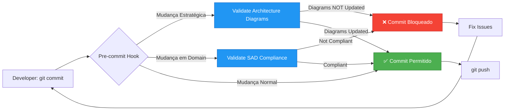

# Git Hooks - Projeto Kubernetes

> **Propósito**: Hooks para validação automática de governança e consistência arquitetural  
> **Método**: pre-commit hooks (validação antes do commit)  
> **Status**: 2 hooks implementados

---

## 📋 Hooks Disponíveis

### 1. validate-architecture-diagrams.sh

**Objetivo**: Garantir que [ARCHITECTURE-DIAGRAMS.md](../../ARCHITECTURE-DIAGRAMS.md) seja atualizado quando houver mudanças em contextos estratégicos.

**Disparo**: Mudanças em:
- `SAD/docs/sad.md` (mudanças no SAD)
- `SAD/docs/adrs/*.md` (novos ADRs sistêmicos)
- `domains/*/README.md` (descrição de domínios)
- `domains/*/docs/adr/*.md` (ADRs de domínio)
- `domains/*/infra/terraform/main.tf` (novos componentes)
- `PROJECT-CONTEXT.md` (contexto consolidado)
- `TERRAFORM-IMPLEMENTATION-REPORT.md` (implementação)

**Ação**: Valida se `ARCHITECTURE-DIAGRAMS.md` foi atualizado junto.

**Instalação**:
```bash
# Copiar hook para .git/hooks
cp docs/hooks/validate-architecture-diagrams.sh .git/hooks/pre-commit

# Tornar executável
chmod +x .git/hooks/pre-commit
```

**Output**:
```
🔍 Validando atualização de diagramas arquiteturais...
⚠️  Arquivos estratégicos modificados:
  - domains/platform-core/infra/terraform/main.tf
  - SAD/docs/adrs/adr-003-cloud-agnostic.md

❌ ATENÇÃO: Mudanças estratégicas detectadas sem atualização de diagramas!

📋 Seções para atualizar em ARCHITECTURE-DIAGRAMS.md:
  • Diagrama 1: Visão Geral (novos componentes/domínios)
  • Diagrama 3: Platform-Core (componentes, contratos)

💡 Ações recomendadas:
  1. Abra: ARCHITECTURE-DIAGRAMS.md
  2. Atualize os diagramas Mermaid relevantes
  3. Execute: git add ARCHITECTURE-DIAGRAMS.md
  4. Commit novamente
```

**Bypass** (não recomendado):
```bash
git commit --no-verify
```

---

### 2. validate-sad-compliance.sh (Existente)

**Objetivo**: Validar conformidade com SAD antes de commits em domínios.

**Disparo**: Mudanças em `domains/*/`

**Ação**: Valida se ADRs foram consultados, contratos respeitados, etc.

**Status**: ✅ Implementado (verificar `/docs/hooks/`)

---

## 🔄 Workflow com Hooks



---

## 📊 Mapeamento: Arquivos → Diagramas

| Arquivo Modificado | Diagrama(s) a Atualizar |
|-------------------|-------------------------|
| `SAD/docs/sad.md` | #1 Visão Geral, #2 Ordem de Deploy |
| `SAD/docs/adrs/adr-*.md` | #1 Visão Geral (se novo domínio/decisão) |
| `domains/platform-core/infra/terraform/main.tf` | #3 Platform-Core |
| `domains/cicd-platform/infra/terraform/main.tf` | #4 CI/CD Platform |
| `domains/observability/infra/terraform/main.tf` | #5 Observability |
| `domains/data-services/infra/terraform/main.tf` | #6 Data Services |
| `domains/secrets-management/docs/adr/adr-002-*.md` | #7 Secrets Management |
| `domains/security/docs/adr/adr-002-*.md` | #8 Security |
| `PROJECT-CONTEXT.md` (seção Contratos) | #9 Comunicação Entre Domínios |
| Novos domínios criados | #1 Visão Geral, #2 Ordem de Deploy, #10 Fluxo de Deploy |

---

## 🛠️ Instalação de Todos os Hooks

```bash
#!/bin/bash
# Instalar todos os hooks de governança

HOOKS_DIR="docs/hooks"
GIT_HOOKS_DIR=".git/hooks"

echo "📦 Instalando hooks de governança..."

# Hook 1: Architecture Diagrams
if [ -f "$HOOKS_DIR/validate-architecture-diagrams.sh" ]; then
    cp "$HOOKS_DIR/validate-architecture-diagrams.sh" "$GIT_HOOKS_DIR/pre-commit"
    chmod +x "$GIT_HOOKS_DIR/pre-commit"
    echo "✅ validate-architecture-diagrams.sh instalado"
fi

# Hook 2: SAD Compliance (se existir)
if [ -f "$HOOKS_DIR/validate-sad-compliance.sh" ]; then
    # Concatenar hooks (permitir múltiplos pre-commit)
    echo "" >> "$GIT_HOOKS_DIR/pre-commit"
    cat "$HOOKS_DIR/validate-sad-compliance.sh" >> "$GIT_HOOKS_DIR/pre-commit"
    echo "✅ validate-sad-compliance.sh instalado"
fi

echo "🎉 Hooks instalados com sucesso!"
echo "⚙️  Localização: $GIT_HOOKS_DIR/pre-commit"
```

Salve como `install-hooks.sh` e execute:
```bash
chmod +x install-hooks.sh
./install-hooks.sh
```

---

## 🔍 Testando Hooks

### Teste 1: Mudança estratégica SEM atualização de diagramas

```bash
# Modificar um ADR sem atualizar diagramas
echo "# Teste" >> SAD/docs/adrs/adr-003-cloud-agnostic.md
git add SAD/docs/adrs/adr-003-cloud-agnostic.md
git commit -m "test: ADR update"

# Resultado esperado:
# ❌ Commit bloqueado
# ⚠️  Mudanças estratégicas detectadas sem atualização de diagramas!
```

### Teste 2: Mudança estratégica COM atualização de diagramas

```bash
# Modificar ADR e diagramas
echo "# Teste" >> SAD/docs/adrs/adr-003-cloud-agnostic.md
echo "<!-- Teste -->" >> ARCHITECTURE-DIAGRAMS.md
git add SAD/docs/adrs/adr-003-cloud-agnostic.md ARCHITECTURE-DIAGRAMS.md
git commit -m "feat: update ADR and diagrams"

# Resultado esperado:
# ✅ ARCHITECTURE-DIAGRAMS.md atualizado junto com mudanças estratégicas
# ✅ Validação concluída com sucesso!
```

### Teste 3: Mudança não-estratégica (código de aplicação)

```bash
# Modificar código de aplicação
echo "# Teste" >> apps/myapp/main.py
git add apps/myapp/main.py
git commit -m "feat: add feature"

# Resultado esperado:
# ✅ Nenhum arquivo estratégico modificado
# (Commit permitido sem validação de diagramas)
```

---

## 🚨 Tratamento de Falsos Positivos

Se o hook bloquear commits válidos (ex: typo fix em README):

**Opção 1: Bypass temporário**
```bash
git commit --no-verify -m "docs: fix typo in README"
```

**Opção 2: Ajustar padrões do hook**
Edite `validate-architecture-diagrams.sh` e ajuste `STRATEGIC_FILES`:
```bash
STRATEGIC_FILES=(
    "SAD/docs/sad.md"              # SAD principal
    "SAD/docs/adrs/*.md"           # ADRs sistêmicos apenas
    "domains/*/docs/adr/*.md"      # ADRs de domínio
    "domains/*/infra/terraform/main.tf"  # Terraform apenas
    # Não incluir: README.md genéricos, documentação de uso
)
```

---

## 📚 Referências

- **Diagramas Arquiteturais**: [ARCHITECTURE-DIAGRAMS.md](../../ARCHITECTURE-DIAGRAMS.md)
- **Contexto Consolidado**: [PROJECT-CONTEXT.md](../../PROJECT-CONTEXT.md)
- **SAD v1.2**: [SAD/docs/sad.md](../../SAD/docs/sad.md)
- **Architect Guardian**: [docs/agents/architect-guardian.md](../agents/architect-guardian.md)

---

**Autor**: System Architect  
**Data**: 2026-01-05  
**Versão**: 1.0
