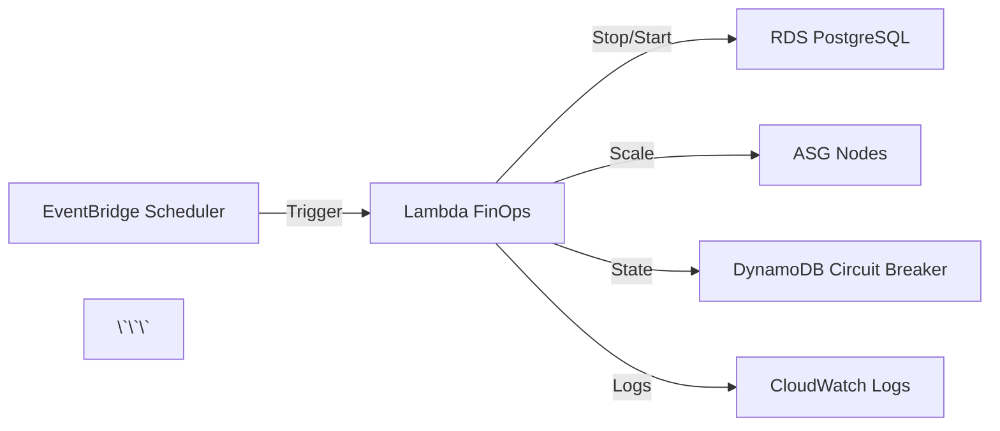

# 📝 POST-HOOK: Update Context Documentation

**Objetivo:** Atualizar architecture.md com recursos criados/modificados pelo Terraform

**Executado por:** Orquestrador DevOps + AWS Specialist

---

## ✅ Checklist de Atualização

### 1. Architecture Diagram Update

- [ ] **Diagrama reflete nova infraestrutura**
  - Novos componentes adicionados (Lambda, EventBridge, DynamoDB, KMS)
  - Conexões entre serviços atualizadas
  - Regiões/AZs documentadas
  - Data flows claros (ex: EventBridge → Lambda → RDS/EKS)

**Ação:**
```markdown
## Arquitetura FinOps Automation



---

### 2. Resource Inventory

- [ ] **Listar recursos criados**
  - Executar `terraform state list`
  - Documentar ARNs principais (Lambda, DynamoDB, KMS)
  - Identificar recursos críticos (prevent_destroy)

**Comando:**
```bash
terraform state list | tee docs/context/terraform-state-$(date +%Y-%m-%d).txt
```

**Adicionar em architecture.md:**
```markdown
### Recursos AWS (2026-01-30)

| Recurso | Tipo | ARN/ID | Região | Criticidade |
|---------|------|--------|--------|-------------|
| Lambda FinOps STAGING | AWS Lambda | arn:aws:lambda:us-east-1:xxx:function:finops-staging | us-east-1 | Média |
| DynamoDB Circuit Breaker | AWS DynamoDB | finops-circuit-breaker | us-east-1 | Alta (prevent_destroy) |
| KMS Key FinOps | AWS KMS | arn:aws:kms:us-east-1:xxx:key/yyy | us-east-1 | Alta |
| EventBridge Rule Shutdown | AWS EventBridge | finops-staging-shutdown | us-east-1 | Média |
| EventBridge Rule Startup | AWS EventBridge | finops-staging-startup | us-east-1 | Média |
```

---

### 3. Network Topology

- [ ] **Atualizar configuração de rede**
  - VPC IDs utilizadas
  - Subnets (public/private/isolated)
  - Security Groups criados/modificados
  - NAT Gateway dependencies

**Ação:**
```markdown
### Network Configuration FinOps

- **Lambda Networking:** NO VPC (internet access direto para BrasilAPI)
- **Security:** IAM execution role (não Access Keys)
- **Endpoints:** Sem VPC endpoints (custo zero)
```

---

### 4. Encryption Configuration

- [ ] **Documentar encryption at rest/transit**
  - KMS keys utilizadas (ARN, rotation policy)
  - Serviços com encryption (DynamoDB, CloudWatch Logs)
  - TLS version (Lambda → RDS = TLS 1.2+)

**Ação:**
```markdown
### Encryption (FinOps)

- **DynamoDB:** KMS encryption habilitado (arn:aws:kms:xxx)
- **CloudWatch Logs:** Encryption at rest padrão AWS
- **Secrets:** IAM roles (sem API keys hardcoded)
```

---

### 5. Observability Stack

- [ ] **Atualizar configuração de monitoramento**
  - CloudWatch Log Groups criados
  - Alarms configurados (startup duration, failure count)
  - Dashboards customizados (se aplicável)

**Comando:**
```bash
aws logs describe-log-groups --log-group-name-prefix /aws/lambda/finops
aws cloudwatch describe-alarms --alarm-name-prefix finops
```

**Adicionar em architecture.md:**
```markdown
### Observability FinOps

- **CloudWatch Logs:** `/aws/lambda/finops-staging` (30d retention)
- **Alarms:**
  - `finops-staging-startup-duration-high` (threshold: 10 min)
  - `finops-staging-failure-count` (threshold: 3 failures)
- **Metrics:** Custom metrics para economia real vs projetada
```

---

### 6. Integration Points

- [ ] **Documentar integrações**
  - External APIs consumidas (BrasilAPI)
  - Integrações internas (Lambda → RDS, Lambda → EKS)
  - Service discovery mechanisms

**Ação:**
```markdown
### Integrações FinOps

| Serviço | Tipo | Endpoint | Autenticação |
|---------|------|----------|--------------|
| BrasilAPI | External API | https://brasilapi.com.br/api/feriados/v1 | Pública (sem auth) |
| RDS PostgreSQL | AWS RDS | finops-staging.xxx.rds.amazonaws.com:5432 | IAM Database Auth |
| EKS Cluster | AWS EKS | kubectl via IRSA | IAM IRSA Role |
```

---

## 📋 Template de Atualização

Adicionar seção em `docs/context/architecture.md`:

```markdown
---

## [FEATURE_NAME] Architecture (Adicionado em YYYY-MM-DD)

### Overview
[1-2 parágrafos descrevendo o propósito da feature]

### Components
[Listar componentes criados com ARNs]

### Data Flow
[Diagrama Mermaid ou descrição textual]

### Security
[IAM roles, encryption, network isolation]

### Observability
[Logs, metrics, alarms]

### Costs
[Custo mensal estimado, referência a costs.md]

---
```

---

## ✅ Aprovação

**Responsável:** Orquestrador DevOps
**Data:** _______
**Status:** [ ] CONCLUÍDO

**Arquivo Atualizado:**
- [ ] docs/context/architecture.md (Data: ______)

**Changelog:**
```
[Listar principais mudanças no documento]
```

---

**Criado:** 2026-01-30
**Versão:** 1.0
**Executar:** Imediatamente após terraform apply sucesso
