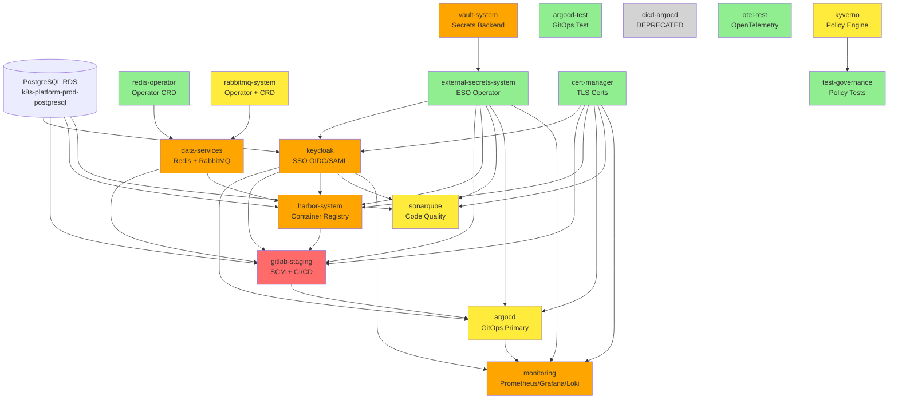

# DEC-074: Dependency Graph & Service Mesh Analysis

**Purpose:** Identify namespace dependencies to determine migration order and minimize downtime.

---

## Dependency Graph (Mermaid)



**Legend:**
- 🔴 **Red (CRITICAL):** GitLab (10 PVCs, source code, CI/CD blocker)
- 🟠 **Orange (HIGH):** Stateful with PVCs or external RDS
- 🟡 **Yellow (MEDIUM):** Stateful with external dependencies
- 🟢 **Green (LOW):** Stateless or isolated testing
- ⚫ **Gray:** Deprecated (cicd-argocd)

---

## Detailed Dependency Analysis

### 1. gitlab-staging (CRITICAL RISK)
**Type:** Platform / SCM + CI/CD

**Ingress:**
- `gitlab.staging.internal` (webservice)
- `kas.staging.internal` (Kubernetes Agent)
- `registry.staging.internal` (Container Registry)

**Service Dependencies (Consumes):**
- `data-services/redis` (session cache, CI job queue)
- `keycloak` (OIDC authentication)
- `harbor-system` (container registry for CI pipelines)
- `vault-system` (via ESO: gitlab-ci-credentials)

**Service Dependencies (Provides):**
- Git repositories → `argocd` (GitOps sync source)
- Container images → `harbor-system` (registry replication)
- CI artifacts → multiple consumers

**Data:**
- 1 StatefulSet: `gitlab-gitaly` (Git repository storage)
- 1 PVC: `repo-data-gitlab-gitaly-0` (50Gi, source code)
- External RDS: PostgreSQL (k8s-platform-prod-postgresql.rds.amazonaws.com)

**ExternalSecrets:**
- `gitlab-ci-credentials` (Vault path: secret/gitlab/ci-variables)

**Risk Assessment:**
- **Data Loss Risk:** CRITICAL (source code repositories on PVC)
- **Downtime Impact:** CRITICAL (blocks CI/CD pipelines for entire platform)
- **Rollback Complexity:** HARD (50GB PVC restore, RDS connection switch, multiple DNS endpoints)

**Mitigation:**
1. Create VolumeSnapshot of `repo-data-gitlab-gitaly-0` BEFORE migration
2. Test PVC restore in `argocd-test` namespace first (same pattern)
3. Schedule migration during maintenance window (Friday 18:00-22:00)
4. Keep old namespace 14 days (double retention vs standard 7d)
5. Real-time rsync pod as backup (parallel copy during migration)

---

### 2. data-services (HIGH RISK)
**Type:** Data / Infrastructure

**Service Dependencies (Provides):**
- Redis → `gitlab-staging`, `harbor-system` (session cache)
- RabbitMQ → `gitlab-staging` (job queue)
- PostgreSQL RDS connection secrets → Multiple consumers

**Service Dependencies (Consumes):**
- `redis-operator` (manages Redis CR)
- `rabbitmq-system` (manages RabbitmqCluster CR)
- `vault-system` (via ESO: keycloak/gitlab/harbor/sonarqube postgresql credentials)

**Data:**
- 2 StatefulSets: `redis` (1 replica), `k8s-platform-prod-rabbitmq-server` (1 replica)
- 2 PVCs: `redis-redis-0` (1Gi), `persistence-k8s-platform-prod-rabbitmq-server-0` (5Gi)
- External RDS: PostgreSQL (connection strings only, no data in namespace)

**Ingress:**
- `rabbitmq.staging.internal` (management UI)

**ExternalSecrets:**
- Multiple secrets for RDS connections (synced from Vault)

**CRDs:**
- `redis.redis.opstreelabs.in/v1beta2` (Redis CR)
- `rabbitmq.com/v1beta1` (RabbitmqCluster CR)

**Risk Assessment:**
- **Data Loss Risk:** HIGH (Redis cache can rebuild, RabbitMQ queues need backup)
- **Downtime Impact:** HIGH (GitLab + Harbor degraded without Redis)
- **Rollback Complexity:** MEDIUM (CRD recreation, PVC restore)

**Mitigation:**
1. Export RabbitMQ definitions before migration: `rabbitmqadmin export definitions.json`
2. Redis is cache (no persistence required, can rebuild)
3. Migrate CRDs (not operators) to new namespace
4. Validate RDS connection strings post-migration

---

### 3. harbor-system (HIGH RISK)
**Type:** Platform / Container Registry

**Ingress:**
- `harbor.staging.internal` (web UI + Docker Registry API)

**Service Dependencies (Consumes):**
- `data-services/redis` (session cache)
- External RDS: PostgreSQL (Harbor metadata)
- `keycloak` (OIDC authentication)
- `vault-system` (via ESO: harbor-oidc-credentials, harbor-postgresql-credentials)
- `cert-manager` (TLS certificates)

**Service Dependencies (Provides):**
- Container images → `gitlab-staging` (CI pipeline pulls)
- OCI artifacts → cluster (Helm charts storage)

**Data:**
- 2 PVCs: `harbor-jobservice` (1Gi), `harbor-registry` (5Gi, OCI image blobs)
- External RDS: PostgreSQL (image metadata)

**ExternalSecrets:**
- `harbor-oidc-credentials` (Vault: secret/harbor/oidc)
- `harbor-postgresql-credentials` (Vault: secret/harbor/postgresql)

**Risk Assessment:**
- **Data Loss Risk:** HIGH (OCI image blobs on PVC, 5Gi registry data)
- **Downtime Impact:** HIGH (CI pipelines fail without image pulls)
- **Rollback Complexity:** MEDIUM (PVC restore, RDS connection, DNS)

**Mitigation:**
1. Snapshot `harbor-registry` PVC (5Gi image blobs)
2. RDS connection switch (no data migration needed)
3. Test image pull after migration: `docker pull harbor.staging.internal/library/nginx`
4. Keep old namespace 7 days for validation

---

### 4. keycloak (HIGH RISK)
**Type:** Platform / SSO Identity Provider

**Ingress:**
- `keycloak.staging.internal` (admin console + OIDC/SAML endpoints)

**Service Dependencies (Consumes):**
- External RDS: PostgreSQL (Keycloak database)
- `vault-system` (via ESO: keycloak-postgresql-credentials)
- `cert-manager` (TLS certificates)

**Service Dependencies (Provides):**
- OIDC → `argocd`, `gitlab`, `harbor`, `grafana` (monitoring), `vault`
- SAML 2.0 → `sonarqube`

**Data:**
- 1 StatefulSet: `keycloak-keycloakx` (1 replica)
- 0 PVCs (stateless, all data in RDS)
- External RDS: PostgreSQL (user accounts, realm config)

**ExternalSecrets:**
- `keycloak-postgresql-credentials` (Vault: secret/keycloak/postgresql)

**Risk Assessment:**
- **Data Loss Risk:** LOW (all data in RDS, stateless pods)
- **Downtime Impact:** HIGH (all SSO logins fail during migration)
- **Rollback Complexity:** EASY (recreate deployment, point to same RDS)

**Mitigation:**
1. No PVC migration needed (stateless)
2. RDS connection switch only
3. Test OIDC login after migration: `curl https://keycloak.staging.internal/auth/realms/master`
4. Short maintenance window (5-10min DNS propagation)

---

### 5. monitoring (HIGH RISK)
**Type:** Observability / Prometheus Stack

**Ingress:**
- `grafana.staging.internal` (Grafana dashboards)

**Service Dependencies (Consumes):**
- `keycloak` (OIDC authentication for Grafana)
- `vault-system` (via ESO: grafana-admin-credentials, grafana-oidc-credentials)
- `cert-manager` (TLS certificates)

**Service Dependencies (Provides):**
- Prometheus metrics → All namespaces (ServiceMonitor discovery)
- Grafana dashboards → Operations team
- Loki logs → All namespaces (Promtail agents)
- Tempo traces → Distributed tracing

**Data:**
- 6 StatefulSets: `prometheus`, `alertmanager`, `grafana`, `loki-write`, `loki-backend`, `tempo-ingester`, `tempo-memcached`
- 9 PVCs (94Gi total):
  - Prometheus: 20Gi (metrics TSDB)
  - Grafana: 5Gi (dashboards)
  - Loki: 40Gi (logs, 4 PVCs × 10Gi)
  - Tempo: 20Gi (traces, 2 PVCs × 10Gi)
  - Alertmanager: 2Gi

**ExternalSecrets:**
- `grafana-admin-credentials`
- `grafana-oidc-credentials`

**Risk Assessment:**
- **Data Loss Risk:** MEDIUM (metrics/logs can rebuild, 30d retention)
- **Downtime Impact:** HIGH (no monitoring during migration, blind operations)
- **Rollback Complexity:** MEDIUM (9 PVCs restore, multiple StatefulSets)

**Mitigation:**
1. Snapshot all 9 PVCs before migration
2. Accept metrics gap during migration (Prometheus rebuilds from targets)
3. Migrate during low-traffic window (Sunday morning)
4. Priority: Prometheus → Grafana → Loki → Tempo (monitoring first)

---

### 6. vault-system (HIGH RISK)
**Type:** Security / Secrets Backend

**Ingress:**
- `vault.staging.internal` (Vault UI + API)

**Service Dependencies (Consumes):**
- `cert-manager` (TLS certificates)
- `external-secrets-system` (ESO reads secrets from Vault)

**Service Dependencies (Provides):**
- Secrets → All namespaces (via ESO)
- KV v2 backend for 7 ExternalSecrets:
  - grafana/oidc, sonarqube/postgresql, sonarqube/saml
  - harbor/postgresql, harbor/oidc
  - keycloak/postgresql, gitlab/ci-variables

**Data:**
- 1 StatefulSet: `vault` (1 replica)
- 2 PVCs: `data-vault-0` (10Gi, encrypted secrets), `audit-vault-0` (5Gi, audit logs)
- No external database (integrated storage backend)

**ExternalSecrets:**
- 1 ExternalSecret: `vault-backend` (bootstrap secret, namespace=null? → investigate)

**Risk Assessment:**
- **Data Loss Risk:** HIGH (all secrets on PVC, no external backup)
- **Downtime Impact:** CRITICAL (ESO fails → all ExternalSecrets desync)
- **Rollback Complexity:** MEDIUM (PVC restore, unseal process)

**Mitigation:**
1. **BACKUP VAULT BEFORE MIGRATION:** `vault operator raft snapshot save backup.snap`
2. Snapshot `data-vault-0` PVC (10Gi encrypted secrets)
3. Document unseal keys (required after migration)
4. Test ESO reconnection after migration
5. Keep old namespace 14 days (critical service)

---

### 7. argocd (MEDIUM RISK)
**Type:** Platform / GitOps Controller

**Ingress:**
- `argocd.staging.internal` (web UI + gRPC API)

**Service Dependencies (Consumes):**
- `gitlab-staging` (Git repository source)
- `keycloak` (OIDC authentication)
- `vault-system` (via ESO: argocd-oidc-credentials, argocd-postgresql-credentials)
- External RDS: PostgreSQL (ArgoCD application state)

**Service Dependencies (Provides):**
- GitOps deployments → All namespaces
- Application sync status → `monitoring` (Grafana dashboards)

**Data:**
- 1 StatefulSet: `argocd-application-controller` (1 replica)
- 0 PVCs (stateless, all state in RDS)
- External RDS: PostgreSQL (application definitions, sync history)

**ExternalSecrets:**
- `argocd-oidc-credentials`
- `argocd-postgresql-credentials`

**Risk Assessment:**
- **Data Loss Risk:** LOW (all state in RDS)
- **Downtime Impact:** MEDIUM (no auto-sync during migration, manual deploys OK)
- **Rollback Complexity:** EASY (stateless, RDS connection switch)

**Mitigation:**
1. Export ArgoCD applications: `argocd app list -o yaml > apps-backup.yaml`
2. Pause auto-sync before migration: `argocd app set <app> --sync-policy none`
3. No PVC migration needed
4. Test ArgoCD UI + CLI after migration

---

### 8. kyverno (MEDIUM RISK)
**Type:** Governance / Policy Engine

**Service Dependencies:**
- None (watches all namespaces, admission webhook)

**Data:**
- 0 StatefulSets, 0 PVCs (stateless admission controller)
- Cluster-scoped CRDs: `ClusterPolicy`, `Policy`

**Risk Assessment:**
- **Data Loss Risk:** NONE (policies stored as CRDs)
- **Downtime Impact:** HIGH (admission webhook failures during migration)
- **Rollback Complexity:** EASY (stateless, recreate deployment)

**Mitigation:**
1. Export ClusterPolicies before migration: `kubectl get clusterpolicy -o yaml > policies-backup.yaml`
2. Short maintenance window (webhook downtime < 5min)
3. Test policy enforcement after migration: Create test pod

---

### 9. sonarqube (MEDIUM RISK)
**Type:** Platform / Code Quality

**Ingress:**
- `sonarqube.staging.internal` (web UI + API)

**Service Dependencies (Consumes):**
- `keycloak` (SAML 2.0 authentication)
- External RDS: PostgreSQL (SonarQube analysis data)
- `vault-system` (via ESO: sonarqube-postgresql, sonarqube-sp-saml)

**Data:**
- 1 StatefulSet: `sonarqube-sonarqube` (1 replica)
- 1 PVC: `sonarqube-sonarqube` (20Gi, analysis cache + plugins)
- External RDS: PostgreSQL (scan results, quality gates)

**ExternalSecrets:**
- `sonarqube-postgresql`
- `sonarqube-sp-saml`

**Risk Assessment:**
- **Data Loss Risk:** LOW (analysis cache can rebuild, data in RDS)
- **Downtime Impact:** MEDIUM (code scans fail during migration)
- **Rollback Complexity:** EASY (PVC snapshot, RDS connection)

---

### 10. rabbitmq-system (MEDIUM RISK)
**Type:** Data / Operator

**Service Dependencies (Provides):**
- RabbitMQ Cluster Operator → manages `data-services/k8s-platform-prod-rabbitmq` CR

**Data:**
- 1 Deployment: `rabbitmq-cluster-operator` (stateless)
- 0 PVCs (operator only, CRs in data-services)

**Risk Assessment:**
- **Data Loss Risk:** NONE (operator only)
- **Downtime Impact:** MEDIUM (operator reconciliation paused)
- **Rollback Complexity:** EASY (stateless operator)

**Mitigation:**
1. Operator watches all namespaces (cluster-scoped)
2. No data migration (CRs in data-services namespace)
3. Validate operator reconnection after migration

---

### 11-17. Low Risk Namespaces (GREEN)

#### cert-manager (LOW RISK)
- Stateless, TLS cert issuance
- Short DNS propagation downtime (<5min)

#### external-secrets-system (LOW RISK)
- Stateless ESO operator
- Pauses secret sync during migration (~5min)

#### redis-operator (LOW RISK)
- Stateless operator, manages CRs in data-services

#### otel-test (LOW RISK)
- Testing namespace, no production traffic

#### test-governance (LOW RISK)
- Kyverno policy testing, isolated

#### argocd-test (LOW RISK)
- Testing GitOps instance, no production apps

---

## Dependency Waves (Bottom-Up Migration)

### Wave 1: Foundation (No Dependencies)
**Namespaces:** cert-manager, external-secrets-system, redis-operator, test-governance, otel-test, argocd-test
**Strategy:** Parallel migration (6 agents)
**Downtime:** 5-10min per namespace
**ETA:** 1.5h (parallelized)

### Wave 2: Operators
**Namespaces:** rabbitmq-system, kyverno
**Strategy:** Sequential (operator dependencies)
**Downtime:** 10-15min per namespace
**ETA:** 2h

### Wave 3: Security + Data
**Namespaces:** vault-system, data-services
**Strategy:** Sequential (ESO dependency: Vault → data-services)
**Downtime:** 30min per namespace
**ETA:** 4h (Vault backup + PVC snapshots)

### Wave 4: Platform Core
**Namespaces:** keycloak, argocd, sonarqube
**Strategy:** Sequential (SSO dependency: Keycloak → others)
**Downtime:** 15-20min per namespace
**ETA:** 3h

### Wave 5: Platform Services + Observability
**Namespaces:** harbor-system, monitoring
**Strategy:** Sequential (high PVC count)
**Downtime:** 60min per namespace
**ETA:** 8h (9 PVCs in monitoring, 2 PVCs in harbor)

### Wave 6: Critical (Last)
**Namespaces:** gitlab-staging
**Strategy:** Dedicated maintenance window (Friday 18:00-22:00)
**Downtime:** 90-120min (50GB PVC + RDS + 3 ingress endpoints)
**ETA:** 4h (with validation)

---

## Total Migration Time

| Phase | Duration | Parallelization | Optimized |
|-------|----------|-----------------|-----------|
| Wave 1 (6 namespaces) | 6h serial | 6 agents | 1.5h |
| Wave 2 (2 namespaces) | 2h serial | Sequential | 2h |
| Wave 3 (2 namespaces) | 4h serial | Sequential | 4h |
| Wave 4 (3 namespaces) | 3h serial | Sequential | 3h |
| Wave 5 (2 namespaces) | 8h serial | Sequential | 8h |
| Wave 6 (1 namespace) | 4h serial | Dedicated | 4h |
| Validation buffer | - | - | +10% |
| **TOTAL** | **27h** | **Optimized** | **24.5h** |

**Execution:** 3-4 working days (8h/day) or 1 week (4h/day incremental)

---

## Critical Path (Longest Dependency Chain)

```
cert-manager → vault-system → external-secrets-system → keycloak → gitlab-staging
(5min)         (60min)        (5min)                    (15min)    (120min)

TOTAL CRITICAL PATH: 200min (3h 20min)
```

**Optimization:** Execute non-critical namespaces in parallel during critical path execution.

---

## Next: Review Migration Patterns
→ `/03-migration-patterns.md`
