# AWS EKS Quickstart — GitLab, Observability e Serviços Básicos

**Última atualização:** 2026-01-07 | **Atualização Estratégica:** 2026-01-29 (ADR-023)

> ⚠️ **ATUALIZAÇÃO CRÍTICA 2026-01-29 - ADR-023:** Este documento representa o **plano original** com Bitnami Helm Charts para Redis e RabbitMQ. **A estratégia foi atualizada** para usar **Kubernetes Operators** ao invés de Bitnami charts devido à mudança de licenciamento (Tanzu Standard $72,000/ano).
>
> **Nova Abordagem:**
> - ✅ **Redis:** Spotahome Redis Operator (RedisFailover CRD, Sentinel-based HA)
> - ✅ **RabbitMQ:** RabbitMQ Cluster Operator oficial (RabbitmqCluster CRD, Quorum Queues)
> - ✅ **Economia:** $72,900/ano vs Bitnami Tanzu Standard
> - ✅ **Benefícios:** HA superior, backups nativos, zero-downtime upgrades, cloud-agnostic
>
> **Documentos Atualizados:**
> - 📄 [ADR-023: Migration from Bitnami Charts to Kubernetes Operators](../../context/decisions.md#adr-023)
> - 📄 [03-data-services-operators.md](../aws-execution/03-data-services-helm.md) - Guia de implementação completo
> - 📄 [executor-terraform.md](../../prompts/executor-terraform.md) - Framework Operators pattern
>
> Este documento permanece como **referência histórica** do planejamento original. Para implementação atual, consultar os documentos atualizados acima.

---

Resumo executivo rápido para o time terceirizado: plano estratégico para provisionar um ambiente AWS/EKS operacional com GitLab (híbrido Helm + serviços gerenciados), observability (OpenTelemetry + Prometheus/Grafana/Loki/Tempo) e serviços básicos (RDS Postgres, Redis e RabbitMQ via Helm). A abordagem é "clickOps rápido".

**Novidades nesta versão:**
- ✅ **Estratégia de 2 ambientes (Staging + Prod)** - Ambiente Dev removido após análise de custo-benefício
- ✅ Diagramas de rede e security groups adicionados (expandíveis)
- ✅ Especificações técnicas de node groups definidas
- ✅ Helm charts principais listados com versões recomendadas
- ✅ Definition of Done (DoD) detalhado para cada sprint
- ✅ Épico J adicionado: Disaster Recovery Drill obrigatório no Sprint 3
- ✅ Mesa técnica completa para tomada de decisão (ver [technical-roundtable.md](technical-roundtable.md))

**Decisões chave**
- **Arquitetura de 2 ambientes**: Staging (testes + homologação) e Prod (produção), sem ambiente Dev dedicado para otimização de custos
- Instalar GitLab via Helm (umbrella chart) em modo *hybrid*: desabilitar subcharts de DB/Redis e apontar para RDS PostgreSQL (gerenciado) e Redis via Helm; `gitlab-runner` como release separado.
- Observability: OpenTelemetry Collector (DaemonSet + Gateway) + Prometheus (kube-prometheus-stack) + Grafana + Loki + Tempo.
- Serviços de dados iniciais: Amazon RDS (Postgres) Multi-AZ gerenciado, Redis (bitnami/redis) e RabbitMQ (bitnami/rabbitmq) via Helm no cluster.
- Secrets iniciais: Kubernetes Secrets (encrypted-at-rest via EBS + KMS). Vault fica para próximo ciclo.

---

## Arquitetura da Plataforma

**Componentes Principais:**

- **Camada de Entrada**: Internet → Route53 → ALB (WAF + IP Allowlist) → EKS
- **Ambientes Segregados**:
  - **Staging (namespace staging)**: GitLab para testes, experimentação e homologação
  - **Prod (namespace prod)**: GitLab produção com recursos dedicados
- **Observability (namespace observability)**: OTEL Collector → Prometheus/Loki/Tempo → Grafana (compartilhado entre ambientes)
- **Sistema (namespace kube-system)**: AWS Load Balancer Controller, EBS CSI Driver, cert-manager, CoreDNS
- **Node Groups**: 3 grupos auto-scaling (system/workloads/critical) com instâncias t3
- **Serviços Gerenciados AWS**: RDS PostgreSQL Multi-AZ (1 instância staging, 1 instância prod)
- **Storage**: S3 para backups (GitLab, Loki, Tempo) e EBS gp3 para volumes persistentes (Redis, RabbitMQ, etc)

---

**Diagramas de Rede e Segurança**

<b>VPC Network Architecture (clique para expandir)</b>

**Estrutura de Rede:**
- **VPC CIDR**: 10.0.0.0/16
- **3 Availability Zones**: us-east-1a, us-east-1b, us-east-1c
- **Subnets por AZ**:
  - Public Subnets (10.0.x.0/24): NAT Gateways, ALB
  - Private Subnets (10.0.1x.0/24): EKS Worker Nodes
  - Data Subnets (10.0.2x.0/24): RDS PostgreSQL
- **Node Groups**:
  - `system`: t3.medium (2 vCPU, 4GB RAM) - System workloads
  - `workloads`: t3.large (2 vCPU, 8GB RAM) - Application workloads
  - `critical`: t3.xlarge (4 vCPU, 16GB RAM) - GitLab, critical services

<b>Security Groups & Network Flow (clique para expandir)</b>

**Regras de Segurança:**
- **ALB-SG**: Aceita HTTPS (443) apenas de IPs corporativos na allowlist + WAF
- **EKS Control Plane SG**: Comunicação bidirecional com nodes (443, 10250)
- **EKS Nodes SG**:
  - Ingress: ALB (NodePort range 30000-32767), Control Plane (443, 10250)
  - Egress: RDS (5432), S3 (443 via Gateway)
- **Data Layer SGs**: Apenas EKS Nodes SG permitido
- **S3 Access**: Via VPC Gateway Endpoint (sem transit por Internet Gateway)

---

**Deploy Order (recomendado)**

1. Provision VPC / subnets / Route53 / IAM / EKS cluster and node groups.
2. Prepare cluster: namespaces, StorageClass (gp3 CSI), cert-manager (staging), RBAC mínimo.
3. Provision gerenciados: RDS PostgreSQL, S3 backup.
4. Deploy Redis e RabbitMQ via Helm (bitnami/redis, bitnami/rabbitmq).
5. Deploy GitLab (Helm hybrid) + runners.
6. Deploy Observability (OTEL Collector → Prometheus → Loki → Tempo → Grafana).
7. Smoke tests, backups e monitoramento.

---

## Helm Charts Principais

Os seguintes Helm charts serão utilizados para provisionar os componentes da plataforma:

### GitLab & CI/CD

- **gitlab/gitlab** (v7.7.x ou superior)
  - Chart umbrella com todos os componentes GitLab
  - Configuração hybrid: desabilitar subcharts `postgresql`, `redis`, `minio`
  - Conectar a RDS, ElastiCache e S3 externos
  - Repository: `https://charts.gitlab.io/`

- **gitlab/gitlab-runner** (v0.60.x ou superior)
  - Deploy separado para runners Kubernetes
  - Executor: `kubernetes` com privileged mode (opcional para DinD)
  - Repository: `https://charts.gitlab.io/`

### Observability Stack

- **open-telemetry/opentelemetry-collector** (v0.76.x ou superior)
  - Dois deploys: DaemonSet (node collector) + Deployment (gateway)
  - Receivers: OTLP, Prometheus, Jaeger
  - Exporters: Prometheus, Loki, Tempo
  - Repository: `https://open-telemetry.github.io/opentelemetry-helm-charts`

- **prometheus-community/kube-prometheus-stack** (v55.x ou superior)
  - Inclui: Prometheus Operator, Grafana, Alertmanager, Node Exporter, Kube State Metrics
  - ServiceMonitors pré-configurados para componentes K8s
  - Repository: `https://prometheus-community.github.io/helm-charts`

- **grafana/loki** (v5.x ou superior)
  - Deploy: Simple Scalable mode (read/write paths separados)
  - Storage: S3 backend
  - Repository: `https://grafana.github.io/helm-charts`

- **grafana/tempo** (v1.7.x ou superior)
  - Deploy: Distributed mode
  - Storage: S3 backend
  - Repository: `https://grafana.github.io/helm-charts`

### Infraestrutura & Messaging

- **jetstack/cert-manager** (v1.13.x ou superior)
  - ACME/Let's Encrypt integration (staging inicial)
  - ClusterIssuers para HTTP01 e DNS01 challenges
  - Repository: `https://charts.jetstack.io`

- **bitnami/redis** (v18.x ou superior)
  - Deploy: Master-Replica com Sentinel (HA mode)
  - Features: Persistence habilitada (PVC), metrics para Prometheus
  - Repository: `https://charts.bitnami.com/bitnami`

- **bitnami/rabbitmq** (v12.x ou superior)
  - Deploy: StatefulSet com persistent volumes
  - Features: Management UI habilitado, metrics para Prometheus
  - Repository: `https://charts.bitnami.com/bitnami`

**Nota**: Versões específicas serão definidas nos `values.yaml` de cada ambiente. Manter charts atualizados com patch versions para correções de segurança.

---

**Épicos, Features e Tasks (fatiado por sprints — 2 semanas cada)**

Nota: estimativas em person-hours para um time pequeno (1-2 engenheiros plenos). Ajuste conforme FTE.

### Sprint 1 — Preparação e GitLab mínimo (88h)

- Épico A: Preparação do Cluster (20h)
  - Task A.1 Criar VPC multi-AZ, subnets públicas/privadas, NAT/IGW (6h)
  - Task A.2 Criar EKS cluster e 3 node groups (`system`,`workloads`,`critical`) (8h)
  - Task A.3 Criar StorageClass gp3 (CSI) e PVC templates (2h)
  - Task A.4 Configurar IAM roles/IRSA e RBAC mínimo (4h)

- Épico B: GitLab Hybrid Deploy (48h)
  - Task B.1 Criar Route53 hosted zone e ALB (6h)
  - Task B.2 Helm: preparar `values.yaml` (externalURL, storage, ingress, disable subcharts) (8h)
  - Task B.3 Instalar `gitlab` Helm chart (umbrella) apontando para RDS/Redis (12h)
  - Task B.4 Configurar S3 backups e RBAC para backup agent (6h)
  - Task B.5 Provisionar 1–2 `gitlab-runner` (k8s executor, nodeSelector `critical`) (8h)
  - Task B.6 Capturar initial root password / documentar (4h)

- Épico C: Provisionamento de DB e Data Services (20h)
  - Task C.1 Provisionar RDS Postgres Multi-AZ (4h)
  - Task C.2 Deploy Redis via Helm chart (bitnami/redis) com HA (8h)
  - Task C.3 Deploy RabbitMQ via Helm chart (bitnami/rabbitmq) (8h)

#### Definition of Done - Sprint 1

- [ ] **Infraestrutura Base**
  - [ ] VPC criada com 3 AZs, subnets públicas/privadas/data configuradas
  - [ ] NAT Gateways (3) e Internet Gateway operacionais
  - [ ] EKS cluster (versão 1.28+) provisionado e acessível via `kubectl`
  - [ ] 3 Node groups criados e nodes aparecem como `Ready` no cluster
  - [ ] StorageClass gp3 configurado como default

- [ ] **GitLab Operacional**
  - [ ] GitLab UI acessível via HTTPS no domínio configurado
  - [ ] Login com root password funcional
  - [ ] RDS Postgres conectado (verificar logs sem erros de conexão)
  - [ ] Redis conectado (cache funcionando)
  - [ ] Pelo menos 1 GitLab runner registrado e com status "online"
  - [ ] Criar projeto de teste e executar pipeline básico (hello-world) com sucesso

- [ ] **Data Services (DB, Cache, Messaging)**
  - [ ] RDS Multi-AZ provisionado, encrypted-at-rest, backups automáticos habilitados
  - [ ] Redis instalado via Helm (bitnami/redis) em modo HA (master-replica com Sentinel)
  - [ ] Redis com persistence habilitada (PVC) e replicação funcional
  - [ ] RabbitMQ instalado via Helm chart (bitnami/rabbitmq) no cluster
  - [ ] RabbitMQ Management UI acessível e funcional
  - [ ] Credentials de acesso aos serviços documentadas em Kubernetes Secrets

- [ ] **Documentação**
  - [ ] Diagramas as-built da VPC e Security Groups atualizados
  - [ ] Credenciais root do GitLab documentadas em local seguro
  - [ ] IDs de recursos AWS documentados (VPC ID, Subnet IDs, Security Group IDs)
  - [ ] Comandos de acesso ao cluster documentados

### Sprint 2 — Observability baseline (84h)

- Épico D: OTEL & Metrics (34h)
  - Task D.1 Deploy OpenTelemetry Collector (DaemonSet + Gateway) e configurar OTLP receivers (12h)
  - Task D.2 Deploy `kube-prometheus-stack` (Prometheus Operator, ServiceMonitors) (16h)
  - Task D.3 Configure Prometheus scraping & retention basic (6h)

- Épico E: Logs & Traces (28h)
  - Task E.1 Deploy Loki (and promtail or fluent-bit) (12h)
  - Task E.2 Deploy Tempo (8h)
  - Task E.3 Wire OTEL pipelines: traces → Tempo, logs → Loki, metrics → Prometheus (8h)

- Épico F: Visualization & Alerts (22h)
  - Task F.1 Deploy Grafana, add datasources (Prometheus, Loki, Tempo) (6h)
  - Task F.2 Provision baseline dashboards (k8s health, gitlab CI, key SLIs) (10h)
  - Task F.3 Configure Alertmanager & Grafana alerts (6h)

#### Definition of Done - Sprint 2

- [ ] **Métricas (Prometheus)**
  - [ ] Prometheus Operator instalado e operacional
  - [ ] ServiceMonitors configurados para: kube-state-metrics, node-exporter, GitLab
  - [ ] Retenção configurada (mínimo 15 dias)
  - [ ] Prometheus UI acessível e exibindo métricas de todos os nodes e pods
  - [ ] TSDB storage configurado com PVC (mínimo 50GB)

- [ ] **Logs (Loki)**
  - [ ] Loki instalado em modo Simple Scalable (read/write paths)
  - [ ] Fluent-bit ou Promtail coletando logs de todos os pods
  - [ ] Logs do GitLab visíveis no Loki
  - [ ] Retenção configurada (mínimo 30 dias)
  - [ ] S3 backend configurado para chunks

- [ ] **Traces (Tempo)**
  - [ ] Tempo instalado em modo distribuído
  - [ ] OTLP receiver configurado e acessível
  - [ ] S3 backend configurado para traces
  - [ ] Sample trace manual enviado e visualizado com sucesso

- [ ] **OpenTelemetry Collector**
  - [ ] DaemonSet collector rodando em todos os nodes
  - [ ] Gateway collector recebendo e roteando telemetria
  - [ ] Pipelines configurados: metrics → Prometheus, logs → Loki, traces → Tempo
  - [ ] Health check endpoints respondendo

- [ ] **Visualização (Grafana)**
  - [ ] Grafana acessível via HTTPS
  - [ ] Datasources configurados: Prometheus, Loki, Tempo (todos com status "success")
  - [ ] Dashboards instalados:
    - [ ] Kubernetes Cluster Monitoring
    - [ ] Node Exporter Full
    - [ ] GitLab CI Pipeline Metrics
    - [ ] Pod/Container Resources
  - [ ] Alertmanager configurado com pelo menos 3 alertas críticos:
    - [ ] Node down
    - [ ] Pod CrashLooping
    - [ ] PVC usage > 80%

- [ ] **Validação End-to-End**
  - [ ] Deploy de aplicação de teste gerando métricas, logs e traces visíveis em Grafana
  - [ ] Correlação funcional: clicar em trace leva aos logs correspondentes

### Sprint 3 — Hardening, Network & Smoke Tests (80h)

- Épico G: Network & Security (30h)
  - Task G.1 Security Groups: restrict DB/ElastiCache access to EKS SGs (8h)
  - Task G.2 ALB WAF / IP allowlist / basic VPN (client) plan (8h)
  - Task G.3 Implement minimal NetworkPolicies `deny-all` + opens for pods (14h)

- Épico H: RBAC & Backups (24h)
  - Task H.1 RBAC least-privilege for critical SAs (12h)
  - Task H.2 Validate backups to S3 and restore test (12h)

- Épico I: Smoke & End-to-end (26h)
  - Task I.1 CI pipeline smoke test com aplicação exemplo (12h)
  - Task I.2 Kong/Ingress/Keycloak basic flow smoke (if present) (8h)
  - Task I.3 Remediations and hotfixes (6h)

- Épico J: Disaster Recovery Drill (10h)
  - Task J.1 Documentar procedimentos de backup e restore (3h)
  - Task J.2 Simular falha de RDS e restore de snapshot (3h)
  - Task J.3 Simular perda de namespace GitLab e restore completo (4h)

#### Definition of Done - Sprint 3

- [ ] **Segurança de Rede**
  - [ ] Security Groups revisados e restritos:
    - [ ] RDS aceita apenas conexões de EKS Nodes SG (porta 5432)
  - [ ] ALB WAF configurado com OWASP rules habilitadas
  - [ ] IP allowlist configurada no ALB (lista de IPs corporativos documentada)
  - [ ] NetworkPolicies implementadas:
    - [ ] Default deny-all em namespaces críticos (gitlab, observability)
    - [ ] Policies específicas para permitir comunicação necessária
    - [ ] Validação: tentar acessar pod sem policy resulta em timeout

- [ ] **RBAC & Acesso**
  - [ ] ServiceAccounts específicos para cada componente (não usar default)
  - [ ] Roles/RoleBindings configurados com princípio de least-privilege
  - [ ] IRSA configurado para pods que acessam S3/RDS
  - [ ] Validação: pods não conseguem acessar recursos sem permissão

- [ ] **Backups & Restore**
  - [ ] Backup automático do GitLab para S3 configurado (diário)
  - [ ] Snapshots automáticos RDS configurados (retenção 7 dias)
  - [ ] Velero (ou similar) instalado para backup de recursos K8s
  - [ ] **Teste de restore realizado com sucesso**:
    - [ ] RDS restaurado de snapshot em < 30 minutos
    - [ ] GitLab namespace restaurado e aplicação funcional
    - [ ] Dados de teste verificados após restore

- [ ] **Smoke Tests & Validação**
  - [ ] Pipeline CI completo funcional com aplicação de exemplo (app Python FastAPI com Postgres/Redis/RabbitMQ)
  - [ ] Métricas, logs e traces da pipeline visíveis em Grafana
  - [ ] Alertas testados (simular condições de alerta e verificar notificações)

- [ ] **Disaster Recovery Drill** 🔴
  - [ ] Runbook de DR documentado com step-by-step procedures
  - [ ] Simulação de falha catastrófica executada:
    - [ ] Cenário 1: Falha de RDS → restore de snapshot → GitLab funcional
    - [ ] Cenário 2: Delete acidental de namespace → restore via Velero → dados recuperados
    - [ ] Cenário 3: Perda de nó crítico → validar HA e redistribuição de workloads
  - [ ] Tempos de recuperação (RTO/RPO) medidos e documentados:
    - [ ] RTO GitLab: < 1 hora
    - [ ] RPO GitLab: < 24 horas
  - [ ] Lições aprendidas documentadas e melhorias identificadas

- [ ] **Documentação & Handoff**
  - [ ] Runbooks operacionais criados:
    - [ ] Como acessar o cluster
    - [ ] Como fazer backup manual
    - [ ] Como fazer restore
    - [ ] Troubleshooting comum (pods CrashLooping, PVC full, etc)
  - [ ] Diagramas as-built finais
  - [ ] Inventário completo de recursos AWS (IDs, custos estimados)
  - [ ] Lista de credenciais e secrets (em local seguro)
  - [ ] Sessão de knowledge transfer realizada com time interno

---

## Resumo de Estimativas

| Sprint | Épicos | Horas Estimadas |
|--------|--------|-----------------|
| Sprint 1 | A: Preparação Cluster (20h) B: GitLab Deploy (48h) C: DB e Data Services (20h) | **88h** |
| Sprint 2 | D: OTEL & Metrics (34h) E: Logs & Traces (28h) F: Visualization (22h) | **84h** |
| Sprint 3 | G: Network & Security (30h) H: RBAC & Backups (24h) I: Smoke Tests (26h) J: DR Drill (10h) | **90h** |
| **TOTAL** | **10 Épicos** | **262 person-hours** |

**Equivalência em dias úteis**: 262h ÷ 8h/dia = **~33 dias** para 1 engenheiro ou **~17 dias** para 2 engenheiros trabalhando em paralelo.

---

## Estimativa de Custos (2 Ambientes: Staging + Prod)

**⚠️ Nota sobre custos:** Valores baseados em cotação USD→BRL R$ 6,00 (jan/2026), região us-east-1, modelo on-demand. Variação esperada: ±10-15% devido a flutuação cambial e ajustes de preços AWS. Detalhes completos em [cost-assumptions.md](cost-assumptions.md).

---

### Estratégia Adotada: Staging com Automação Start/Stop

**Contexto:** Como o time de desenvolvimento trabalha em **horário comercial** (seg-sex, 8h-18h, conforme estimativas de 262 person-hours), o ambiente Staging será configurado para **desligar automaticamente fora desse período**, gerando economia significativa sem impactar a produtividade.

---

### Staging (Testes + Homologação) - 50h/semana

**Schedule:** Segunda a sexta, 8h-18h (desliga automaticamente à noite e finais de semana)

- EKS Control Plane (compartilhado): $73/mês ÷ 2 = ~$37/mês (rateio)
- 2 EC2 nodes t3.medium (50h/semana): ~$18/mês
- RDS db.t3.small Multi-AZ (auto-pause): ~$30/mês
- Redis (bitnami/redis) - scaled to 0 fora horário: ~$8/mês
- RabbitMQ (bitnami/rabbitmq) - scaled to 0 fora horário: ~$7/mês
- EBS volumes (50GB) + S3 backups: ~$12/mês
- **SUBTOTAL STAGING**: ~$112/mês USD (~**R$ 672/mês**)

**Economia vs Staging 24/7:** R$ 450/mês (R$ 5.400/ano)

---

### Prod (Produção) - 24/7 Alta Disponibilidade

**Operação contínua (24/7):**
- EKS Control Plane (compartilhado): $73/mês ÷ 2 = ~$37/mês (rateio)
- 3 EC2 nodes t3.large (24/7, 3 AZs): ~$180/mês
- RDS db.t3.medium Multi-AZ (24/7): ~$120/mês
- Redis (bitnami/redis) HA com Sentinel: ~$30/mês
- RabbitMQ (bitnami/rabbitmq) cluster: ~$30/mês
- EBS volumes (100GB) + S3 backups + replication: ~$40/mês
- ALB + WAF: ~$30/mês
- **SUBTOTAL PROD**: ~$467/mês USD (~**R$ 2.802/mês**)

---

### Observability (Compartilhada entre Staging e Prod)

- Prometheus + Grafana + Loki + Tempo: Roda nos nodes existentes
- Storage adicional (métricas/logs): ~$25/mês
- **SUBTOTAL OBSERVABILITY**: ~$25/mês USD (~**R$ 150/mês**)

---

### Total Consolidado (Estratégia Adotada)

| Componente | Staging (scheduled) | Prod (24/7) | Observability | **TOTAL** |
|------------|---------------------|-------------|---------------|-----------|
| **Custo Mensal (USD)** | $112 | $467 | $25 | **$604** |
| **Custo Mensal (BRL)** | R$ 672 | R$ 2.802 | R$ 150 | **R$ 3.624** |
| **Custo Anual (BRL)** | R$ 8.064 | R$ 33.624 | R$ 1.800 | **R$ 43.488** |

---

### Comparativo: Estratégias de Custo

| Cenário | Custo Mensal | Custo Anual | Economia |
|---------|--------------|-------------|----------|
| **3 Ambientes (Dev + Staging + Prod, todos 24/7)** | R$ 5.100 | R$ 61.200 | Baseline |
| **2 Ambientes sem otimização (Staging 24/7 + Prod)** | R$ 4.074 | R$ 48.888 | -20% (-R$ 12.312/ano) |
| **2 Ambientes ADOTADO (Staging scheduled + Prod)** | **R$ 3.624** | **R$ 43.488** | **-29% (-R$ 17.712/ano)** |

**Decisões arquiteturais:**
1. **2 ambientes vs 3:** Staging assume papel dual (dev + homologação), eliminando ambiente Dev dedicado
2. **Automação de custo:** Staging desliga automaticamente fora do horário comercial (compatível com modelo de trabalho do time interno)

---

### Implementação da Automação Start/Stop

**Ferramenta:** AWS EventBridge + Lambda functions
**Esforço:** ~2 horas (Sprint 3 ou posterior)
**Schedule:**
- **Start:** Segunda a sexta, 8h (BRT)
- **Stop:** Segunda a sexta, 18h (BRT)
- **Finais de semana:** Desligado

**Recursos afetados:**
- EC2 instances (stop/start)
- RDS (stop-db-instance/start-db-instance)
- Pods K8s (scale to 0 / scale up)

**Dados preservados:** 100% dos dados mantidos em volumes persistentes (EBS, S3)

**Tempo de inicialização:** ~10-15 minutos (cold start pela manhã)

---

### Notas Importantes

**Variações esperadas:**
- ±10-15% devido a flutuação cambial USD/BRL
- ±2-5% anual por ajustes de preços AWS
- Data transfer out não incluído (estimado +5-10% do custo total)

**Gestão financeira:**
- Configurar AWS Budgets com alerta em R$ 4.000/mês
- Monitorar AWS Cost Explorer semanalmente (primeiros 2 meses)
- Revisar custos reais vs projetados mensalmente

**Otimizações futuras (Ano 2+):**
- Savings Plans (1 ano): -20% EC2/RDS → economia adicional ~R$ 5.000/ano
- Reserved Instances (3 anos): -40% EC2/RDS → economia adicional ~R$ 10.000/ano

## Observações

**Arquitetura de 2 Ambientes:**
- **Staging**: Ambiente para testes, experimentação, validação e homologação. Developers podem testar aqui antes de prod.
- **Prod**: Ambiente de produção com recursos dedicados e alta disponibilidade (Multi-AZ).
- **Sem Dev dedicado**: Decisão baseada em análise custo-benefício (ver [technical-roundtable.md](technical-roundtable.md)). Staging assume papel de dev+homologação.

**Uso do Ambiente Staging:**
- Testes de novas features e integrações
- POCs e experimentações (novos charts, versões, configurações)
- Validação de upgrades antes de aplicar em prod
- Troubleshooting de bugs reportados em prod
- Treinamento de novos membros do time
- Smoke tests antes de promoção para prod

**Schedule de Operação Staging:**
- **Horário ativo:** Segunda a sexta, 8h-18h (horário comercial do time)
- **Automação:** Desligamento automático às 18h, inicialização às 8h via AWS EventBridge + Lambda
- **Tempo de cold start:** ~10-15 minutos pela manhã (aceitável para modelo de trabalho do time)
- **Dados preservados:** 100% dos dados mantidos em volumes persistentes durante desligamento

**Isolamento entre Ambientes:**
- Namespaces Kubernetes segregados (`staging` e `prod`)
- RDS PostgreSQL separados (1 instância por ambiente)
- Redis e RabbitMQ isolados por namespace
- RBAC: acesso controlado por ambiente
- Network Policies: staging não acessa prod diretamente

**Backups e Persistência:**
- RDS PostgreSQL: backups automáticos gerenciados pela AWS (snapshots diários, retenção 7 dias).
- Redis: dados persistidos em PVC (EBS gp3). Backups via Velero (snapshot de PVCs) ou redis-cli BGSAVE + cópia para S3.
- RabbitMQ: dados persistidos em PVC (EBS gp3). Backups de definições (exchanges, queues) via Management API + Velero para PVCs.
- GitLab: backup completo para S3 via GitLab backup task (inclui repositories, DB, uploads).

**Processo:**
- Estimativas para 1–2 engenheiros; paralelizar reduz calendar time.
- Integração Microsoft Entra ID: fase posterior. Inicialmente, utilizar usuários locais no GitLab com e-mails corporativos corretos para rastreabilidade e auditoria. Acesso restringido por allowlist de IPs no ALB e WAF. Preparar estrutura OIDC/SAML, grupos de segurança e mapeamento de permissões para futura integração com Entra ID, mantendo sincronização de e-mails corporativos e controle de acesso baseado em domínios Microsoft.

**Riscos e Mitigações:**
- Risco: exposição pública do GitLab → Mitigante: ALB + IP allowlist + WAF + forçar 2FA; adiar AD integration.
- Risco: backups/restore não testados → Mitigante: testar restauração em staging antes do cutover.
- Risco: performance de GitLab sob-resourced → Mitigante: usar node group `critical`, monitorar e ajustar recursos/scale.
- **Risco: variação cambial (USD/BRL)** → Mitigante: AWS Budgets com alertas (R$ 4.000/mês), revisão mensal de custos, considerar hedge cambial se necessário.
- **Risco: ajuste de preços AWS** → Mitigante: monitorar AWS Price List API, assinatura de notificações de mudanças de preço.

## Entregáveis

Ao final dos 3 sprints, os seguintes entregáveis devem estar prontos:

### Infraestrutura

- ✅ VPC multi-AZ configurada (VPC/Subnets/NAT/IGW/Security Groups)
- ✅ EKS cluster operacional com 3 node groups
- ✅ StorageClass gp3 configurado
- ✅ RDS PostgreSQL Multi-AZ
- ✅ Redis (via Helm - bitnami/redis HA)
- ✅ RabbitMQ (via Helm - bitnami/rabbitmq)
- ✅ S3 buckets para backups e artifacts

### Aplicações

- ✅ GitLab CE instalado via Helm (hybrid mode)
- ✅ GitLab Runners funcionais (mínimo 1)
- ✅ Redis com HA (master-replica + Sentinel)
- ✅ RabbitMQ com Management UI
- ✅ OpenTelemetry Collector (DaemonSet + Gateway)
- ✅ Prometheus + Alertmanager
- ✅ Grafana com dashboards baseline
- ✅ Loki para agregação de logs
- ✅ Tempo para distributed tracing

### Segurança & Compliance

- ✅ WAF configurado no ALB
- ✅ IP allowlist implementada
- ✅ NetworkPolicies aplicadas
- ✅ RBAC com least-privilege
- ✅ Encryption-at-rest em todos os serviços de dados
- ✅ Backups automáticos configurados

### Documentação

- ✅ Runbooks operacionais
- ✅ Diagramas as-built (VPC, Security Groups, Arquitetura)
- ✅ Procedimentos de DR testados
- ✅ Inventário de recursos AWS
- ✅ Knowledge transfer realizado

---

## Próximos Passos (Fora do Escopo - Fases Futuras)

Os seguintes itens **NÃO** fazem parte deste quickstart e serão abordados em fases posteriores:

1. **Integração Microsoft Entra ID (Azure AD)**
   - OIDC/SAML configuration
   - Group sync e RBAC mapping

2. **Platform Core (Kong + Keycloak + Linkerd)**
   - Service Mesh completo
   - API Gateway centralizado
   - Identity Provider próprio

3. **Secrets Management (HashiCorp Vault)**
   - Dynamic secrets
   - Rotação automática

4. **Advanced Security (Kyverno + Falco)**
   - Policy as Code
   - Runtime threat detection

5. **Data Services (PostgreSQL HA Operator, RabbitMQ Operator)**
   - Migração de managed services para operators K8s
   - True cloud-agnostic data layer

6. **Backstage Developer Portal**
   - Self-service templates
   - Service catalog

---

## Estratégia de Evolução

Este quickstart foi projetado com **fundações arquiteturais corretas** que permitem crescimento exponencial sem necessidade de refatoração brutal.

Para entender o roadmap completo de evolução (5 fases de maturidade, custos projetados, gatekeepers de transição, e exemplos práticos), consulte:

**📘 [Estratégia de Evolução Completa](evolution-strategy.md)**

O documento de evolução detalha:
- Roadmap de crescimento: Do ambiente único até Platform Engineering completo
- Tabela comparativa de maturidade por fase
- Custos evolutivos (AWS)
- Decisões de arquitetura evolutivas (namespaces, RBAC, network policies, Helm)
- Mapeamento de conformidade com ADRs
- Checklists de validação por fase

---
