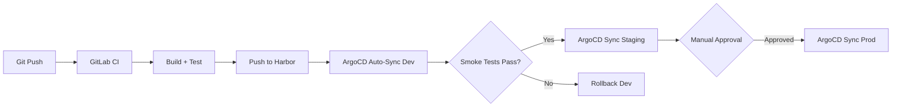

# Estratégia de Evolução: Do Paliativo ao Enterprise-Grade

**Documento**: Evolution Strategy v1.0
**Data**: 2026-01-07
**Relacionado**: [AWS EKS Quickstart](aws-eks-gitlab-quickstart.md)

---

**Filosofia**: Este documento descreve como o ambiente quickstart foi projetado como um **ambiente paliativo evolutivo** - inicia com o mínimo viável, mas com **fundações arquiteturais corretas** que permitem crescimento exponencial sem necessidade de refatoração.

## Princípios de Design Evolutivo

1. **Start Small, Scale Smart**: Começar com 1 ambiente, mas com padrões que suportam N ambientes
2. **Namespace-First**: Estrutura de namespaces já preparada para segregação futura
3. **IaC desde o Dia 1**: Terraform + Helm permitem replicação idempotente
4. **Security by Design**: RBAC e Network Policies básicas, expansíveis sem breaking changes
5. **GitOps-Ready**: Estrutura de configuração compatível com ArgoCD desde o início

---

## Roadmap de Crescimento: 5 Fases de Maturidade

### **Fase 0: Quickstart (Este Documento) - 3 Sprints**

**Estado**: Ambiente único de desenvolvimento/validação
**Objetivo**: Validar stack técnica e viabilidade

**Características**:
- ✅ Single environment (dev/test)
- ✅ Namespaces básicos por domínio (`gitlab`, `observability`, `app-default`)
- ✅ RBAC mínimo e Network Policies básicas
- ✅ GitLab operacional com CI básico
- ✅ Observability baseline (Prometheus, Loki, Tempo, Grafana)
- ✅ Backups e DR básico

**Conformidade ADRs**: 45% (foco em ADR-003, ADR-004, ADR-013)

---

### **Fase 1: Segregação de Ambientes - 2 Sprints Adicionais**

**Estado**: Multi-ambiente no mesmo cluster
**Objetivo**: Dev, Staging e Prod isolados via namespaces

**Mudanças Incrementais**:

```diff
# De:
namespaces:
  - gitlab
  - observability
  - app-default

# Para:
namespaces:
  - k8s-cicd-dev           # GitLab Dev + Runners
  - k8s-cicd-staging       # GitLab Staging (share runners)
  - k8s-cicd-prod          # GitLab Prod (dedicated runners)
  - k8s-observability-dev
  - k8s-observability-prod # Observability consolidada
  - k8s-app-dev
  - k8s-app-staging
  - k8s-app-prod
```

**Novas Capabilities**:
- ✅ Resource Quotas por ambiente (dev: 4 CPUs, staging: 8 CPUs, prod: 16+ CPUs)
- ✅ Network Policies de isolamento (dev ↛ prod)
- ✅ RBAC granular (devs = read-only prod, write dev)
- ✅ RDS segregado (1 instância dev/staging compartilhada, 1 prod dedicada Multi-AZ)
- ✅ Redis/RabbitMQ por ambiente
- ✅ Helm values overlay por ambiente (`values-{env}.yaml`)

**Estratégia de Promoção** (manual nesta fase):

```bash
# Promoção manual via Helm
helm upgrade gitlab-dev -f values-dev.yaml   # Auto-deploy em git push
helm upgrade gitlab-stg -f values-staging.yaml  # Manual após validação
helm upgrade gitlab-prd -f values-prod.yaml     # Manual com approval
```

**Conformidade ADRs**: 65% (adiciona ADR-005, ADR-015 parcial)

**Estimativa**: +32h (2 engenheiros x 2 dias)

---

### **Fase 2: GitOps e Automação - 2 Sprints**

**Estado**: Continuous Deployment automatizado
**Objetivo**: Promoção automática dev → staging, manual staging → prod

**Novas Capabilities**:
- ✅ **ArgoCD** instalado em `k8s-cicd-prod` (control plane)
- ✅ **GitOps Repository** separado do código (infra-as-code)
- ✅ **Applications ArgoCD** por ambiente:

  ```yaml
  # argocd/apps/gitlab-dev.yaml
  apiVersion: argoproj.io/v1alpha1
  kind: Application
  metadata:
    name: gitlab-dev
    namespace: argocd
  spec:
    source:
      repoURL: https://gitlab.example.com/infra/gitops-configs.git
      path: apps/gitlab/overlays/dev
      targetRevision: main
    destination:
      server: https://kubernetes.default.svc
      namespace: k8s-cicd-dev
    syncPolicy:
      automated:
        prune: true
        selfHeal: true  # Auto-sync dev
  ```

- ✅ **Image Updater** para promover tags entre ambientes
- ✅ **Sync Waves** para ordem de deploy (DB → App → Ingress)

**Fluxo de Promoção Automatizado**:



**Conformidade ADRs**: 75% (adiciona ADR-004 completo)

**Estimativa**: +48h (2 engenheiros x 3 dias)

---

### **Fase 3: Service Mesh e Segurança Avançada - 3 Sprints**

**Estado**: Zero-trust networking
**Objetivo**: mTLS automático, policies avançadas, conformidade total

**Novas Capabilities**:
- ✅ **Linkerd** (Service Mesh) instalado em todos os namespaces
  - mTLS automático entre pods
  - Traffic splitting para Canary deployments
  - Retry policies e circuit breakers
- ✅ **Kyverno** (Policy Engine)
  - Enforce image scanning (block vulnerabilities)
  - Require resource limits em todos os pods
  - Validate labels obrigatórios
- ✅ **Falco** (Runtime Security)
  - Detecção de comportamento anômalo
  - Alertas em shells interativos em prod
- ✅ **Cert-Manager Production**
  - Let's Encrypt production certificates
  - Rotação automática
- ✅ **External Secrets Operator**
  - Preparação para Vault (ainda usando K8s Secrets)
  - Interface unificada para migração futura
- ✅ **Network Policies Avançadas**

  ```yaml
  # Exemplo: Apenas staging pode acessar prod para blue/green
  apiVersion: networking.k8s.io/v1
  kind: NetworkPolicy
  metadata:
    name: allow-staging-to-prod-canary
    namespace: k8s-app-prod
  spec:
    podSelector:
      matchLabels:
        app: myapp
        version: canary
    ingress:
    - from:
      - namespaceSelector:
          matchLabels:
            env: staging
  ```

**Conformidade ADRs**: 90% (adiciona ADR-005 completo, ADR-007, ADR-014)

**Estimativa**: +72h (2 engenheiros x 4.5 dias)

---

### **Fase 4: Multi-Cluster e HA Enterprise - 4 Sprints**

**Estado**: Produção em cluster dedicado
**Objetivo**: Separação física dev/staging vs prod, HA real

**Arquitetura Target**:

```
┌─────────────────────────────────────────┐
│ EKS Cluster 1: Non-Prod                 │
│ ├── k8s-cicd-dev                        │
│ ├── k8s-cicd-staging                    │
│ ├── k8s-observability-dev               │
│ └── k8s-app-{domain}-{dev|staging}      │
└─────────────────────────────────────────┘
                  │
                  ↓ (Promoção via ArgoCD)
┌─────────────────────────────────────────┐
│ EKS Cluster 2: Production               │
│ ├── k8s-cicd-prod (3 AZs HA)            │
│ ├── k8s-observability-prod (federated)  │
│ ├── k8s-platform-core (Kong+Keycloak)   │
│ └── k8s-app-{domain}-prod (HA)          │
└─────────────────────────────────────────┘
```

**Novas Capabilities**:
- ✅ **Cluster Prod Dedicado** com node groups HA (3+ AZs)
- ✅ **RDS Aurora Global** (Multi-Region DR)
- ✅ **ElastiCache Redis Cluster Mode** (sharded, HA)
- ✅ **S3 Cross-Region Replication** para backups
- ✅ **ArgoCD Multi-Cluster** (1 control plane → N clusters)
- ✅ **Observability Federada** (Prometheus federation, Grafana centralizado)
- ✅ **Kong API Gateway** + **Keycloak** em prod
- ✅ **HashiCorp Vault** para secrets production
- ✅ **Velero** com restore cross-cluster

**Conformidade ADRs**: 98% (todos os ADRs sistêmicos implementados)

**Estimativa**: +128h (2 engenheiros x 8 dias)

---

### **Fase 5: Platform Engineering Completo - Contínuo**

**Estado**: Self-service developer platform
**Objetivo**: Desenvolvedores provisionam recursos via portal

**Capabilities Finais**:
- ✅ **Backstage** (Developer Portal)
  - Service catalog de todos os serviços
  - Templates scaffolding (novo microsserviço em 5 min)
  - Self-service CI/CD pipelines
- ✅ **Crossplane** (Control Plane)
  - Abstrações cloud-agnostic
  - Developers criam RDS via `kubectl apply -f database.yaml`
- ✅ **Kubernetes Operators** customizados
  - PostgreSQL Operator (CloudNativePG)
  - RabbitMQ Cluster Operator
- ✅ **FinOps Automation**
  - Kubecost para chargeback por namespace
  - Spot instances automation
  - Auto-scaling baseado em custo
- ✅ **Compliance as Code**
  - OPA policies para todas as regulações
  - Audit logs automáticos
  - Drift detection

**Conformidade ADRs**: 100% + Innovation Backlog

**Estimativa**: Platform team dedicado (ongoing)

---

## Tabela Comparativa de Maturidade

| Característica | Fase 0 | Fase 1 | Fase 2 | Fase 3 | Fase 4 | Fase 5 |
|----------------|--------|--------|--------|--------|--------|--------|
| **Ambientes** | 1 (dev) | 3 (dev/stg/prd) | 3 + GitOps | 3 + GitOps | Multi-Cluster | N Clusters |
| **Namespaces** | 3 básicos | 8+ segregados | 8+ GitOps | 8+ + Mesh | 15+ HA | N self-service |
| **Promoção** | Manual | Manual Helm | ArgoCD Auto | Canary/Blue-Green | Multi-Cluster | Template-driven |
| **Segurança** | RBAC básico | RBAC + NP | RBAC + NP | mTLS + Policies | Vault + Zero-Trust | Compliance Auto |
| **HA/DR** | Single-AZ | Multi-AZ | Multi-AZ + Backup | Multi-AZ + DR Drill | Multi-Region | Auto-Failover |
| **Observability** | Prom + Grafana | Por ambiente | Traces + Logs | APM completo | Federado | AIOps |
| **Secrets** | K8s Secrets | K8s Secrets | External Secrets | External Secrets | Vault | Vault + Rotation |
| **IaC Coverage** | 60% | 80% | 90% | 95% | 98% | 100% |
| **Time to Deploy** | 3 sprints | +2 sprints | +2 sprints | +3 sprints | +4 sprints | Contínuo |
| **Team Size** | 1-2 eng | 2 eng | 2 eng | 2-3 eng | 3-4 eng | Platform team |
| **ADR Compliance** | 45% | 65% | 75% | 90% | 98% | 100% |

---

## Gatekeepers de Transição Entre Fases

**Fase 0 → Fase 1** (Pronto para segregar ambientes):
- [ ] GitLab operacional com 10+ pipelines bem-sucedidos
- [ ] Observability coletando métricas de todos os pods
- [ ] 1 restore de backup validado com sucesso
- [ ] Network Policies básicas testadas e funcionais
- [ ] Time familiarizado com Helm e Terraform

**Fase 1 → Fase 2** (Pronto para GitOps):
- [ ] 3 ambientes (dev/staging/prod) estáveis por 2+ semanas
- [ ] Promoção manual executada com sucesso 5+ vezes
- [ ] Resource Quotas não violadas, pods não evicted
- [ ] RBAC granular validado (devs não acessam prod)
- [ ] Git repository estruturado com branches por ambiente

**Fase 2 → Fase 3** (Pronto para Service Mesh):
- [ ] ArgoCD gerenciando 100% dos deploys há 1+ mês
- [ ] Zero rollbacks manuais nas últimas 20 promoções
- [ ] Tracing distribuído coletando dados de apps
- [ ] Network Policies cobrindo 100% dos namespaces
- [ ] Time confortável com conceitos de mTLS

**Fase 3 → Fase 4** (Pronto para Multi-Cluster):
- [ ] Prod rodando stable por 3+ meses sem downtime
- [ ] DR Drill executado com sucesso (RTO < 1h)
- [ ] Linkerd operando sem issues por 2+ meses
- [ ] Políticas Kyverno cobrindo 100% dos workloads
- [ ] Justificativa de negócio para cluster dedicado (compliance, scale, ou security)

**Fase 4 → Fase 5** (Pronto para Platform Engineering):
- [ ] Multi-cluster estável por 6+ meses
- [ ] 10+ aplicações rodando em produção
- [ ] Demanda comprovada de desenvolvedores por self-service
- [ ] Time de platform dedicado disponível (2+ engenheiros)
- [ ] Buy-in executivo para investimento em developer experience

---

## Decisões de Arquitetura Evolutivas

### **Namespaces: Preparados para Crescer**

**Quickstart (Fase 0)**:

```yaml
# Simples, mas já com padrão extensível
namespaces:
  - gitlab           # Pode virar k8s-cicd-dev
  - observability    # Pode virar k8s-observability-dev
  - app-default      # Template para k8s-app-{name}-dev
```

**Fase 1 Migration Path** (zero downtime):

```bash
# 1. Criar novos namespaces com padrão target
kubectl create namespace k8s-cicd-dev
kubectl label namespace k8s-cicd-dev env=dev domain=cicd

# 2. Migrar recursos com Helm upgrade
helm upgrade gitlab gitlab/gitlab \
  -n k8s-cicd-dev \
  -f values-dev.yaml \
  --set global.hosts.domain=gitlab-dev.example.com

# 3. Validar novo namespace
kubectl get pods -n k8s-cicd-dev

# 4. Deprecar namespace antigo (após 2 semanas de validação)
kubectl delete namespace gitlab
```

**Vantagem**: Namespaces iniciais simples não bloqueiam evolução futura.

---

### **RBAC: Least-Privilege desde o Início**

**Quickstart (Fase 0)** - RBAC Mínimo Evolutivo:

```yaml
# Já criar ServiceAccounts dedicadas (mesmo em ambiente único)
apiVersion: v1
kind: ServiceAccount
metadata:
  name: gitlab-runner
  namespace: gitlab
---
# Role básica, mas explícita (não usar default SA)
apiVersion: rbac.authorization.k8s.io/v1
kind: Role
metadata:
  name: gitlab-runner-role
  namespace: gitlab
rules:
- apiGroups: [""]
  resources: ["pods", "pods/exec", "secrets"]
  verbs: ["get", "list", "create", "delete"]
---
apiVersion: rbac.authorization.k8s.io/v1
kind: RoleBinding
metadata:
  name: gitlab-runner-binding
  namespace: gitlab
subjects:
- kind: ServiceAccount
  name: gitlab-runner
roleRef:
  kind: Role
  name: gitlab-runner-role
  apiGroup: rbac.authorization.k8s.io
```

**Fase 1 Evolution** (apenas adicionar, não refatorar):

```yaml
# Adicionar Roles específicas por ambiente
---
apiVersion: rbac.authorization.k8s.io/v1
kind: Role
metadata:
  name: developer-role
  namespace: k8s-cicd-dev
rules:
- apiGroups: [""]
  resources: ["pods", "pods/log"]
  verbs: ["get", "list"]  # Read-only em dev
- apiGroups: ["apps"]
  resources: ["deployments"]
  verbs: ["get", "list", "patch"]  # Pode fazer rollback
---
apiVersion: rbac.authorization.k8s.io/v1
kind: Role
metadata:
  name: developer-role
  namespace: k8s-cicd-prod
rules:
- apiGroups: [""]
  resources: ["pods/log"]
  verbs: ["get", "list"]  # Apenas logs em prod, sem exec
```

**Vantagem**: RBAC inicial já segue princípios corretos, evolução é aditiva.

---

### **Network Policies: Deny-All Day 1, Relaxar Depois**

**Quickstart (Fase 0)** - Já implementar deny-all:

```yaml
# Default deny em TODOS os namespaces desde o início
apiVersion: networking.k8s.io/v1
kind: NetworkPolicy
metadata:
  name: default-deny-all
  namespace: gitlab  # Aplicar em cada namespace
spec:
  podSelector: {}
  policyTypes:
  - Ingress
  - Egress
---
# Permitir apenas o necessário explicitamente
apiVersion: networking.k8s.io/v1
kind: NetworkPolicy
metadata:
  name: allow-gitlab-to-rds
  namespace: gitlab
spec:
  podSelector:
    matchLabels:
      app: webservice
  policyTypes:
  - Egress
  egress:
  - to:
    - namespaceSelector: {}  # Permitir DNS
      podSelector:
        matchLabels:
          k8s-app: kube-dns
    ports:
    - protocol: UDP
      port: 53
  - to:
    - podSelector: {}  # RDS está fora do cluster (AWS Security Group controla)
    ports:
    - protocol: TCP
      port: 5432
```

**Fase 1 Evolution** (apenas copiar policies para novos namespaces):

```bash
# Script para replicar policies
for ns in k8s-cicd-dev k8s-cicd-staging k8s-cicd-prod; do
  kubectl apply -f network-policies/deny-all.yaml -n $ns
  kubectl apply -f network-policies/allow-{service}.yaml -n $ns
done
```

**Vantagem**: Segurança desde o dia 1, sem relaxar depois (evita drift).

---

### **Configuração: Helm Values Overlay Preparado**

**Quickstart (Fase 0)** - Já estruturar em layers:

```
helm/
└── gitlab/
    ├── values.yaml              # Base (cloud-agnostic)
    ├── values-aws.yaml          # Cloud-specific (storage class, etc)
    └── values-quickstart.yaml   # Environment-specific (single env)
```

**Fase 1 Evolution** (apenas adicionar novos arquivos):

```
helm/
└── gitlab/
    ├── values.yaml              # Base (unchanged)
    ├── values-aws.yaml          # Cloud-specific (unchanged)
    ├── values-dev.yaml          # New: dev environment
    ├── values-staging.yaml      # New: staging environment
    └── values-prod.yaml         # New: prod environment (mais recursos)
```

**Deploy commands evolution**:

```bash
# Fase 0 (quickstart)
helm install gitlab -f values.yaml -f values-aws.yaml -f values-quickstart.yaml

# Fase 1 (multi-env)
helm install gitlab-dev -f values.yaml -f values-aws.yaml -f values-dev.yaml -n k8s-cicd-dev
helm install gitlab-stg -f values.yaml -f values-aws.yaml -f values-staging.yaml -n k8s-cicd-staging
helm install gitlab-prd -f values.yaml -f values-aws.yaml -f values-prod.yaml -n k8s-cicd-prod
```

**Vantagem**: Camadas base reutilizadas, apenas overlay muda.

---

## Mapeamento de ADRs por Fase

| ADR | Título | Fase 0 | Fase 1 | Fase 2 | Fase 3 | Fase 4 | Fase 5 |
|-----|--------|--------|--------|--------|--------|--------|--------|
| ADR-003 | Cloud-Agnostic | ✅ Helm+TF | ✅ | ✅ | ✅ | ✅ | ✅ |
| ADR-004 | IaC + GitOps | ⚠️ IaC only | ⚠️ IaC only | ✅ Full | ✅ | ✅ | ✅ |
| ADR-005 | Segurança Sistêmica | ⚠️ Básico | ✅ RBAC+NP | ✅ | ✅ Full | ✅ | ✅ |
| ADR-006 | Observabilidade | ✅ OTEL+Prom | ✅ | ✅ | ✅ APM | ✅ Federado | ✅ |
| ADR-007 | Service Mesh | ❌ | ❌ | ❌ | ✅ Linkerd | ✅ | ✅ |
| ADR-013 | Disaster Recovery | ⚠️ Backup | ✅ DR Drill | ✅ | ✅ | ✅ Multi-Region | ✅ |
| ADR-015 | Multi-Tenancy | ⚠️ NS básico | ✅ Segregado | ✅ | ✅ | ✅ | ✅ |
| ADR-020 | Provisionamento | ⚠️ Manual | ⚠️ IaC | ✅ GitOps | ✅ | ✅ | ✅ Self-Service |

**Legenda**:
- ✅ Implementado completamente
- ⚠️ Implementação parcial (suficiente para fase)
- ❌ Não aplicável na fase

---

## Exemplo Prático: Jornada de uma Aplicação

### **Fase 0 - Deploy Manual**

```bash
# Developer publica app manualmente
kubectl apply -f app.yaml -n app-default
kubectl expose deployment myapp --port=8080
```

### **Fase 1 - Deploy por Ambiente**

```bash
# Developer escolhe ambiente target
kubectl apply -f app.yaml -n k8s-app-dev      # Dev
kubectl apply -f app.yaml -n k8s-app-staging  # Staging
kubectl apply -f app.yaml -n k8s-app-prod     # Prod (com approval)
```

### **Fase 2 - GitOps Automático**

```bash
# Developer apenas faz commit
git commit -m "feat: add feature X"
git push origin develop

# ArgoCD auto-sync em dev (sem intervenção humana)
# Pipeline GitLab notifica sucesso
# Developer clica "Promote to Staging" na UI do ArgoCD
```

### **Fase 3 - Canary Deployment**

```yaml
# Developer define estratégia no manifesto
apiVersion: apps/v1
kind: Deployment
metadata:
  annotations:
    linkerd.io/inject: enabled
    flagger.app/canary-weight: "10"  # 10% do tráfego
spec:
  replicas: 3
```

### **Fase 4 - Multi-Cluster Promotion**

```bash
# Developer faz merge to main
# ArgoCD deploy em cluster non-prod primeiro
# Validação automática (smoke tests + metrics)
# ArgoCD promove para cluster prod após approval
```

### **Fase 5 - Self-Service Platform**

```bash
# Developer usa Backstage template
backstage-cli create component \
  --template fastapi-microservice \
  --name my-awesome-api

# Platform provisiona automaticamente:
# - Git repository
# - CI/CD pipeline
# - Dev/Staging/Prod namespaces
# - PostgreSQL database (via Crossplane)
# - Observability dashboards
# - Secrets management
```

---

## Custos Evolutivos (AWS us-east-1)

| Fase | Clusters | Nodes | RDS | Custo Mensal (dev) | Custo Mensal (prod 24/7) |
|------|----------|-------|-----|-------------------|--------------------------|
| **Fase 0** | 1 | 3-4 t3 | 1 t3.small | ~$280 (8h/dia) | ~$650 |
| **Fase 1** | 1 | 4-6 t3 | 2 t3.small | ~$380 (8h/dia) | ~$920 |
| **Fase 2** | 1 | 5-7 t3 | 2 t3.small | ~$420 (8h/dia) | ~$1,050 |
| **Fase 3** | 1 | 6-8 t3 | 2 t3.medium | ~$580 (8h/dia) | ~$1,450 |
| **Fase 4** | 2 | 10-15 t3/c5 | Aurora Multi-AZ | ~$1,200 | ~$3,800 |
| **Fase 5** | 2+ | 15-25 spot/on-demand | Aurora Global | ~$1,800 | ~$6,500 |

**Observações**:
- Custos dev assumem uso 8h/dia útil (automatizar stop/start)
- Fase 4+ usa Spot instances (~70% economia) para non-prod
- Custos não incluem: WAF, Route53, S3, data transfer (adicionar ~15%)
- Conversão USD → BRL com cotação R$ 6,00 (jan/2026)

---

## Recomendação de Ritmo

**Cenário 1: Time Terceirizado (velocidade máxima)**
- Fase 0: 3 sprints (6 semanas)
- Fase 1: +2 sprints (4 semanas) - **Total: 10 semanas**
- Pausa para estabilização: 4 semanas
- Fase 2: +2 sprints (4 semanas) - **Total: 18 semanas**

**Cenário 2: Time Interno (aprendizado contínuo)**
- Fase 0: 4 sprints (8 semanas)
- Estabilização e learning: 8 semanas
- Fase 1: +3 sprints (6 semanas) - **Total: 22 semanas**
- Estabilização: 4 semanas
- Fase 2: +3 sprints (6 semanas) - **Total: 32 semanas (~8 meses)**

**Cenário 3: Híbrido (recomendado)**
- Terceirizado: Fase 0 + Fase 1 (10 semanas)
- Handoff + knowledge transfer: 2 semanas
- Interno: Fase 2 em diante (ritmo próprio)

---

## Checklist de Conformidade por Fase

Use esta checklist para validar se está pronto para evoluir:

### ✅ Fase 0 - Quickstart Completo

- [ ] GitLab acessível via HTTPS com TLS válido
- [ ] 3+ pipelines CI rodando com sucesso
- [ ] Observability coletando métricas de todos os pods
- [ ] Grafana com 5+ dashboards operacionais
- [ ] 1 backup restaurado com sucesso (GitLab + RDS)
- [ ] Network Policies deny-all aplicadas e testadas
- [ ] RBAC com ServiceAccounts dedicadas (não usar default)
- [ ] Documentação as-built atualizada
- [ ] DR Drill executado (RTO < 1h, RPO < 24h)
- [ ] Time treinado em Terraform + Helm + Kubectl

### ✅ Fase 1 - Ambientes Segregados

- [ ] 3 namespaces por domínio (dev/staging/prod)
- [ ] Resource Quotas configuradas e não violadas
- [ ] RBAC granular: devs não acessam secrets de prod
- [ ] Network Policies isolam dev de prod
- [ ] RDS segregado (ou schemas separados com encryption)
- [ ] Helm values overlay por ambiente funcionando
- [ ] Promoção manual executada 5+ vezes com sucesso
- [ ] Observability por ambiente (labels corretos)
- [ ] Custos por ambiente rastreáveis (tags AWS)

### ✅ Fase 2 - GitOps Implementado

- [ ] ArgoCD gerenciando 100% dos deploys
- [ ] Git repository estruturado (branches por ambiente)
- [ ] Auto-sync habilitado para dev
- [ ] Manual approval para staging → prod
- [ ] Image Updater promovendo tags automaticamente
- [ ] Rollback automático em falhas de healthcheck
- [ ] Sync hooks executando pre/post deploy tasks
- [ ] Notifications integradas (Slack/Teams)

### ✅ Fase 3 - Mesh e Segurança

- [ ] Linkerd operando em todos os namespaces
- [ ] mTLS verificado (100% dos requests encrypted)
- [ ] Kyverno policies enforcing image scanning
- [ ] Falco alertando em comportamentos anômalos
- [ ] External Secrets Operator gerenciando secrets
- [ ] Cert-Manager com certificados production
- [ ] Zero vulnerabilidades críticas em imagens
- [ ] Compliance scan passando (CIS Benchmark)

### ✅ Fase 4 - Multi-Cluster

- [ ] Cluster prod dedicado operacional
- [ ] ArgoCD multi-cluster configurado
- [ ] Observability federada (Prometheus federation)
- [ ] Aurora Multi-AZ com read replicas
- [ ] Cross-region backups configurados
- [ ] Disaster Recovery testado cross-cluster
- [ ] Latency < 50ms entre clusters (se multi-region)

### ✅ Fase 5 - Platform Engineering

- [ ] Backstage operacional com 10+ templates
- [ ] Crossplane provisionando recursos cloud
- [ ] Self-service habilitado para desenvolvedores
- [ ] FinOps automation (chargeback por namespace)
- [ ] Compliance as Code (OPA policies)
- [ ] Platform team dedicado (2+ engenheiros)

---

## Diagrama Visual de Evolução

Veja [evolution-roadmap.mmd](diagrams/evolution-roadmap.mmd) para o diagrama Mermaid completo das 5 fases.

---

**Próximos Passos**:

1. Complete a Fase 0 (Quickstart) conforme [aws-eks-gitlab-quickstart.md](aws-eks-gitlab-quickstart.md)
2. Valide gatekeepers de transição Fase 0 → Fase 1
3. Decida timing para evolução baseado em critérios de negócio
4. Mantenha este documento atualizado conforme evolução real

---

**Referências**:
- [AWS EKS Quickstart](aws-eks-gitlab-quickstart.md)
- [SAD v1.2 - Arquitetura Principal](../SAD/docs/sad.md)
- [ADRs Sistêmicos](../SAD/docs/adrs/)
