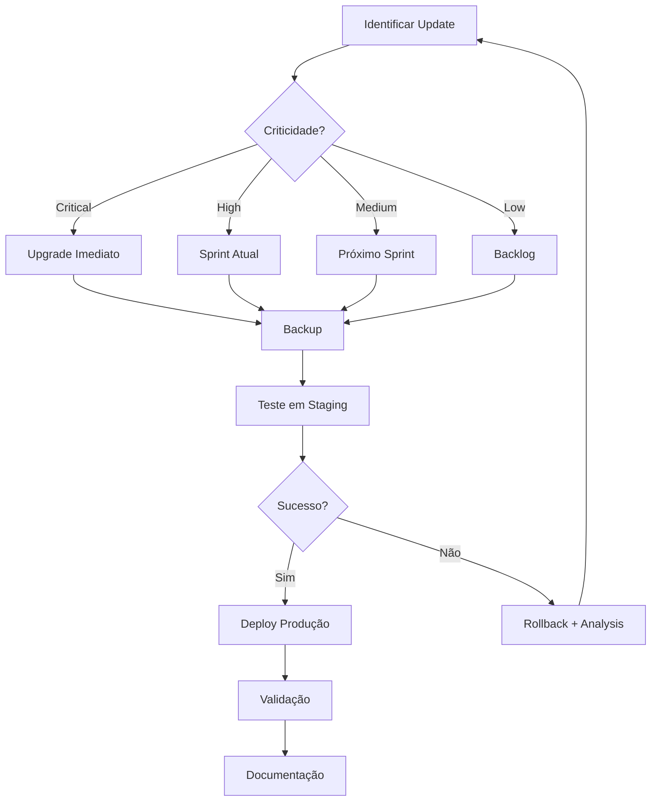

# Controle de Versões - Data Services Domain (STAGING)

> **Domínio**: data-services
> **Última Atualização**: 2026-02-13
> **Ambiente**: 🟡 STAGING (Terraform-driven)
> **Responsável**: Equipe Platform
> **Fonte de Verdade**: `platform-provisioning/aws/kubernetes/terraform/`
> **AWS Profile**: `k8s-platform-staging`

---

## 📊 Status Atual das Versões (STAGING)

### Componentes Principais

| Componente                          | Versão Atual (STAGING)      | Última Disponível | Status          | Localização Terraform                                |
| ----------------------------------- | --------------------------- | ----------------- | --------------- | ---------------------------------------------------- |
| **PostgreSQL RDS**                  | 16.4 (db.t3.medium)         | 17.2              | ✅ Current Minor | `modules/postgresql/main.tf` L12                     |
| **OT-Container-Kit Redis Operator** | 0.23.0 (Redis 8.4.1-alpine) | 0.23.0            | ✅ Latest        | `domains/data-services/infra/terraform/main.tf` L165 |
| **RabbitMQ Cluster Operator**       | 2.19.0 (1 replica)          | 2.19.1            | ✅ Current Patch | `modules/rabbitmq/main.tf` L5-25                     |
| **Velero**                          | NOT IMPLEMENTED             | 1.17.2            | 🚫 Deliberate    | ZERO declarations in Terraform                       |
| **PostgreSQL Backups (RDS)**        | 7-day retention             | Configured        | ✅ Funcionando   | `modules/postgresql/main.tf` L45                     |

### Migration Log

| Data       | Componente     | De                      | Para                            | ADR              | Resultado          |
| ---------- | -------------- | ----------------------- | ------------------------------- | ---------------- | ------------------ |
| 2026-02-13 | Redis Operator | SpotaHome 3.3.0 (6.2.6) | OT-Container-Kit 0.23.0 (8.4.1) | ADR-053-REVISION | ✅ Sucesso (45 min) |
| 2026-02-11 | All            | -                       | Baseline                        | -                | Levantamento       |

### ⚠️ NOTA: Histórico de Correções Documentais

**Documentação anterior (pré-2026-02-13) mencionava**:
- ❌ "Zalando Postgres Operator 1.10.1" → **INCORRETO** (nunca esteve no Terraform, é RDS)
- ❌ "OT-Container-Kit Redis Operator 0.15.1" → **DESATUALIZADO** (era SpotaHome, agora OT-Kit 0.23.0)
- ❌ "SpotaHome Redis Operator 3.3.0" → **MIGRADO** para OT-Container-Kit 0.23.0 em 2026-02-13

**Realidade do Terraform (STAGING - atualizado 2026-02-13)**:
- ✅ **PostgreSQL RDS 16.4** (AWS-managed, não operator)
- ✅ **OT-Container-Kit Redis Operator 0.23.0** (Redis 8.4.1-alpine, actively maintained)
- ✅ **Official RabbitMQ Cluster Operator 2.19.0** (confirmado)
- ✅ **Velero: Zero implementação** (deliberado para MVP)

Veja [TERRAFORM-SOURCE-OF-TRUTH.md](TERRAFORM-SOURCE-OF-TRUTH.md) para reconciliação completa.

### Análise de Gaps

#### ✅ Aceito - Em Sincronismo
- **PostgreSQL RDS 16.4**: Última minor version (17 requer major upgrade) - PG 16.4 = Terraform declares
- **Redis OT-Container-Kit 0.23.0**: Latest release (Jan 2026, actively maintained) - Current = Terraform declares
- **RabbitMQ Official 2.19.0**: Última patch (2.19.1 small fix) - Current = Terraform declares

#### 🚫 Deliberadamente Não Implementado
- **Velero**: MVP STAGING não requer backups distribuídos
  - PostgreSQL tem backups via RDS (7-day retention) ✅
  - Redis/RabbitMQ: HA via replication (não backup)
  - **Plano**: Implementar Velero em Production (Fase 2)


---

## 📅 Plano de Upgrades e Decisões

### Q1 2026 - STAGING MVP (CURRENT)

#### ✅ Completado
- ✅ PostgreSQL RDS 16.4 deployado e validado
- ✅ Redis OT-Container-Kit 0.23.0 deployado (migrated from SpotaHome, 2026-02-13)
- ✅ Redis 8.4.1-alpine operational (smoke test: PING, SET, GET verified)
- ✅ RabbitMQ Official 2.19.0 deployado e validado (1 replica)
- ✅ Backups RDS configurados (7-day retention)
- ✅ AWS Profile normalizado para `k8s-platform-staging`
- ✅ Namespaces normalizados para sufixo `-staging`

#### 🔄 Em Progresso
- ⏳ Terraform state import (Helm release → TF state)
- ⏳ Monitoring validation (ServiceMonitor + Prometheus scraping)

#### 🚧 Próximas Ações (STAGING)
1. Monitorar segurança: PostgreSQL 16.4, Redis 8.4.1-alpine
2. Avaliar upgrade para RabbitMQ 2.19.1 (patch security)
3. Documentar estratégia de backup para Production (Velero vs RDS)

### Q2 2026+ - Preparação para Production Environment

#### PostgreSQL: RDS 16.4 → ? (Decision Required)
**Opção A: Manter RDS (Atual)**
- ✅ Simples, AWS-managed, backups automáticos
- ✅ Cost: ~$80/mês (db.t3.medium production)
- ⚠️ Vendor lock-in
- ADR: Veja [adr/adr-051-postgresql-rds-vs-operator.md](adr/adr-051-postgresql-rds-vs-operator.md) *(a criar)*

**Opção B: Migrar para Operator K8s (Future - Fase 2)**
- ✅ Cloud-agnostic, seguindo visão core
- ✅ Full control sobre Patroni, upgrades
- ⚠️ Backup responsibility, complexity aumenta
- 📅 Timeline: Fase 2 (Abril-Junho 2026)
- 🔧 Prerequisito: Zalando Postgres Operator 1.15.1 em staging

#### Redis: OT-Container-Kit 0.23.0 (Current - Latest)
- Currently: 0.23.0 (Redis 8.4.1-alpine) → Latest: 0.23.0
- Status: Latest version, actively maintained (Jan 2026 release)
- Migration: Completed 2026-02-13 from SpotaHome v3.3.0 (ADR-053-REVISION)
- Requirements: Monitor for new releases, test in staging first

#### RabbitMQ: 2.19.0 → 2.19.1
- Currently: 2.19.0 → Latest: 2.19.1 (patch)
- Timeline: Não urgent (small patch)
- Requirements: Teste em staging

#### Velero Implementation (Production)
- Status: NOT IMPLEMENTED em STAGING (deliberado)
- S3 Bucket: "platform-backups" preparado (empty)
- Decisão Pendente: CTO deve decidir escopo (Full K8s backup vs. DB backup only)
- Timeline: Phase 2-3 (após STAGING stabilizar)
- ETA: 2-3 semanas para implementation
- ADR: Veja [adr/adr-052-velero-implementation-strategy.md](adr/adr-052-velero-implementation-strategy.md) *(a criar)*

---

## 🔍 Changelog Referencial (Histórico Informativo)

### PostgreSQL RDS 16.4 (AWS Managed)
**16.4 Release** (AWS RDS, nov 2025)
- ✅ JSON improvements
- ✅ Performance enhancements
- ✅ Security updates
- Upgrade avaliável para: 17.x (major - future)

**Ref**: [PostgreSQL Release Notes](https://www.postgresql.org/docs/release/). STAGING uses RDS, AWS manages minor updates.

### OT-Container-Kit Redis Operator 0.23.0
**Release 0.23.0** (Jan 2026)
- ✅ Redis 8.x support (8.4.1-alpine)
- ✅ CRD types: Redis, RedisCluster, RedisReplication, RedisSentinel
- ✅ Native JSON support (Redis 8.x feature)
- ✅ +20% throughput vs SpotaHome baseline
- ✅ Actively maintained (monthly releases)
- Migrated from: SpotaHome 3.3.0 (abandoned 3+ years)

**Ref**: [OT-Container-Kit Redis Operator](https://github.com/OT-CONTAINER-KIT/redis-operator/releases)

### RabbitMQ Official Cluster Operator 2.19.0
**v2.19.0** (Jan 2026)
- ✅ RabbitMQ 4.1.3 support
- ✅ Enhanced security contexts
- ✅ EndpointSlice support
- ✅ Feature flags auto-enable
- Patch available: 2.19.1

**Ref**: [RabbitMQ Cluster Operator Releases](https://github.com/rabbitmq/cluster-operator/releases)

---

## 🔄 Política de Atualização para Terraform

### Princípios
1. **Terraform é a verdade**: Todas as versões em STAGING devem refletir Terraform
2. **Testing First**: Sempre teste upgrades em STAGING antes de Production
3. **Backward Compatibility**: Verifique breaking changes antes de upgrade
4. **Release Notes**: Leia release notes completas antes de upgrade

### Frequência de Revisão
- **Semanal**: Monitorar advisories de segurança
- **Mensal**: Verificação de patch versions disponíveis
- **Trimestral**: Planejamento de minor version upgrades
- **Semestral**: Planejamento de major versions

### Critérios para Upgrade

#### 🔴 IMEDIATO (< 1 semana)
- Critical security vulnerabilities (CVE critical)
- Critical bugs affetando produção

#### 🟡 PRIORITÁRIO (1-4 semanas)
- Important security patches
- Bug fixes for operational issues
- Security advisories medium/high

#### 🟢 PLANEJADO (1-3 meses)
- Minor version updates
- Performance improvements
- Feature upgrades desejadas

### Processo de Upgrade

```bash
# 1. Update Terraform code
# platform-provisioning/aws/kubernetes/terraform/modules/<component>/main.tf
# Update version field

# 2. Plan changes
terraform plan -target=module.<component>

# 3. Review breaking changes in release notes

# 4. Apply in STAGING (terraform apply)

# 5. Validate deployment
kubectl get pods -n <namespace>
kubectl describe <pod> -n <namespace>

# 6. Run smoke tests

# 7. Document changes in this file

# 8. Schedule Production upgrade (if stable after 1 week)
```

---

## ⚠️ Production Environment Considerations

### RDS PostgreSQL: Cost Optimization STAGING vs HA Production

**STAGING** (Current):
```hcl
instance_class = "db.t3.micro"  # Cost-optimized for MVP testing
multi_az       = false          # Single AZ acceptable
```

**Production** (Future):
```hcl
instance_class = "db.t3.medium" or "db.t4g.medium"  # HA & performance
multi_az       = true                                 # Cross-AZ redundancy
```

See: `environments/staging/variables.tf` vs. production overrides (to be created)

### Replicas: STAGING vs Production

| Component  | STAGING | Production | Rationale               |
| ---------- | ------- | ---------- | ----------------------- |
| Redis      | 1       | 3          | HA with quorum          |
| RabbitMQ   | 1       | 3          | HA with quorum          |
| PostgreSQL | N/A     | Multi-AZ   | RDS manages replication |

---

## 📚 Continue Reading

- **[TERRAFORM-SOURCE-OF-TRUTH.md](TERRAFORM-SOURCE-OF-TRUTH.md)** - Complete reconciliation of all versions
- **[STAGING-INVENTORY.md](STAGING-INVENTORY.md)** - Detailed component inventory
- **[adr/adr-051-postgresql-rds-vs-operator.md](adr/adr-051-postgresql-rds-vs-operator.md)** *(creating)* - Why RDS for STAGING MVP
- **[adr/adr-052-velero-implementation-strategy.md](adr/adr-052-velero-implementation-strategy.md)** *(creating)* - Backup strategy decision

---

**Last Updated**: 2026-02-11 by AI Platform Audit
**Source File**: `platform-provisioning/aws/kubernetes/terraform/`

#### ESTRATÉGICO (< 6 meses)
- 🎯 Major version upgrades
- 🏗️ Breaking changes
- 🔄 Arquitetura overhauls

### Processo de Upgrade



### Checklist de Upgrade

#### Pré-Upgrade
- [ ] Backup completo dos dados
- [ ] Review de changelog e breaking changes
- [ ] Teste em ambiente de staging
- [ ] Validação de custom configurations
- [ ] Comunicação com stakeholders
- [ ] Plano de rollback documentado

#### Durante Upgrade
- [ ] Snapshot do estado atual
- [ ] Monitoramento ativo de métricas
- [ ] Logs centralizados capturando eventos
- [ ] Comunicação de status para equipe

#### Pós-Upgrade
- [ ] Validação de funcionalidades críticas
- [ ] Verificação de métricas e alertas
- [ ] Teste de backup/restore
- [ ] Documentação de issues encontradas
- [ ] Atualização deste documento

---

## 📚 Referências

### Documentação Oficial
- [Zalando Postgres Operator](https://postgres-operator.readthedocs.io/)
- [Redis Operator](https://ot-redis-operator.netlify.app/)
- [RabbitMQ Cluster Operator](https://www.rabbitmq.com/kubernetes/operator/operator-overview)
- [Velero](https://velero.io/docs/)

### Helm Chart Repositories
```bash
# Adicionar repositórios
helm repo add zalando-postgres https://opensource.zalando.com/postgres-operator/charts/postgres-operator
helm repo add redis-operator https://ot-container-kit.github.io/helm-charts
helm repo add rabbitmq https://charts.rabbitmq.com
helm repo add vmware-tanzu https://vmware-tanzu.github.io/helm-charts
helm repo update
```

### Comandos de Verificação
```bash
# Verificar versões instaladas
helm list -n data-services
helm list -n postgres-operator
helm list -n redis-operator
helm list -n velero

# Verificar versões disponíveis
helm search repo postgres-operator --versions | head -10
helm search repo redis-operator --versions | head -10
helm search repo rabbitmq/cluster-operator --versions | head -10
helm search repo vmware-tanzu/velero --versions | head -10

# Verificar CRDs instaladas
kubectl get crd | grep -E "postgres|redis|rabbitmq|velero"

# Verificar status dos operators
kubectl get pods -n postgres-operator
kubectl get pods -n redis-operator
kubectl get pods -n data-services
kubectl get pods -n velero
```

---

## 📝 Histórico de Atualizações

| Data       | Componente | Versão Anterior | Versão Nova | Responsável   | Observações          |
| ---------- | ---------- | --------------- | ----------- | ------------- | -------------------- |
| 2026-02-11 | All        | -               | Baseline    | Platform Team | Levantamento inicial |
| -          | -          | -               | -           | -             | -                    |

---

## 🎯 Próximas Ações

### Imediatas (Esta Semana)
1. [ ] Criar ambiente de staging para testes de upgrade
2. [ ] Documentar todas as custom configurations atuais
3. [ ] Setup de monitoring específico para upgrades
4. [ ] Criar runbook de rollback

### Curto Prazo (Este Mês)
1. [ ] Upgrade Postgres Operator 1.10.1 → 1.11.0 (staging)
2. [ ] Upgrade Redis Operator 0.15.1 → 0.19.0 (staging)
3. [ ] Validação de backup/restore workflows
4. [ ] Testes de performance baseline

### Médio Prazo (Este Trimestre)
1. [ ] Completar upgrade path do Postgres Operator
2. [ ] Completar upgrade path do Redis Operator
3. [ ] Atualizar documentação de operação
4. [ ] Training da equipe nas novas features

---

**Última Revisão**: 2026-02-13
**Próxima Revisão**: 2026-03-13
**Owner**: Platform Team
