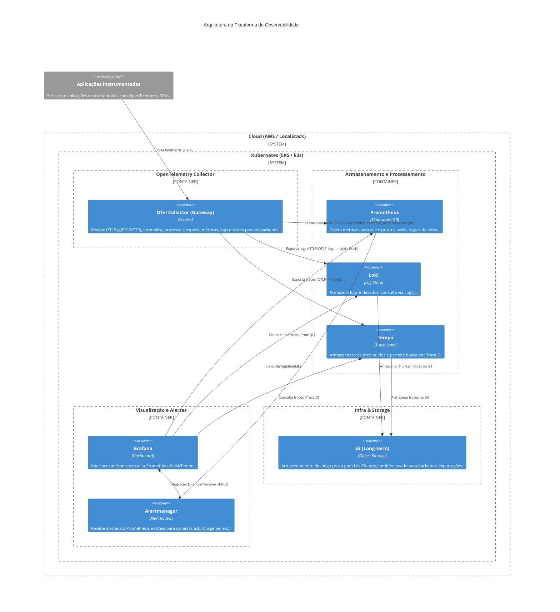

# Arquitetura Lógica - Plataforma de Observabilidade

## Visão Geral
Plataforma centralizada de observabilidade na AWS usando stack open source (Prometheus, Grafana, Loki, Tempo) com isolamento por namespace Kubernetes.

## Decisões Arquiteturais
Baseado em ADR-001 e ADR-002 (Mesa Técnica 08/12/2025).

## Componentes Principais

### 1. AWS Infrastructure Layer
- **VPC**: 3 Availability Zones, subnets públicas e privadas
- **EKS**: Cluster Kubernetes único (versão 1.28+)
- **S3**: Buckets para long-term storage (métricas, logs, backups)
- **IAM**: Roles com IRSA (IAM Roles for Service Accounts) por namespace

### 2. Kubernetes Namespaces
```
observability-dev     # Ambiente de desenvolvimento
observability-hml     # Ambiente de homologação
observability-prd     # Ambiente de produção
```

Isolamento via:
- Network Policies
- Resource Quotas
- RBAC (Role-Based Access Control)
- IAM roles separadas por namespace

### 3. Ingestão e Processamento (Hub Central)

#### OpenTelemetry Collector (Gateway Mode)
- **Ponto único de entrada** para todos os sinais (métricas, logs, traces) via OTLP.
- **Responsabilidades**:
  - **Receivers**: OTLP (gRPC/HTTP), Prometheus Remote Write, etc.
  - **Processors**: sampling, filtering, batching, attribute manipulation, enrichment.
  - **Exporters**: Prometheus, Loki, Tempo, AWS X-Ray, etc.
- **Garante portabilidade**: a instrumentação das aplicações é desacoplada dos backends de armazenamento.

### 4. Stack de Observabilidade (Backends)

#### Métricas (Prometheus)
- **kube-prometheus-stack** (Helm chart)
- Prometheus Operator para gerenciamento declarativo
- ServiceMonitor e PodMonitor para descoberta automática
- Retenção: 15 dias local
- Long-term: S3 via Thanos ou remote write (fase 2)

#### Logs (Loki)
- **Loki** distribuído (read/write separation)
- Promtail como agente de coleta (para logs de sistema/pods)
- Retenção: 7 dias local, 30 dias S3
- Indexação por labels de baixa cardinalidade

#### Traces (Tempo)
- **Tempo** com S3 backend
- Retenção: 7 dias
- Sampling: 10% inicial (configurado no OTEL Collector)

#### Visualização (Grafana)
- Single pane of glass
- Datasources: Prometheus, Loki, Tempo
- Folders por ambiente/projeto
- Dashboards predefinidos (Golden Signals, Kubernetes)

### 5. Aplicações (Futuras)
```
App 1, App 2, ..., App N
  ↓ (instrumentação OpenTelemetry SDK)
OpenTelemetry Collector (Gateway)
  ├─ (processamento) → Prometheus (métricas)
  ├─ (processamento) → Loki (logs)
  └─ (processamento) → Tempo (traces)
```

## Fluxo de Dados

### Métricas
```
App → OTEL SDK → OTEL Collector (gateway) → Prometheus → Grafana
                                              ↓
                                            S3 (long-term)
```

### Logs
```
App → OTEL SDK → OTEL Collector (gateway) → Loki → Grafana
                                              ↓
                                            S3 (long-term)
```

### Traces
```
App → OTEL SDK → OTEL Collector (gateway) → Tempo → Grafana
                                              ↓
                                            S3 (storage)
```

## Segurança

### Autenticação e Autorização
- Grafana: OAuth2 / LDAP (fase 2)
- Kubernetes: RBAC por namespace
- AWS: IAM roles com least privilege

### Network
- Network Policies Kubernetes (isolar namespaces)
- Security Groups AWS (controlar ingress/egress)
- TLS/HTTPS para todos os endpoints externos

### Secrets
- AWS Secrets Manager ou Kubernetes Secrets
- Rotação automática de credenciais

## Custos Estimados (Mensal)

### Infraestrutura AWS
- EKS control plane: ~$73
- Node groups (3x t3.large): ~$150
- S3 storage (~100GB): ~$25
- Data transfer: ~$20
- **Subtotal AWS:** ~$268/mês

### Otimizações planejadas:
- Usar Spot Instances para dev/hml: -50% em compute
- Compressão agressiva de logs: -30% em storage
- **Target otimizado:** ~$180-200/mês

### Budget e Alertas
- Budget AWS: $200/mês
- Alertas: 80% ($160) e 100% ($200)

## Escalabilidade

### Limites Iniciais
- Prometheus: 1M séries temporais
- Loki: 50GB/dia de logs
- Tempo: sem limite rígido (sampling 10%)

### Quando escalar:
- Métricas > 800k séries → revisar cardinalidade ou adicionar Thanos
- Logs > 40GB/dia → revisar retenção ou adicionar tier de storage
- Cluster EKS > 80% CPU/Memory → adicionar node groups

## Disaster Recovery

### Backups
- Configurações Grafana: exportadas para Git (IaC)
- Dashboards e alertas: versionados no repositório
- TSDB Prometheus: opcional (dados efêmeros)
- Configs Kubernetes: backup via Velero (fase 2)

### RTO/RPO
- RTO (Recovery Time Objective): 4 horas
- RPO (Recovery Point Objective): 1 hora
- Estratégia: redeploy via Terraform + Helm

## Roadmap Técnico

### Fase 1 (atual): Fundação
- Infraestrutura base + stack básico

### Fase 2 (Q1 2026):
- Thanos para long-term metrics
- Service Mesh (Istio/Linkerd) para observabilidade automática
- Alertas avançados e SLO tracking

### Fase 3 (Q2 2026):
- Multi-cluster (se necessário)
- Observabilidade de segurança (logs de auditoria)
- Cost attribution por aplicação/equipe

## Referências
- ADR-001: Decisões Iniciais
- ADR-002: Decisões da Mesa Técnica
- OpenTelemetry Documentation: https://opentelemetry.io
- Prometheus Best Practices: https://prometheus.io/docs/practices/
- Grafana Loki Documentation: https://grafana.com/docs/loki/

## Diagrama Arquitetural (Visual)

Veja os diagramas visuais que representam a arquitetura e o mapeamento de implantação em `docs/infra/arquitetura-visual.md`.

Abaixo está uma versão embutida do diagrama C4 (Context / Container) para referência rápida.


