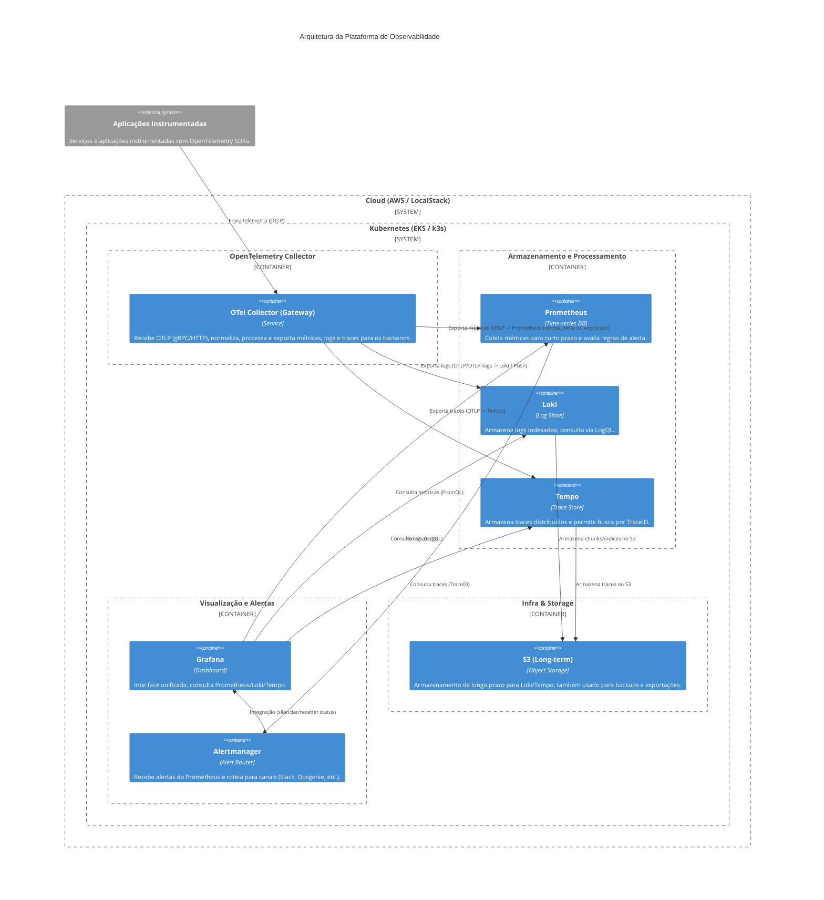

# Diagrama Arquitetural — Plataforma de Observabilidade

Este arquivo contém representações visuais da arquitetura e da implantação da plataforma de observabilidade usando Mermaid (C4 e Deployment diagrams).

> Para renderizar os diagramas, use um visualizador Mermaid que suporte o modo C4 (alguns renderers convertem o C4 para Mermaid). O bloco abaixo é compatível com o plugin Mermaid do VS Code ou com ferramentas que suportem a extensão C4.

## 1) Diagrama C4 — Contexto e Contêineres



---

## 2) Diagrama de Implantação (Kubernetes + Cloud)

Este diagrama mostra, em alto nível, como os componentes são mapeados para namespaces e recursos Kubernetes, incluindo dependências externas (S3/LocalStack).

```mermaid
flowchart TB
  subgraph Cluster[Kubernetes Cluster (EKS / k3s)]
    direction TB

    subgraph ns_observ[Namespace: observability]
      direction LR
      otel["otell-collector\n(Deployment)"]
      prom["prometheus\n(Prometheus Operator / StatefulSet)"]
      loki["loki\n(StatefulSet)"]
      tempo["tempo\n(StatefulSet)"]
      graf["grafana\n(Deployment)"]
      am["alertmanager\n(Deployment)"]
    end

    subgraph ns_apps[Namespaces: app-*]
      direction LR
      app1["app-a\n(Deployments)"]
      app2["app-b\n(Deployments)"]
    end
  end

  %% External services
  s3["S3 (AWS / LocalStack)"]
  kube_api["Kubernetes API / Control Plane"]

  %% Network & relations
  app1 -->|OTLP over gRPC/HTTP| otel
  app2 -->|OTLP over gRPC/HTTP| otel

  otel -->|metrics| prom
  otel -->|logs| loki
  otel -->|traces| tempo

  prom -->|alerts| am
  am -->|notifications| graf

  loki -->|long-term storage| s3
  tempo -->|long-term storage| s3

  %% infra relations
  kube_api --> Cluster
```

---

## 3) Notas de Uso e Boas Práticas

- O **OpenTelemetry Collector** é o ponto de ingestão único — prefira configurá-lo como um Gateway (central) ou como sidecar/agent dependendo do custo e latência.
- Use **namespaces** para isolar ambientes (observability-dev, observability-hml, observability-prd).
- Configure **IRSA** (ou credenciais adaptadas) para que Loki/Tempo possam escrever no S3 em produção; para LocalStack use credenciais dummy conforme `infra/helm/*-values-localstack.yaml`.
- Defina limites de cardinalidade para atributos em métricas e logs para evitar explosão de cardinalidade.

---

## 4) Onde inserir no repositório

- Salve este arquivo em `docs/infra/arquitetura-visual.md` (já criado).
- Referencie-o em `docs/infra/arquitetura-logica.md` adicionando um link ou embutindo o bloco Mermaid conforme necessário.


---

*Fim do diagrama arquitetural.*
