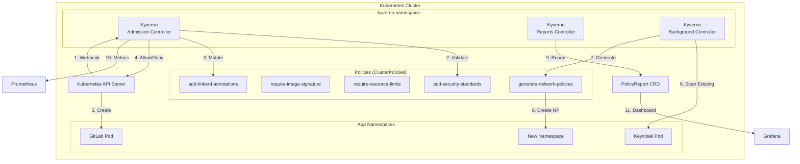

# ADR-002: Kyverno como Policy Engine para Kubernetes

**Status**: ✅ Aprovado
**Data**: 2026-01-22
**Decisores**: System Architect, Security Lead, DevOps Lead
**Supersedes**: ADR-001 (decisão pendente)

---

## Contexto

O domínio `security` precisa de um **Policy Engine** robusto para garantir governança, compliance e segurança em todos os workloads do cluster Kubernetes, com os seguintes requisitos:

### Requisitos Funcionais

1. **Admission Control**: Validar recursos na criação/atualização (deny/warn)
2. **Mutation**: Modificar recursos automaticamente (injetar sidecars, labels, annotations)
3. **Generation**: Criar recursos automaticamente (NetworkPolicies, Secrets, ConfigMaps)
4. **Validation**: Verificar conformidade com padrões (PSS, CIS Benchmarks)
5. **Reporting**: Gerar relatórios de compliance (PolicyReports, ClusterPolicyReports)
6. **Auditoria**: Rastrear violações e exceções

### Requisitos Não-Funcionais

1. **Kubernetes-Native**: Integração nativa via CRDs e Admission Webhooks
2. **Simplicidade**: Curva de aprendizado aceitável para equipe
3. **Performance**: Latência < 100ms para admission control
4. **Flexibilidade**: Suportar políticas customizadas
5. **Observabilidade**: Métricas Prometheus, logs estruturados

### Casos de Uso Críticos

1. **Pod Security Standards (PSS)**: Enforce baseline/restricted profiles
2. **Image Security**: Exigir imagens de registries aprovados (Harbor)
3. **Resource Limits**: Garantir que pods tenham requests/limits
4. **Labels Obrigatórias**: Exigir labels de ownership, cost-center, environment
5. **Network Policies**: Gerar Network Policies automaticamente para novos namespaces
6. **Backup Annotations**: Adicionar annotations Velero automaticamente
7. **Service Mesh**: Injetar Linkerd sidecar automaticamente

---

## Opções Consideradas

### Opção 1: Kyverno

**Arquitetura:**
```
┌─────────────────────────────────────────────────────────┐
│                    KYVERNO ARCHITECTURE                  │
│                                                          │
│  ┌──────────────────────────────────────────────────┐   │
│  │         Admission Controller (Webhook)            │   │
│  │  ┌────────────┐  ┌────────────┐  ┌────────────┐  │   │
│  │  │ Validate   │  │  Mutate    │  │  Generate  │  │   │
│  │  └────────────┘  └────────────┘  └────────────┘  │   │
│  └──────────────────────────────────────────────────┘   │
│                         │                                │
│                         ▼                                │
│  ┌──────────────────────────────────────────────────┐   │
│  │          Policy Engine (CEL/JMESPath)             │   │
│  └──────────────────────────────────────────────────┘   │
│                         │                                │
│                         ▼                                │
│  ┌──────────────────────────────────────────────────┐   │
│  │        Reports Controller (PolicyReport)          │   │
│  └──────────────────────────────────────────────────┘   │
│                                                          │
│  ┌──────────────────────────────────────────────────┐   │
│  │           Background Controller (Scan)            │   │
│  └──────────────────────────────────────────────────┘   │
└─────────────────────────────────────────────────────────┘
```

**Prós:**
- ✅ **Simplicidade**: Políticas em YAML nativo (sem linguagem específica)
- ✅ **Features Completas**: Validate + Mutate + Generate (3-em-1)
- ✅ **Kubernetes-Native**: CRDs nativas (ClusterPolicy, Policy)
- ✅ **PolicyReports Nativos**: Reporting integrado (Kubernetes Policy WG)
- ✅ **CEL Support**: Common Expression Language (padrão K8s 1.26+)
- ✅ **Image Verification**: Cosign integration para assinatura de imagens
- ✅ **Auto-Generation**: Criar NetworkPolicies, RBAC, etc. automaticamente
- ✅ **Curva de Aprendizado Baixa**: YAML familiar para equipe K8s
- ✅ **CLI Poderoso**: `kyverno test`, `kyverno apply`, `kyverno validate`
- ✅ **Maturidade**: CNCF Incubating Project, amplamente adotado

**Contras:**
- ⚠️ **Linguagem Limitada**: JMESPath/CEL menos flexível que Rego
- ⚠️ **Performance**: Overhead maior que OPA (validação de YAML parsing)
- ⚠️ **Complexidade em Policies Avançadas**: Lógica complexa pode ser verbosa

**Estimativa de Recursos:**
- **Admission Controller**: 1 pod × 0.5 CPU + 512MB RAM
- **Reports Controller**: 1 pod × 0.25 CPU + 256MB RAM
- **Background Controller**: 1 pod × 0.25 CPU + 256MB RAM
- **Total**: ~1 CPU, 1GB RAM

---

### Opção 2: OPA Gatekeeper

**Arquitetura:**
```
┌─────────────────────────────────────────────────────────┐
│               OPA GATEKEEPER ARCHITECTURE                │
│                                                          │
│  ┌──────────────────────────────────────────────────┐   │
│  │         Admission Controller (Webhook)            │   │
│  │            (validação apenas)                     │   │
│  └──────────────────────────────────────────────────┘   │
│                         │                                │
│                         ▼                                │
│  ┌──────────────────────────────────────────────────┐   │
│  │          OPA Engine (Rego Language)               │   │
│  └──────────────────────────────────────────────────┘   │
│                         │                                │
│                         ▼                                │
│  ┌──────────────────────────────────────────────────┐   │
│  │    Constraint Framework (CRDs Templates)          │   │
│  │  ┌──────────────────────────────────────────┐    │   │
│  │  │ ConstraintTemplate (define política)     │    │   │
│  │  └──────────────────────────────────────────┘    │   │
│  │  ┌──────────────────────────────────────────┐    │   │
│  │  │ Constraint (aplica política)             │    │   │
│  │  └──────────────────────────────────────────┘    │   │
│  └──────────────────────────────────────────────────┘   │
└─────────────────────────────────────────────────────────┘
```

**Prós:**
- ✅ **Flexibilidade Máxima**: Rego language permite lógica complexa
- ✅ **Performance**: OPA engine altamente otimizado
- ✅ **Maturidade**: CNCF Graduated Project (maior maturidade)
- ✅ **Reusabilidade**: Constraint Templates reutilizáveis
- ✅ **Ecosystem**: Integração com Conftest, OPA bundles, etc.

**Contras:**
- ❌ **Validação Apenas**: Não suporta Mutation ou Generation
- ❌ **Curva de Aprendizado Alta**: Rego é linguagem específica de domínio
- ❌ **Complexidade**: Requer aprender Rego + Constraint Framework
- ❌ **Reporting Limitado**: Necessita integração externa (gatekeeper-audit)
- ❌ **Mutação**: Requer OPA standalone (fora do Gatekeeper)
- ❌ **Verbosidade**: ConstraintTemplate + Constraint (2 recursos por policy)

**Estimativa de Recursos:**
- **Gatekeeper Controller**: 1 pod × 0.5 CPU + 512MB RAM
- **Audit Controller**: 1 pod × 0.25 CPU + 256MB RAM
- **Total**: ~0.75 CPU, 768MB RAM

---

### Opção 3: Kube-bench + Custom Admission Controller

**Descrição**: Usar kube-bench (CIS Benchmarks) + admission controller customizado

**Prós:**
- ✅ **CIS Compliance Built-in**: kube-bench valida CIS Benchmarks
- ✅ **Controle Total**: Admission controller customizado

**Contras:**
- ❌ **Esforço de Desenvolvimento**: Criar e manter admission controller
- ❌ **Sem Features Avançadas**: Não oferece mutation, generation
- ❌ **Manutenção Alta**: Equipe precisa manter código
- ❌ **Sem Ecosystem**: Sem comunidade ou templates prontos

---

## Comparação Detalhada

| Critério | Kyverno | OPA Gatekeeper | Custom Controller |
|----------|---------|----------------|-------------------|
| **Validate** | ✅ Sim | ✅ Sim | ⚠️ Manual |
| **Mutate** | ✅ Sim | ❌ Não | ⚠️ Manual |
| **Generate** | ✅ Sim | ❌ Não | ⚠️ Manual |
| **Policy Language** | 🟢 YAML/CEL (fácil) | 🔴 Rego (difícil) | 🔴 Go (difícil) |
| **Curva de Aprendizado** | 🟢 Baixa | 🔴 Alta | 🔴 Alta |
| **PolicyReports** | ✅ Nativo | ⚠️ Extensão | ❌ Não |
| **Image Verification** | ✅ Cosign | ❌ Não | ⚠️ Manual |
| **Performance** | ⚠️ Média | ✅ Alta | ✅ Alta |
| **Maturidade** | ✅ CNCF Incubating | ✅ CNCF Graduated | ❌ Custom |
| **Ecosystem** | ✅ Grande | ✅ Grande | ❌ Nenhum |
| **Kubernetes-Native** | ✅ Total | ✅ Total | ⚠️ Parcial |
| **Custo de Recursos** | 🔴 1 CPU, 1GB | 🟢 0.75 CPU, 768MB | 🟢 Variável |
| **Maintainability** | 🟢 Alta | ⚠️ Média | 🔴 Baixa |

---

## Decisão

**ESCOLHIDO: Opção 1 - Kyverno**

### Justificativa

1. **Simplicidade e Produtividade:**
   - ✅ YAML nativo reduz curva de aprendizado (equipe já domina YAML)
   - ✅ Políticas fáceis de ler e manter (vs Rego complexo)
   - ✅ CLI poderoso para testes locais (`kyverno test`)

2. **Features Completas (3-em-1):**
   - ✅ **Validate**: Deny/warn em admission control
   - ✅ **Mutate**: Injetar sidecars, labels, annotations automaticamente
   - ✅ **Generate**: Criar NetworkPolicies, Secrets automaticamente
   - ❌ OPA Gatekeeper: **Validação apenas** (sem mutation/generation)

3. **Casos de Uso Críticos Suportados:**
   - ✅ **Auto-Generation de Network Policies**: Kyverno pode gerar NP para novos namespaces
   - ✅ **Linkerd Sidecar Injection**: Mutação automática para adicionar annotations
   - ✅ **Velero Backup Annotations**: Adicionar automaticamente em PVCs
   - ❌ OPA: Requer ferramentas adicionais para mutation/generation

4. **Reporting Nativo:**
   - ✅ PolicyReports (Kubernetes Policy WG) out-of-the-box
   - ✅ Integração com Grafana/Prometheus para dashboards
   - ⚠️ OPA: Requer gatekeeper-audit + configuração adicional

5. **Image Verification (Security Critical):**
   - ✅ Cosign integration nativa (verificar assinaturas de imagens)
   - ✅ Validar que imagens vêm de Harbor (registry aprovado)
   - ❌ OPA: Não oferece image verification nativa

6. **Alinhamento com Requisitos:**
   - ✅ **Simplicidade**: YAML < Rego (menor curva de aprendizado)
   - ✅ **Kubernetes-Native**: CRDs nativas (ClusterPolicy, Policy)
   - ✅ **Flexibilidade**: CEL para lógica avançada (K8s 1.26+)

7. **Trade-off Aceitável:**
   - ⚠️ Performance ligeiramente inferior ao OPA (aceitável para nosso caso)
   - ⚠️ Lógica complexa pode ser verbosa (CEL mitiga)
   - ✅ Benefícios (mutation, generation, simplicidade) superam desvantagens

---

## Arquitetura de Implementação

### High-Level Design



### Componentes Principais

#### 1. Kyverno Admission Controller

**Deployment:**
```yaml
apiVersion: apps/v1
kind: Deployment
metadata:
  name: kyverno
  namespace: kyverno
spec:
  replicas: 3  # HA
  selector:
    matchLabels:
      app: kyverno
  template:
    metadata:
      labels:
        app: kyverno
    spec:
      serviceAccountName: kyverno
      affinity:
        podAntiAffinity:
          preferredDuringSchedulingIgnoredDuringExecution:
            - weight: 100
              podAffinityTerm:
                labelSelector:
                  matchLabels:
                    app: kyverno
                topologyKey: kubernetes.io/hostname
      containers:
        - name: kyverno
          image: ghcr.io/kyverno/kyverno:v1.11.1
          resources:
            requests:
              cpu: 500m
              memory: 512Mi
            limits:
              cpu: 1000m
              memory: 1Gi
          env:
            - name: KYVERNO_NAMESPACE
              valueFrom:
                fieldRef:
                  fieldPath: metadata.namespace
          args:
            - --webhooktimeout=15
            - --enableMetrics=true
            - --metricsPort=8000
            - --enableTracing=true
          ports:
            - containerPort: 9443
              name: https
            - containerPort: 8000
              name: metrics
          livenessProbe:
            httpGet:
              path: /health/liveness
              port: 9443
              scheme: HTTPS
          readinessProbe:
            httpGet:
              path: /health/readiness
              port: 9443
              scheme: HTTPS
```

#### 2. Kyverno Background Controller

```yaml
apiVersion: apps/v1
kind: Deployment
metadata:
  name: kyverno-background-controller
  namespace: kyverno
spec:
  replicas: 1
  selector:
    matchLabels:
      app: kyverno-background-controller
  template:
    metadata:
      labels:
        app: kyverno-background-controller
    spec:
      serviceAccountName: kyverno-background-controller
      containers:
        - name: controller
          image: ghcr.io/kyverno/background-controller:v1.11.1
          resources:
            requests:
              cpu: 250m
              memory: 256Mi
            limits:
              cpu: 500m
              memory: 512Mi
          args:
            - --enableMetrics=true
```

#### 3. Kyverno Reports Controller

```yaml
apiVersion: apps/v1
kind: Deployment
metadata:
  name: kyverno-reports-controller
  namespace: kyverno
spec:
  replicas: 1
  selector:
    matchLabels:
      app: kyverno-reports-controller
  template:
    metadata:
      labels:
        app: kyverno-reports-controller
    spec:
      serviceAccountName: kyverno-reports-controller
      containers:
        - name: controller
          image: ghcr.io/kyverno/reports-controller:v1.11.1
          resources:
            requests:
              cpu: 250m
              memory: 256Mi
          args:
            - --enableMetrics=true
```

---

## Políticas Críticas

### 1. Pod Security Standards (Baseline)

```yaml
apiVersion: kyverno.io/v1
kind: ClusterPolicy
metadata:
  name: pod-security-standards-baseline
  annotations:
    policies.kyverno.io/title: Pod Security Standards (Baseline)
    policies.kyverno.io/category: Pod Security Standards
    policies.kyverno.io/severity: high
    policies.kyverno.io/description: >-
      Enforce Pod Security Standards baseline profile.
      Blocks privileged containers, hostPath, hostNetwork, etc.
spec:
  validationFailureAction: Enforce  # Deny em violação
  background: true
  rules:
    - name: deny-privileged-containers
      match:
        any:
          - resources:
              kinds:
                - Pod
      validate:
        message: "Privileged containers are not allowed"
        pattern:
          spec:
            =(ephemeralContainers):
              - =(securityContext):
                  =(privileged): false
            =(initContainers):
              - =(securityContext):
                  =(privileged): false
            containers:
              - =(securityContext):
                  =(privileged): false

    - name: deny-host-network
      match:
        any:
          - resources:
              kinds:
                - Pod
      validate:
        message: "Host network is not allowed"
        pattern:
          spec:
            =(hostNetwork): false

    - name: deny-host-path
      match:
        any:
          - resources:
              kinds:
                - Pod
      validate:
        message: "HostPath volumes are not allowed"
        pattern:
          spec:
            =(volumes):
              - X(hostPath): null

    - name: deny-host-ports
      match:
        any:
          - resources:
              kinds:
                - Pod
      validate:
        message: "Host ports are not allowed"
        pattern:
          spec:
            containers:
              - =(ports):
                  - X(hostPort): null
```

### 2. Require Image from Approved Registry (Harbor)

```yaml
apiVersion: kyverno.io/v1
kind: ClusterPolicy
metadata:
  name: require-image-from-harbor
  annotations:
    policies.kyverno.io/title: Require Images from Harbor
    policies.kyverno.io/severity: high
spec:
  validationFailureAction: Enforce
  background: true
  rules:
    - name: validate-image-registry
      match:
        any:
          - resources:
              kinds:
                - Pod
      validate:
        message: >-
          Images must come from approved Harbor registry:
          harbor.k8s-platform.seudominio.com.br
        pattern:
          spec:
            containers:
              - image: "harbor.k8s-platform.seudominio.com.br/*"
```

### 3. Verify Image Signature (Cosign)

```yaml
apiVersion: kyverno.io/v1
kind: ClusterPolicy
metadata:
  name: verify-image-signature
  annotations:
    policies.kyverno.io/title: Verify Image Signatures
    policies.kyverno.io/severity: critical
spec:
  validationFailureAction: Enforce
  background: false
  webhookTimeoutSeconds: 30
  rules:
    - name: verify-signature
      match:
        any:
          - resources:
              kinds:
                - Pod
      verifyImages:
        - imageReferences:
            - "harbor.k8s-platform.seudominio.com.br/*"
          attestors:
            - count: 1
              entries:
                - keys:
                    publicKeys: |-
                      -----BEGIN PUBLIC KEY-----
                      MFkwEwYHKoZIzj0CAQYIKoZIzj0DAQcDQgAE...
                      -----END PUBLIC KEY-----
```

### 4. Require Resource Limits

```yaml
apiVersion: kyverno.io/v1
kind: ClusterPolicy
metadata:
  name: require-resource-limits
  annotations:
    policies.kyverno.io/title: Require CPU and Memory Limits
    policies.kyverno.io/severity: medium
spec:
  validationFailureAction: Enforce
  background: true
  rules:
    - name: validate-resources
      match:
        any:
          - resources:
              kinds:
                - Pod
      validate:
        message: "CPU and memory limits are required"
        pattern:
          spec:
            containers:
              - resources:
                  limits:
                    memory: "?*"
                    cpu: "?*"
                  requests:
                    memory: "?*"
                    cpu: "?*"
```

### 5. Add Linkerd Sidecar Annotations (Mutation)

```yaml
apiVersion: kyverno.io/v1
kind: ClusterPolicy
metadata:
  name: add-linkerd-annotations
  annotations:
    policies.kyverno.io/title: Add Linkerd Sidecar Annotations
    policies.kyverno.io/severity: low
spec:
  background: false
  rules:
    - name: add-linkerd-inject
      match:
        any:
          - resources:
              kinds:
                - Deployment
              namespaceSelector:
                matchLabels:
                  linkerd-injection: enabled
      mutate:
        patchStrategicMerge:
          spec:
            template:
              metadata:
                annotations:
                  linkerd.io/inject: "enabled"
```

### 6. Generate Network Policy for New Namespaces

```yaml
apiVersion: kyverno.io/v1
kind: ClusterPolicy
metadata:
  name: generate-default-network-policy
  annotations:
    policies.kyverno.io/title: Generate Default Network Policy
    policies.kyverno.io/severity: medium
spec:
  background: true
  rules:
    - name: default-deny-ingress
      match:
        any:
          - resources:
              kinds:
                - Namespace
      exclude:
        any:
          - resources:
              namespaces:
                - kube-system
                - kyverno
                - vault
      generate:
        apiVersion: networking.k8s.io/v1
        kind: NetworkPolicy
        name: default-deny-ingress
        namespace: "{{request.object.metadata.name}}"
        synchronize: true
        data:
          spec:
            podSelector: {}
            policyTypes:
              - Ingress
```

### 7. Add Velero Backup Annotations to PVCs

```yaml
apiVersion: kyverno.io/v1
kind: ClusterPolicy
metadata:
  name: add-velero-backup-annotations
  annotations:
    policies.kyverno.io/title: Add Velero Backup Annotations
    policies.kyverno.io/severity: low
spec:
  background: false
  rules:
    - name: add-backup-annotations
      match:
        any:
          - resources:
              kinds:
                - PersistentVolumeClaim
      mutate:
        patchStrategicMerge:
          metadata:
            annotations:
              backup.velero.io/backup-volumes: "true"
```

### 8. Require Labels (ownership, cost-center)

```yaml
apiVersion: kyverno.io/v1
kind: ClusterPolicy
metadata:
  name: require-labels
  annotations:
    policies.kyverno.io/title: Require Standard Labels
    policies.kyverno.io/severity: medium
spec:
  validationFailureAction: Audit  # Warn apenas (não block)
  background: true
  rules:
    - name: check-labels
      match:
        any:
          - resources:
              kinds:
                - Deployment
                - StatefulSet
                - DaemonSet
      validate:
        message: "Required labels: app, owner, cost-center, environment"
        pattern:
          metadata:
            labels:
              app: "?*"
              owner: "?*"
              cost-center: "?*"
              environment: "dev|staging|prod"
```

---

## PolicyReports e Monitoring

### PolicyReport CRD (Automático)

```yaml
apiVersion: wgpolicyk8s.io/v1alpha2
kind: PolicyReport
metadata:
  name: polr-ns-default
  namespace: default
spec:
  scope:
    kind: Namespace
    name: default
  results:
    - policy: require-resource-limits
      rule: validate-resources
      result: fail
      source: kyverno
      message: "CPU and memory limits are required"
      resources:
        - apiVersion: v1
          kind: Pod
          name: nginx
          namespace: default
```

### Prometheus Metrics

```yaml
apiVersion: v1
kind: ServiceMonitor
metadata:
  name: kyverno
  namespace: kyverno
spec:
  selector:
    matchLabels:
      app: kyverno
  endpoints:
    - port: metrics
      interval: 30s
```

**Métricas Disponíveis:**
- `kyverno_policy_rule_results_total{policy="pod-security-standards",rule="deny-privileged",result="pass|fail"}`
- `kyverno_policy_execution_duration_seconds{policy="require-image-signature"}`
- `kyverno_admission_requests_total{resource_kind="Pod",result="allow|deny"}`

### Grafana Dashboard

```json
{
  "title": "Kyverno Policy Compliance",
  "panels": [
    {
      "title": "Policy Violations (Last 24h)",
      "targets": [
        {
          "expr": "sum by (policy) (increase(kyverno_policy_rule_results_total{result=\"fail\"}[24h]))"
        }
      ]
    },
    {
      "title": "Admission Request Success Rate",
      "targets": [
        {
          "expr": "sum(rate(kyverno_admission_requests_total{result=\"allow\"}[5m])) / sum(rate(kyverno_admission_requests_total[5m])) * 100"
        }
      ]
    }
  ]
}
```

---

## Testes e Validação

### CLI Testing (kyverno test)

```bash
# Estrutura de teste
$ cat kyverno-test.yaml
apiVersion: kyverno.io/v1
kind: ClusterPolicy
metadata:
  name: require-resource-limits
spec:
  # ... policy ...
---
apiVersion: v1
kind: Pod
metadata:
  name: test-pod
spec:
  containers:
    - name: nginx
      image: nginx
      resources:
        limits:
          memory: "128Mi"
          cpu: "500m"
        requests:
          memory: "64Mi"
          cpu: "250m"

# Executar teste
$ kyverno test kyverno-test.yaml
Executing require-resource-limits...
  applying 1 policy to 1 resource...

  require-resource-limits / validate-resources: PASS

Test Summary: 1 tests passed, 0 tests failed
```

### Unit Tests (CI/CD)

```yaml
# .gitlab-ci.yml
kyverno-test:
  stage: test
  image: ghcr.io/kyverno/kyverno-cli:v1.11.1
  script:
    - kyverno test policies/ --output json
  artifacts:
    reports:
      junit: kyverno-test-results.xml
```

---

## Integração com Outros Domínios

### 1. cicd-platform (GitLab CI)

```yaml
# .gitlab-ci.yml
validate-policies:
  stage: validate
  image: ghcr.io/kyverno/kyverno-cli:v1.11.1
  script:
    - kyverno apply policies/ --resource deployments/
    - kyverno test policies/
```

### 2. observability (Prometheus/Grafana)

```yaml
# ServiceMonitor para métricas Kyverno
apiVersion: monitoring.coreos.com/v1
kind: ServiceMonitor
metadata:
  name: kyverno
  namespace: observability
spec:
  selector:
    matchLabels:
      app: kyverno
  namespaceSelector:
    matchNames:
      - kyverno
  endpoints:
    - port: metrics
```

### 3. platform-core (Linkerd Integration)

```yaml
# ClusterPolicy: Injetar Linkerd em namespaces marcados
apiVersion: kyverno.io/v1
kind: ClusterPolicy
metadata:
  name: linkerd-injection
spec:
  rules:
    - name: add-linkerd-annotation
      match:
        any:
          - resources:
              kinds:
                - Deployment
              namespaceSelector:
                matchLabels:
                  linkerd-injection: enabled
      mutate:
        patchStrategicMerge:
          spec:
            template:
              metadata:
                annotations:
                  linkerd.io/inject: "enabled"
```

---

## Consequências

### Positivas

1. ✅ **Simplicidade**: YAML nativo, curva de aprendizado baixa
2. ✅ **Features Completas**: Validate + Mutate + Generate (3-em-1)
3. ✅ **Kubernetes-Native**: CRDs, admission webhooks, PolicyReports
4. ✅ **Produtividade**: Políticas fáceis de escrever e manter
5. ✅ **Image Security**: Cosign integration para verificação de assinaturas
6. ✅ **Auto-Generation**: NetworkPolicies, RBAC automáticos
7. ✅ **Observabilidade**: Métricas Prometheus, logs estruturados
8. ✅ **Ecosystem**: Biblioteca de políticas prontas (kyverno-policies repo)

### Negativas

1. ❌ **Performance**: Overhead maior que OPA (~20-30ms vs 5-10ms)
2. ❌ **Verbosidade**: Políticas complexas podem ser longas em YAML
3. ❌ **Flexibilidade Limitada**: CEL menos flexível que Rego para lógica avançada

### Neutras

1. ⚪ **Maturidade**: CNCF Incubating (vs OPA Graduated)
2. ⚪ **Adoção**: Crescente, mas OPA ainda mais adotado

---

## Plano de Implementação

### Sprint Atual

- [ ] Instalar Kyverno via Helm
- [ ] Configurar Admission Controller (3 réplicas HA)
- [ ] Configurar Reports Controller
- [ ] Configurar Background Controller
- [ ] Criar políticas críticas (PSS, image verification, resource limits)
- [ ] Habilitar PolicyReports
- [ ] Configurar métricas Prometheus
- [ ] Criar VALIDATION-REPORT.md

### Sprint+1

- [ ] Implementar mutation policies (Linkerd, Velero)
- [ ] Implementar generation policies (NetworkPolicies)
- [ ] Integrar com Grafana (dashboard de compliance)
- [ ] Integrar com GitLab CI (kyverno test)
- [ ] Treinamento da equipe (workshop de 2h)
- [ ] Documentar políticas customizadas

---

## Referências

- [SAD v1.2](../../../../SAD/docs/sad.md)
- [ADR-005: Segurança Sistêmica](../../../../SAD/docs/adrs/adr-005-seguranca-sistemica.md)
- [Kyverno Documentation](https://kyverno.io/docs/)
- [Kyverno Policies Library](https://kyverno.io/policies/)
- [Pod Security Standards](https://kubernetes.io/docs/concepts/security/pod-security-standards/)
- [Kubernetes Policy WG](https://github.com/kubernetes-sigs/wg-policy-prototypes)

---

**Autor**: System Architect
**Versão**: 1.0
**Última Atualização**: 2026-01-22
